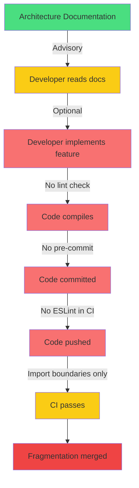

# Livex Architecture Governance Audit

> **Principal Architect Review** · July 2026 · Version 4.2.4
> Classification: Engineering Process Document — Permanent
> Companion to: [Architectural Audit Report](file:///C:/Users/ayuda/.gemini/antigravity/brain/b5f08856-c5d7-43c7-aaf7-79391725bc22/livex_architectural_audit.md)

---

## Executive Summary

This audit examines **why the Livex architecture ALLOWS fragmentation to occur** — not where fragmentation exists (that is covered in the companion Architectural Audit), but what enforcement mechanisms are missing that would prevent it.

The findings are stark:

| Enforcement Layer | Status |
|---|---|
| **ESLint** | ❌ **Does not exist.** No `.eslintrc`, no `eslint.config.js`, no ESLint dependency. |
| **Prettier** | ❌ **Does not exist.** No `.prettierrc`, no `.prettierignore`. Prettier is a devDependency but has no configuration. |
| **Pre-commit hooks** | ❌ **Does not exist.** No `.husky/`, no `lint-staged`, no git hooks. |
| **Unit tests** | ❌ **Near-zero.** Only 2 test files in the entire project (both in `updater/__tests__/`). |
| **Import boundaries** | ✅ **Exists.** Custom script `enforce-import-boundaries.mjs` (83 lines). Runs in CI. |
| **Platform scope** | ✅ **Exists.** Custom script `enforce-platform-scope.mjs` (96 lines). Runs in CI. |
| **Documentation validation** | ✅ **Exists.** Custom script `validate-documentation.mjs` (270 lines). Runs in Web CI. |
| **TypeScript strictness** | ⚠️ **Partial.** `strictNullChecks: true`, `noImplicitReturns: true`, but `noImplicitAny: false`, `noUnusedLocals: false`. |
| **CI pipelines** | ✅ **Exist.** 3 workflows: Android CI, Web CI, Release Pipeline. |
| **Architectural documentation** | ✅ **Exists.** 30+ documents in `docs/architecture/`. But **advisory only** — nothing enforces compliance. |

The core problem: **Livex has documentation that describes the architecture, but no tooling that enforces the architecture.** Documentation tells engineers what they *should* do. Enforcement tools tell engineers what they *can't* do. Livex has the former but almost none of the latter.

---

## Table of Contents

1. [Current Enforcement Inventory](#1-current-enforcement-inventory)
2. [Per-Subsystem Governance Analysis](#2-per-subsystem-governance-analysis)
3. [The 12 Governance Gaps](#3-the-12-governance-gaps)
4. [Root Cause: Why the Architecture Is Optional](#4-root-cause-why-the-architecture-is-optional)
5. [Recommended Enforcement Architecture](#5-recommended-enforcement-architecture)
6. [Priority Implementation Roadmap](#6-priority-implementation-roadmap)
7. [Governance Scorecard](#7-governance-scorecard)

---

## 1. Current Enforcement Inventory

### What Exists ✅

#### 1.1 Import Boundary Enforcement

[enforce-import-boundaries.mjs](file:///c:/Users/ayuda/Documents/.gemini/antigravity/scratch/Studio/scripts/enforce-import-boundaries.mjs) (83 lines)

**What it enforces:**
- `studio-web` cannot import from `ui-android`
- `studio-android` cannot import from `ui-web`
- `studio-core` cannot import from any UI package
- `ui-shared` cannot import from platform UI packages

**What it does NOT enforce:**
- ❌ Whether feature modules import from shared systems (e.g., design tokens)
- ❌ Whether components use CSS variables vs hardcoded colors
- ❌ Whether stores are created in the correct package
- ❌ Whether spring configs use centralized presets
- ❌ File size limits
- ❌ Component naming conventions

**Runs in CI:** ✅ Both Android CI and Web CI

#### 1.2 Platform Scope Enforcement

[enforce-platform-scope.mjs](file:///c:/Users/ayuda/Documents/.gemini/antigravity/scratch/Studio/scripts/enforce-platform-scope.mjs) (96 lines)

**What it enforces:** Changed files must belong to the correct platform scope (web files shouldn't change in APK builds and vice versa).

**Runs in CI:** ✅ Android CI only

#### 1.3 Documentation Validation

[validate-documentation.mjs](file:///c:/Users/ayuda/Documents/.gemini/antigravity/scratch/Studio/scripts/validate-documentation.mjs) (270 lines)

**What it enforces:** Markdown link integrity, file path references, documentation completeness.

**Runs in CI:** ✅ Web CI only

#### 1.4 TypeScript Compilation

**What it enforces:** Type safety at compilation time.

**What it does NOT enforce:**
- ❌ `noImplicitAny` is `false` — any developer can use `any` types freely
- ❌ `noUnusedLocals` is `false` — dead code accumulates
- ❌ `strictFunctionTypes` is `false` — function parameter types are covariant
- ❌ No path mapping prevents cross-package deep imports

**Runs in CI:** ✅ Both pipelines

#### 1.5 CI Pipelines

| Pipeline | Steps |
|---|---|
| **Android CI** | Install → Import boundaries → Platform scope → Version check → Typecheck → Build → Cap sync → Architecture smoke tests → Debug APK → APK validation |
| **Web CI** | Install → Doc validation → Import boundaries → Typecheck → Build |
| **Release** | All of the above + Signed APK + GitHub Release + OTA metadata |

### What Does NOT Exist ❌

| Tool | Status | Impact |
|---|---|---|
| **ESLint** | No configuration, no dependency (except Prettier as devDep) | No code style enforcement, no restricted import rules, no banned pattern detection |
| **Prettier** | Listed as devDependency but no configuration file | No formatting consistency |
| **Pre-commit hooks** | No `.husky/`, no `lint-staged` | Every check only runs in CI (after push), not at commit time |
| **Unit tests** | 2 test files in entire project | Zero coverage on shared systems, stores, components |
| **Integration tests** | None | No verification that shared systems work correctly across apps |
| **Component tests** | None | No verification that UI components render correctly |
| **Architectural fitness functions** | None | No automated check that the architecture matches documentation |

---

## 2. Per-Subsystem Governance Analysis

For each subsystem, I answer 7 questions:

1. Is there one official implementation?
2. Is that implementation mandatory?
3. Can another implementation be created without detection?
4. Would CI detect it?
5. Would TypeScript detect it?
6. Would documentation prevent it?
7. Would another engineer immediately notice it?

---

### 2.1 Design Tokens (SpringPresets, Colors, Typography, Spacing)

| Question | Answer |
|---|---|
| Official implementation? | Yes — `designTokens.ts` in studio-core |
| Mandatory? | **No.** Nothing requires importing from it. |
| Can bypass? | **Yes.** Write `style={{ color: '#ff5733' }}` anywhere. |
| CI detection? | **No.** No lint rule bans hardcoded colors. |
| TypeScript detection? | **No.** `React.CSSProperties` accepts any string for `color`. |
| Documentation prevents? | **No.** Docs say "use tokens" but nothing enforces it. |
| Engineer notices? | **No.** The code compiles and runs. Visual inconsistency only visible at runtime. |

> **Current situation:** `designTokens.ts` exports `SpringPresets`, `ColorTokens`, `MotionTokens` etc. Zero feature modules import them. A parallel `SPRING_PRESETS` exists in `AppAnimationSystem.tsx` with different values. 270+ hardcoded hex colors exist in feature files.
>
> **Why this allows fragmentation:** Any developer can write any color, any spring value, any spacing value inline. Nothing tells them they should use tokens, and nothing blocks the commit if they don't.
>
> **Long-term risk:** Visual inconsistency grows linearly with each commit. Theme changes become impossible to roll out uniformly.
>
> **Recommended enforcement:**
> - ESLint rule: `no-restricted-syntax` banning hex color literals in TSX style props
> - ESLint rule: custom rule banning inline `stiffness`/`damping`/`mass` objects (require import from `SpringPresets`)
> - CI check: grep for hardcoded hex values in feature modules, fail if count increases
>
> **Priority:** 🔴 Critical — affects every visual element

---

### 2.2 Bottom Navigation

| Question | Answer |
|---|---|
| Official implementation? | Yes — `useBottomNavigationStore` + `SharedNavigationBar` |
| Mandatory? | **Partially.** Apps must call `setItems()` to register, but nothing forces them to. |
| Can bypass? | **Yes.** An app could render its own `<nav>` bar at the bottom of the screen. |
| CI detection? | **No.** No check verifies that every app registers with the shared bottom nav. |
| TypeScript detection? | **No.** The type system doesn't require bottom nav registration. |
| Documentation prevents? | **Partially.** Docs describe the system but don't enforce registration. |
| Engineer notices? | **Eventually.** But only if they manually test navigation between all apps. |

> **Recommended enforcement:**
> - Architecture test: verify every app listed in the app registry calls `setItems()` in its mount effect
> - CI script: scan each app's main component for `useBottomNavigationStore.getState().setItems`
>
> **Priority:** 🟡 Medium

---

### 2.3 Motion / Animation System

| Question | Answer |
|---|---|
| Official implementation? | **Ambiguous.** Two competing systems: `designTokens.ts` SpringPresets AND `AppAnimationSystem.tsx` SPRING_PRESETS |
| Mandatory? | **No.** Nothing requires importing from either. |
| Can bypass? | **Yes.** Write `transition={{ type: 'spring', stiffness: 999, damping: 1 }}` anywhere. |
| CI detection? | **No.** |
| TypeScript detection? | **No.** Framer Motion accepts any spring config object. |
| Documentation prevents? | **No.** |
| Engineer notices? | **No.** Animations compile and run. Inconsistency only visible through careful side-by-side comparison. |

> **Recommended enforcement:**
> - Merge the two systems into one canonical file
> - ESLint custom rule: ban inline `{ type: 'spring', stiffness: ..., damping: ... }` objects
> - Require all spring configs to be imported from `@workspace/studio-core` SpringPresets
> - CI grep: count inline spring configs, fail if count increases
>
> **Priority:** 🔴 Critical

---

### 2.4 Theme System

| Question | Answer |
|---|---|
| Official implementation? | Yes — CSS custom properties in `index.css` + `ThemeTransitionEngine` |
| Mandatory? | **No.** Nothing prevents using hardcoded colors or creating new CSS files. |
| Can bypass? | **Yes.** Write `backgroundColor: '#1a1a1a'` instead of `var(--c-bg-primary)`. Stagex bypasses it entirely via iframe. |
| CI detection? | **No.** |
| TypeScript detection? | **No.** |
| Documentation prevents? | **No.** |
| Engineer notices? | **Only during theme switching.** Hardcoded colors look fine in the default theme but break in alternate themes. |

> **Recommended enforcement:**
> - ESLint rule: ban hardcoded color values in `style` props
> - Shared CSS file: extract common tokens from platform CSS into `packages/ui-shared/src/styles/tokens.css`
> - CI check: diff Android and Web `index.css` to verify custom property parity
>
> **Priority:** 🔴 Critical

---

### 2.5 Store / State Management

| Question | Answer |
|---|---|
| Official location? | `packages/studio-core/src/store/` and `packages/studio-core/src/lib/navigation/` |
| Mandatory? | **No.** `useGroovexStore` was created in `packages/ui-shared/` with no enforcement preventing it. |
| Can bypass? | **Yes.** Any developer can `create(...)` a new Zustand store anywhere in any package. |
| CI detection? | **No.** Import boundaries only block cross-platform imports, not store location violations. |
| TypeScript detection? | **No.** Zustand's `create()` works anywhere. |
| Documentation prevents? | **Partially.** Docs say stores belong in studio-core, but nothing enforces it. |
| Engineer notices? | **No.** The store works correctly regardless of which package it's in. |

> **Recommended enforcement:**
> - ESLint rule or CI script: scan for `zustand` `create(` calls outside of `packages/studio-core/`
> - Import boundary rule: if a store is created in `ui-shared`, CI fails
>
> **Priority:** 🟡 Medium

---

### 2.6 Shared Components (Button, Card, Dialog, Sheet)

| Question | Answer |
|---|---|
| Official implementation? | Yes — `StudioDesignSystem.tsx` exports `Button`, `Card`, `Dialog`, `Sheet`, etc. |
| Mandatory? | **No.** `WebDesignSystem.tsx` exists as a parallel system with `WebButton`, `WebCard`, etc. |
| Can bypass? | **Yes.** Any developer can create a new `<button>` with inline styles. |
| CI detection? | **No.** |
| TypeScript detection? | **No.** HTML elements are always available in JSX. |
| Documentation prevents? | **Partially.** Docs describe the shared components but don't prevent creating new ones. |
| Engineer notices? | **Not immediately.** Different components may look similar but behave differently on interaction. |

> **Recommended enforcement:**
> - ESLint rule: `no-restricted-syntax` banning raw `<button>`, `<input>`, `<dialog>` elements in feature modules (must use `Button`, `SearchBar`, `Dialog`)
> - Component registry: CI script that counts component definitions, alerts when a new component is created that matches an existing shared component's name
>
> **Priority:** 🟡 Medium

---

### 2.7 Navigation

| Question | Answer |
|---|---|
| Official implementation? | Yes — `useNavigationStore` + `NavigationDispatcher` |
| Mandatory? | **Mostly.** All apps use the shared navigation, but they access route state with different patterns (some use `useShallow`, some don't). |
| Can bypass? | **Partially.** An app could create its own internal tab state without using the shared store. |
| CI detection? | **No.** |
| TypeScript detection? | **No.** |
| Documentation prevents? | **Partially.** |
| Engineer notices? | **Yes.** Navigation is visible and cross-app, so deviations are noticed quickly. |

> **Priority:** 🟢 Low — already mostly enforced by necessity

---

### 2.8 CSS Files

| Question | Answer |
|---|---|
| Official location? | `apps/studio-android/src/index.css` and `apps/studio-web/src/index.css` |
| Mandatory? | **No.** Any package can create its own CSS file. Stagex has 129KB of separate CSS. |
| Can bypass? | **Yes.** Create a new `.css` file, import it in a component. |
| CI detection? | **No.** No check verifies CSS file locations or contents. |
| Platform parity? | **Not enforced.** Android has 1,673 lines, Web has 1,808 lines. 135-line divergence. |
| Engineer notices? | **Only on the other platform.** A Web-only CSS change doesn't affect Android visuals, and vice versa. |

> **Recommended enforcement:**
> - CI check: extract CSS custom property names from both platform CSS files, diff them, fail if they diverge
> - Shared base CSS: move common tokens to a shared file that both platforms import
>
> **Priority:** 🔴 Critical

---

### 2.9 File Size / Monoliths

| Question | Answer |
|---|---|
| Limit? | **None.** No file size limit exists anywhere. |
| Current state? | StudioHub.tsx: 6,832 lines. DrumEditor.tsx: 5,200 lines. AccountCard.tsx: 4,398 lines. |
| Can create more? | **Yes.** Nothing prevents adding 1,000 more lines to a 5,000-line file. |
| CI detection? | **No.** |
| Engineer notices? | **Not at commit time.** Files grow incrementally. |

> **Recommended enforcement:**
> - CI script: fail if any `.tsx` file exceeds 1,000 lines (with temporary allowlist for existing violations)
> - Pre-commit hook: warn when editing a file > 800 lines
>
> **Priority:** 🟡 Medium

---

### 2.10 Search

| Question | Answer |
|---|---|
| Official implementation? | **No.** There is no centralized search system. |
| Current state? | Each app implements its own search locally (Chordex SearchBar, Groovex `searchQuery`, Drumex library filter). |
| Can fragment? | **Already fragmented.** No shared system exists to bypass. |

> **Priority:** 🟡 Medium (new system needed, not enforcement of existing one)

---

### 2.11 Notifications

| Question | Answer |
|---|---|
| Official implementation? | Yes — `useNotificationService` in studio-core |
| Mandatory? | **Mostly.** Publishers use the shared API. |
| Can bypass? | **Yes.** A developer could use `alert()` or render a custom toast without publishing to the notification store. |
| CI detection? | **No.** |
| Engineer notices? | **Yes.** Custom alerts are visually different from system notifications. |

> **Priority:** 🟢 Low

---

### 2.12 Synchronization

| Question | Answer |
|---|---|
| Official implementation? | Yes — `sync.ts` in studio-core |
| Mandatory? | **Mostly.** All persistent data flows through Firestore via the sync engine. |
| Can bypass? | **Partially.** Vocalex uses IndexedDB for audio blobs (by design). Stagex communicates via postMessage to iframe. |

> **Priority:** 🟢 Low

---

## 3. The 12 Governance Gaps

Listed in order of impact:

### Gap 1: No ESLint Configuration
**Current:** Zero ESLint configuration in the project. No `.eslintrc`, no `eslint.config.js`, no ESLint dependencies.

**Impact:** The most powerful static analysis tool in the JavaScript ecosystem is completely absent. ESLint could enforce:
- Banned patterns (hardcoded colors, inline spring configs, raw HTML elements)
- Import restrictions (force feature modules to import from shared systems)
- Code complexity limits
- React best practices (hooks rules, exhaustive deps)
- Naming conventions

**Recommendation:** Install `eslint`, `@typescript-eslint/eslint-plugin`, `eslint-plugin-react`, `eslint-plugin-react-hooks`. Create a root `eslint.config.js` with shared and per-package rules.

---

### Gap 2: No Pre-Commit Hooks
**Current:** No `.husky/`, no `lint-staged`. All checks only run in CI after code has been pushed.

**Impact:** A developer can commit and push any code without local validation. Bad patterns enter the repository and are only caught in CI (if CI even checks for them, which in most cases it doesn't).

**Recommendation:** Install `husky` + `lint-staged`. Pre-commit: run ESLint + Prettier on staged files. Pre-push: run typecheck.

---

### Gap 3: No Hardcoded Value Detection
**Current:** 270+ hardcoded hex colors and 17+ inline spring configs exist. No tool detects new ones.

**Impact:** Every commit can add more hardcoded values. The design token system becomes progressively more irrelevant.

**Recommendation:** Custom ESLint rule or CI grep script that counts hardcoded values and fails if the count increases.

---

### Gap 4: No Store Location Enforcement
**Current:** Import boundaries enforce cross-platform rules but not store placement. `useGroovexStore` was created in `ui-shared` without detection.

**Impact:** State can be created anywhere. Convention is advisory, not enforced.

**Recommendation:** CI script: fail if `zustand/create` (or `import.*create.*from.*zustand`) appears outside `packages/studio-core/`.

---

### Gap 5: No CSS Parity Enforcement
**Current:** Android and Web CSS files diverge by 135 lines. No check verifies they define the same custom properties.

**Impact:** Tokens defined on one platform but not the other cause silent visual bugs on the missing platform.

**Recommendation:** CI script: extract `--c-*` custom property declarations from both files, diff them, fail on divergence.

---

### Gap 6: No File Size Limits
**Current:** No maximum file size. 6 files exceed 2,000 lines.

**Impact:** Monolithic files grow unchecked. Shared patterns become impossible to extract.

**Recommendation:** CI script: fail if any `.tsx` file exceeds a threshold (e.g., 1,500 lines). Allowlist existing violations with a migration plan.

---

### Gap 7: No Component Duplication Detection
**Current:** No check prevents creating a new `Button` component when `StudioDesignSystem.Button` exists.

**Impact:** Parallel components accumulate. Each new component creates maintenance burden.

**Recommendation:** CI script or ESLint rule: maintain a registry of shared component names. Alert when a new export with a matching name is created.

---

### Gap 8: No Unit Tests
**Current:** 2 test files in the entire project (both in `updater/__tests__/`).

**Impact:** No verification that shared systems work correctly. Regressions are only caught at runtime. Refactoring shared systems is terrifying because nothing validates behavior preservation.

**Recommendation:** Start with tests for shared systems: `useNavigationStore`, `useBottomNavigationStore`, `useApplicationTransitionStore`, `ThemeTransitionEngine`, `sync.ts`. Target 80% coverage for `studio-core`.

---

### Gap 9: No Architecture Fitness Functions
**Current:** Architectural documentation describes the target architecture. Nothing validates that the codebase matches it.

**Impact:** Documentation drifts from reality. Engineers read outdated docs and make incorrect assumptions.

**Recommendation:** Automated fitness functions:
- Verify every app registers bottom nav items
- Verify every store lives in `studio-core`
- Verify every feature module imports from `@workspace/studio-core` (not deep paths)
- Verify component counts don't increase unexpectedly

---

### Gap 10: No `noImplicitAny` Enforcement
**Current:** `tsconfig.base.json` sets `noImplicitAny: false`.

**Impact:** `any` types proliferate. Type safety is undermined. TypeScript becomes a suggestion rather than an enforcement mechanism.

**Recommendation:** Enable `noImplicitAny: true`. Fix existing violations incrementally.

---

### Gap 11: No Formatting Enforcement
**Current:** Prettier is installed as a devDependency but has no configuration file and is not run anywhere (not in CI, not in pre-commit).

**Impact:** Code style varies between contributors. Diff noise from formatting changes.

**Recommendation:** Create `.prettierrc`, add `prettier --check` to CI, add `prettier --write` to pre-commit via lint-staged.

---

### Gap 12: No Dependency Visibility
**Current:** `studio-core/src/index.ts` has 84 `export *` statements. Everything is exported in a flat namespace. Feature modules import 10-15 items per import line from `@workspace/studio-core`.

**Impact:** It's impossible to know which features depend on which core modules. Import statements become unreadable. Tree-shaking is impaired.

**Recommendation:** Consider sub-path exports (`@workspace/studio-core/navigation`, `@workspace/studio-core/theme`, etc.) to make dependencies explicit and enforce module boundaries.

---

## 4. Root Cause: Why the Architecture Is Optional



**The enforcement pyramid is inverted:**

| Layer | Should Enforce | Actually Enforces |
|---|---|---|
| **IDE (Real-time)** | ESLint warnings as you type | ❌ Nothing |
| **Pre-commit** | Lint + format + basic checks | ❌ Nothing |
| **CI** | Full validation suite | ⚠️ Import boundaries + typecheck + build only |
| **Documentation** | Architectural intent | ✅ Comprehensive but advisory |

In a well-governed project, enforcement should be strongest at the lowest level (IDE → pre-commit → CI → docs). In Livex, enforcement only exists at the CI level, and even there it only covers import boundaries and compilation — not code patterns, not design compliance, not component usage.

---

## 5. Recommended Enforcement Architecture

### Tier 1: IDE-Level (Real-time feedback)

```
eslint.config.js (root)
├── @typescript-eslint/recommended
├── react/recommended
├── react-hooks/rules-of-hooks
├── Custom Rules:
│   ├── no-hardcoded-hex-in-style      ← Ban hex colors in style props
│   ├── no-inline-spring-config        ← Ban inline { stiffness, damping } objects
│   ├── no-raw-html-elements           ← Ban <button>, <input> in feature modules
│   ├── no-zustand-create-outside-core ← Ban store creation outside studio-core
│   └── no-restricted-imports           ← Force imports from package entry points
└── Per-package overrides
```

### Tier 2: Pre-commit (Commit-time gate)

```
.husky/pre-commit
├── lint-staged
│   ├── *.tsx,*.ts → eslint --fix + prettier --write
│   ├── *.css → prettier --write
│   └── *.md → prettier --write
└── File size check (warn > 800 lines)
```

### Tier 3: CI (Merge-time gate)

```
CI Pipeline (enhanced)
├── [EXISTING] pnpm lint:imports          ← Import boundary check
├── [EXISTING] pnpm scope:check           ← Platform scope check
├── [EXISTING] pnpm docs:validate         ← Documentation validation
├── [EXISTING] pnpm typecheck             ← TypeScript compilation
├── [EXISTING] pnpm build                 ← Production build
├── [NEW] pnpm lint                       ← ESLint (full project)
├── [NEW] pnpm format:check              ← Prettier --check
├── [NEW] pnpm test                       ← Unit tests
├── [NEW] pnpm check:tokens               ← Hardcoded value count (must not increase)
├── [NEW] pnpm check:css-parity           ← CSS custom property parity between platforms
├── [NEW] pnpm check:file-sizes           ← File size limits
├── [NEW] pnpm check:store-locations      ← Store placement validation
├── [NEW] pnpm check:component-registry   ← Component duplication detection
└── [NEW] pnpm check:spring-configs       ← Inline spring config detection
```

### Tier 4: Documentation (Design-time guidance)

```
[EXISTING] docs/architecture/     ← System architecture (30 docs)
[EXISTING] docs/bugs/             ← Bug knowledge base
[EXISTING] docs/workflows/        ← Engineering workflows
[EXISTING] docs/decisions/        ← Architectural decisions
[NEW]      docs/governance/       ← This document + enforcement runbooks
```

---

## 6. Priority Implementation Roadmap

### Phase 1: Foundation (Week 1) — 🔴 Critical
**Goal:** Establish the enforcement infrastructure that everything else depends on.

1. **Install and configure ESLint**
   - Install `eslint`, `@typescript-eslint/eslint-plugin`, `eslint-plugin-react`, `eslint-plugin-react-hooks`
   - Create `eslint.config.js` with TypeScript and React recommended rules
   - Add `pnpm lint` script to `package.json`
   - Add `pnpm lint` step to both CI workflows

2. **Install and configure Prettier**
   - Create `.prettierrc` with project-wide formatting rules
   - Add `pnpm format:check` to CI
   - Run `prettier --write` on the entire codebase once (formatting commit)

3. **Install pre-commit hooks**
   - Install `husky` + `lint-staged`
   - Configure: ESLint + Prettier on staged `.ts`, `.tsx`, `.css` files

### Phase 2: Token Enforcement (Week 2) — 🔴 Critical
**Goal:** Stop new hardcoded values from entering the codebase.

4. **Merge spring token systems**
   - Consolidate `designTokens.ts` SpringPresets and `AppAnimationSystem.tsx` SPRING_PRESETS into one canonical set
   - Create ESLint rule or CI script banning inline `stiffness`/`damping`/`mass` objects

5. **Create CSS parity check**
   - CI script extracts `--c-*` properties from both platform CSS files, diffs, fails on divergence

6. **Create hardcoded value counter**
   - CI script counts hex values in `.tsx` files, stores the count, fails if it increases

### Phase 3: Structural Enforcement (Week 3) — 🟡 Medium
**Goal:** Enforce where code lives.

7. **Create store location enforcement**
   - CI script scans for `zustand` `create(` outside `studio-core`

8. **Create file size enforcement**
   - CI script fails if any `.tsx` file exceeds 1,500 lines
   - Allowlist existing violations with migration deadlines

9. **Enable `noImplicitAny`**
   - Set `noImplicitAny: true` in `tsconfig.base.json`
   - Fix existing violations (likely significant effort)

### Phase 4: Testing Foundation (Week 4+) — 🟡 Medium
**Goal:** Enable safe refactoring.

10. **Create unit tests for shared systems**
    - `useNavigationStore` — route state, back handler, history
    - `useBottomNavigationStore` — item registration, visibility
    - `useApplicationTransitionStore` — state machine transitions
    - `sync.ts` — sync lifecycle

11. **Create architecture fitness tests**
    - Verify every app registers bottom nav items
    - Verify every store lives in `studio-core`
    - Verify component export counts don't increase unexpectedly

---

## 7. Governance Scorecard

| Governance Dimension | Current Score | With Phase 1 | With All Phases |
|---|---|---|---|
| **Static Analysis** | 0/100 | 70/100 | 90/100 |
| **Code Style** | 5/100 | 80/100 | 90/100 |
| **Commit-time Gates** | 0/100 | 70/100 | 85/100 |
| **CI Coverage** | 40/100 | 60/100 | 90/100 |
| **Token Enforcement** | 0/100 | 5/100 | 85/100 |
| **Store Governance** | 10/100 | 10/100 | 80/100 |
| **Component Governance** | 5/100 | 10/100 | 70/100 |
| **Test Coverage** | 2/100 | 2/100 | 50/100 |
| **Documentation** | 75/100 | 80/100 | 90/100 |
| **Overall** | **15/100** | **43/100** | **81/100** |

---

## Summary: One Sentence

> **Livex has extensive documentation describing the correct architecture, but zero tooling preventing incorrect architecture from entering the codebase.**

The fix is not more documentation. The fix is enforcement: ESLint rules that reject hardcoded values at the IDE level, pre-commit hooks that reject them at commit time, and CI checks that reject them at merge time.

Documentation tells engineers what to build. Enforcement ensures they build it correctly.

---

> *Architecture Governance Audit · July 2026*
> *Classification: Permanent Engineering Process Document*
> *This document should be reviewed quarterly and updated as new enforcement tools are added.*
