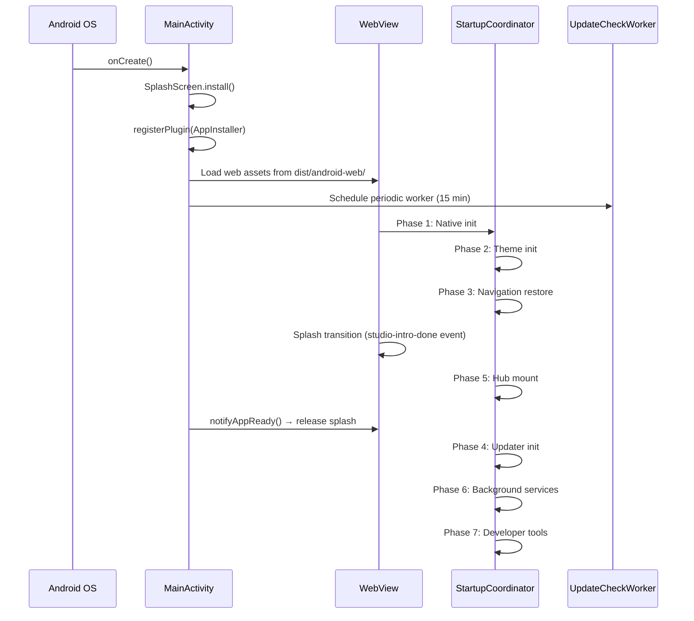

# Android Architecture

## Overview

The Android application is a **Capacitor 8.4.1 WebView** shell wrapping the React SPA. All business logic runs in the WebView; native Java code handles APK installation, background update polling, file sharing intents, and hardware permissions.

## Native Source Files

```
apps/studio-android/android/app/src/main/java/com/chordex/app/
├── MainActivity.java          (325 lines, 13.6 KB)
├── AppInstallerPlugin.java    (1860 lines, 85.8 KB)
├── InstallReceiver.java       (196 lines, 11.1 KB)
└── UpdateCheckWorker.java     (274 lines, 11.9 KB)
```

### MainActivity.java

Extends Capacitor's `BridgeActivity`. Responsibilities:

- **Splash screen**: AndroidX SplashScreen with JS→native handoff via `notifyAppReady()`
- **File sharing intents**: Handles `ACTION_VIEW` and `ACTION_SEND` for JSON and audio files
- **WebView permissions**: Auto-grants microphone permissions via custom `BridgeWebChromeClient`
- **Background updates**: Schedules `UpdateCheckWorker` via WorkManager on startup
- **Lifecycle instrumentation**: Logs `onCreate`, `onResume`, `onPause`, `onStop`, `onDestroy` with `SystemClock.elapsedRealtime()` timings
- **Native boot timings**: Injects `window.__nativeBootTimings = { processStart, onCreate, webViewInit }` into WebView
- **Plugin registration**: Manually registers `AppInstallerPlugin`

### AppInstallerPlugin.java (85.8 KB)

The primary Capacitor native plugin. This is the largest native file and handles:

| Category | Methods |
|----------|---------|
| **APK Download** | `downloadApk`, `downloadAndInstallApk`, `downloadFileWithResume` (HTTP redirect handling up to 8 hops, Range header resume, progress events) |
| **APK Installation** | `triggerInstallation` (PackageInstaller Session API), `installApk` |
| **APK Inspection** | `inspectApk` (extracts packageName, versionName/Code, signing cert SHA-256, debuggable flag, minSdk, targetSdk, X.509 cert details) |
| **Verification** | `verifySha256` (SHA-256 hash of downloaded APK file) |
| **Permissions** | `canRequestPackageInstalls`, `openUnknownAppSourcesSettings`, `openInstallPermissionSettings` |
| **Secure Storage** | EncryptedSharedPreferences via `MasterKeys.AES256_GCM_SPEC` |
| **Diagnostics** | `getExtendedDiagnostics` (PackageInstaller session dump), `logNativeInstrumentation`, call counters per method |
| **Device Info** | `getDeviceInfo` (model, SDK, architecture, locale, storage, network, battery, RAM) |
| **Clipboard** | `copyToClipboard` |
| **Notification** | `notifyAppReady` (releases splash screen) |

**Event bridge to JS:**
- `onInstallStatusChanged` — PackageInstaller status updates
- `apkDownloadProgress` — Download progress (bytes/total)
- `onNativeInstrumentation` — Native diagnostic events

### InstallReceiver.java

`BroadcastReceiver` for `com.chordex.app.SESSION_API_PACKAGE_INSTALLED`.

- Receives PackageInstaller results (success, cancelled, signature mismatch, storage error, version downgrade)
- Persists results to SharedPreferences for cold-start recovery
- Emits status to JS via `AppInstallerPlugin.notifyListeners()` when plugin is available
- Sets `pending_js_notification` flag when app was killed during install

### UpdateCheckWorker.java

WorkManager periodic worker (15-minute intervals):

- Polls Firebase Hosting manifests (`app-release.json` and `version.json`)
- Compares remote version against installed version from SharedPreferences
- Posts Android system notification for new versions even when app is closed
- Shares state with JS via `@capacitor/preferences` (CapacitorStorage SharedPreferences)

## Android Manifest

### Permissions

| Permission | Purpose |
|------------|---------|
| `INTERNET` | Network access |
| `RECORD_AUDIO` | Vocalex recording |
| `MODIFY_AUDIO_SETTINGS` | Audio engine control |
| `POST_NOTIFICATIONS` | Update notifications (Android 13+) |
| `REQUEST_INSTALL_PACKAGES` | OTA APK installation |
| `READ_EXTERNAL_STORAGE` | File access |
| `WRITE_EXTERNAL_STORAGE` | File write (maxSdkVersion=32) |
| `READ_MEDIA_IMAGES` | Media access (Android 13+) |
| `READ_MEDIA_AUDIO` | Audio file access |
| `READ_MEDIA_VIDEO` | Video file access |

### Intent Filters

- `ACTION_VIEW` for `application/json` files (file://, content://)
- `ACTION_VIEW` for `audio/*` files
- `ACTION_SEND` for JSON and audio files (Share Sheet integration)
- App Shortcuts (`@xml/shortcuts`)

### Registered Components

- `InstallReceiver` — exported BroadcastReceiver
- `FileProvider` — secure file sharing

## Build Configuration (`build.gradle`)

| Property | Value |
|----------|-------|
| Package | `com.chordex.app` |
| Java | 21 |
| minSdk | 23 |
| compileSdk | 35 |
| targetSdk | 35 |
| minifyEnabled | true (release) |
| shrinkResources | true (release) |
| ProGuard | enabled |

### Signing

- **Debug**: Keystore checked into repo for consistent SHA-1 fingerprints (Google Sign-In compatibility)
- **Production**: Keystore from environment variables:
  - `ANDROID_KEYSTORE_BASE64` — base64-encoded keystore file
  - `ANDROID_KEYSTORE_PASSWORD`
  - `ANDROID_KEY_ALIAS`
  - `ANDROID_KEY_PASSWORD`

### Dependencies

| Dependency | Purpose |
|------------|---------|
| `capacitor-android` | Capacitor runtime |
| `play-services-auth` | Google Sign-In |
| `firebase-auth` | Firebase Authentication |
| `work-runtime:2.9.1` | Background update polling |
| `security-crypto:1.0.0` | EncryptedSharedPreferences |
| `guava:33.2.1-android` | ListenableFuture for WorkManager |
| `core-splashscreen` | AndroidX Splash Screen |

## Capacitor Plugins

| Plugin | Package | Purpose |
|--------|---------|---------|
| Core | `@capacitor/core` | Runtime, `isNativePlatform()`, `registerPlugin()` |
| Android | `@capacitor/android` | Platform support |
| App | `@capacitor/app` | App lifecycle events |
| Filesystem | `@capacitor/filesystem` | File I/O for APK cache |
| Local Notifications | `@capacitor/local-notifications` | Update available notifications |
| Preferences | `@capacitor/preferences` | SharedPreferences bridge (JS↔native) |
| Screen Orientation | `@capacitor/screen-orientation` | Orientation lock (Stagex) |
| Share | `@capacitor/share` | Share APK via Android Share Sheet |
| Status Bar | `@capacitor/status-bar` | Status bar style/color |
| Firebase Auth | `@capacitor-firebase/authentication` | Google Sign-In (skipNativeAuth: true) |
| **AppInstaller** | Custom | APK download, install, inspect, verify |

### Custom AppInstaller Plugin

Registered as:
```typescript
// JS side (apkDownloader.ts)
const AppInstaller = registerPlugin<AppInstallerPlugin>('AppInstaller');

// Native side (MainActivity.java)
bridge.registerPlugin(AppInstallerPlugin.class);
```

A Proxy guard blocks mock/simulated paths from reaching native code.

## Lifecycle Flow



## Security Model

1. **Secure storage**: EncryptedSharedPreferences with AES-256-GCM for sensitive values
2. **APK integrity**: SHA-256 hash verification against remote manifest
3. **Signing verification**: X.509 certificate SHA-256 fingerprint matching against `PRODUCTION_SIGNING_SHA256`
4. **PackageInstaller**: OS-level signature verification (status code 5 = mismatch)
5. **Firebase Auth**: Token-based, with Capacitor bridge for Google Sign-In
6. **Encrypted Zustand state**: All persisted stores use `secureReadLocal`/`secureWriteLocal`
