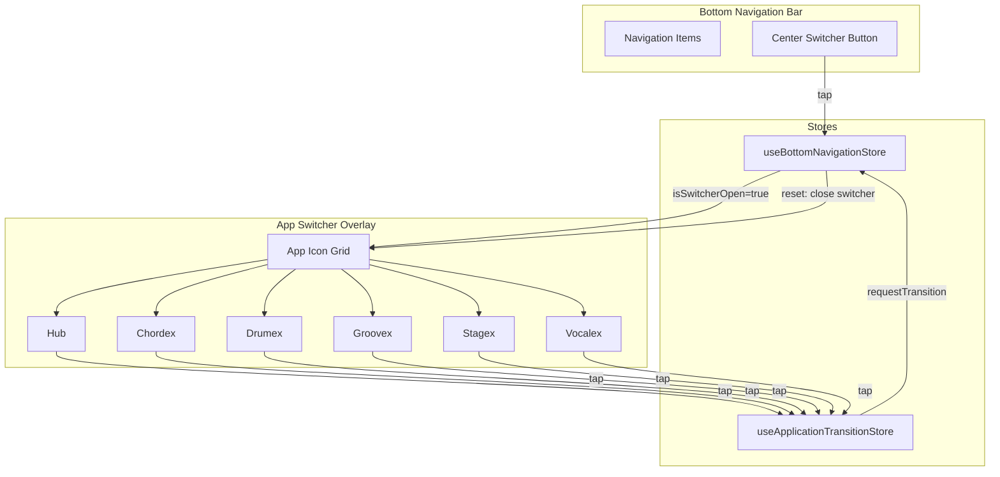
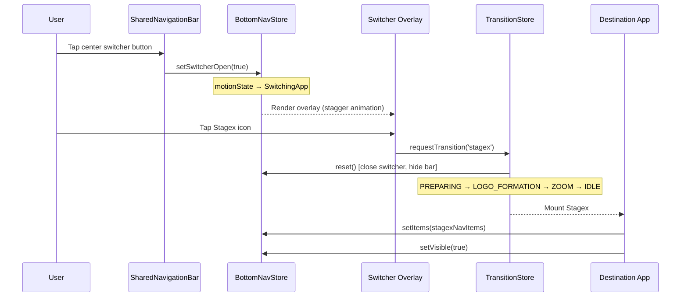

# App Switcher

The App Switcher is the overlay modal that allows users to switch between Livex sub-applications (Hub, Chordex, Drumex, Groovex, Stagex, Vocalex) from within any screen.

---

## Purpose

Provide instant access to all Livex applications from any screen via a single tap on the center navigation button, with smooth transitions and clear visual feedback.

## Responsibilities

| Responsibility | Owner |
|---|---|
| Switcher open/close state | `useBottomNavigationStore.isSwitcherOpen` |
| Switcher trigger button | [SharedNavigationBar.tsx](file:///c:/Users/ayuda/Documents/.gemini/antigravity/scratch/Studio/packages/ui-shared/src/navigation/SharedNavigationBar.tsx) |
| App icon grid rendering | [SharedNavigationBar.tsx](file:///c:/Users/ayuda/Documents/.gemini/antigravity/scratch/Studio/packages/ui-shared/src/navigation/SharedNavigationBar.tsx) |
| Transition orchestration | [useApplicationTransitionStore.ts](file:///c:/Users/ayuda/Documents/.gemini/antigravity/scratch/Studio/packages/studio-core/src/lib/navigation/useApplicationTransitionStore.ts) |

## Architecture

## Data Flow — Complete User Journey

## App Keys

| Key | Application | Icon |
|---|---|---|
| `hub` | Hub (Home) | `home` |
| `chordex` | Chordex (Chords) | `music_note` |
| `drumex` | Drumex (Drums) | `drum` |
| `groovex` | Groovex (Grooves) | `queue_music` |
| `stagex` | Stagex (Stage) | `dashboard` |
| `vocalex` | Vocalex (Vocals) | `mic` |

## Lifecycle

1. **Closed** → User taps center button → `setSwitcherOpen(true)` → `motionState: 'SwitchingApp'`
2. **Open** → Overlay renders with glassmorphic blur backdrop and stagger-animated app icons
3. **Selection** → User taps app icon → `requestTransition(appKey)` → switcher is closed via `reset()`
4. **Transition** → Full transition lifecycle runs (see [transition-engine.md](file:///c:/Users/ayuda/Documents/.gemini/antigravity/scratch/Studio/docs/architecture/transition-engine.md))
5. **Recovery** → Destination app mounts and re-registers its own bottom nav items

## Design Decisions

1. **Integrated into SharedNavigationBar**: The switcher is not a separate component — it's rendered as part of the bottom navigation bar to share the glassmorphic backdrop and animation context.
2. **Cross-store coordination**: Opening the switcher updates `useBottomNavigationStore`. Selecting an app triggers `useApplicationTransitionStore.requestTransition()` which resets `useBottomNavigationStore`, closing the switcher. This one-directional dependency prevents circular updates.
3. **Stagger animation**: App icons animate in with staggered delays for a premium cascading reveal.
4. **Current app highlighting**: The currently active app is visually highlighted (accent border/glow) in the grid.

## Known Constraints

- The switcher is hardcoded to 6 apps. Adding a new app requires modifying the grid layout.
- No long-press or drag-to-reorder — the app order is fixed.
- The switcher must be fully closed before the transition begins to prevent overlapping UI (enforced by `requestTransition` calling `reset()`).

## Related Documentation

- [transition-engine.md](file:///c:/Users/ayuda/Documents/.gemini/antigravity/scratch/Studio/docs/architecture/transition-engine.md) — Handles the actual app switching transition
- [bottom-navigation.md](file:///c:/Users/ayuda/Documents/.gemini/antigravity/scratch/Studio/docs/architecture/bottom-navigation.md) — Manages the switcher's parent bar
- [bottom-navigation-overlap.md](file:///c:/Users/ayuda/Documents/.gemini/antigravity/scratch/Studio/docs/bugs/bottom-navigation-overlap.md) — Bug where switcher persisted during transitions

## Future Improvements

- Dynamic app list from a registry (support for plugin apps).
- Long-press to show app info or recent screens.
- Gesture-based dismiss (swipe down to close).
- Recent app ordering based on usage frequency.
