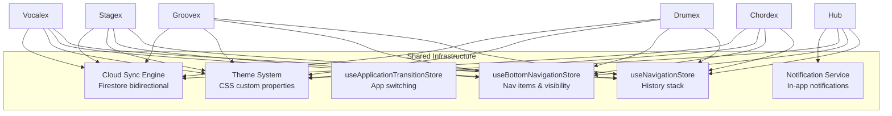

# Livex Sub-Applications

Livex is composed of 6 sub-applications that share a common infrastructure (navigation, theme, sync, notifications) while owning their own feature logic, internal navigation, and bottom navigation items.

---

## Purpose

Document the responsibilities, entry points, root screens, and navigation ownership of each Livex sub-application to prevent architectural drift, duplicated implementations, and cross-app coupling violations.

## Application Registry

| App Key | Name | Root Screen | Entry Component |
|---|---|---|---|
| `hub` | Hub | Home | [StudioHub.tsx](file:///c:/Users/ayuda/Documents/.gemini/antigravity/scratch/Studio/packages/ui-shared/src/components/hub/StudioHub.tsx) |
| `chordex` | Chordex | Library | App.tsx wrapper |
| `drumex` | Drumex | Main Editor | [DrumEditor.tsx](file:///c:/Users/ayuda/Documents/.gemini/antigravity/scratch/Studio/packages/ui-shared/src/features/drumex/DrumEditor.tsx) |
| `groovex` | Groovex | Home | [GroovexApp.tsx](file:///c:/Users/ayuda/Documents/.gemini/antigravity/scratch/Studio/packages/ui-shared/src/features/groovex/GroovexApp.tsx) |
| `stagex` | Stagex | Main Workspace | [StageCorePanel.tsx](file:///c:/Users/ayuda/Documents/.gemini/antigravity/scratch/Studio/packages/ui-shared/src/features/stagex/pages/StageCorePanel.tsx) |
| `vocalex` | Vocalex | Home | [VocalexApp.tsx](file:///c:/Users/ayuda/Documents/.gemini/antigravity/scratch/Studio/packages/ui-shared/src/features/vocalex/VocalexApp.tsx) |

---

## Hub

The central launcher, settings manager, and system dashboard.

### Responsibilities
- Application launcher (home tab with app orbit)
- Settings management (general, appearance, language, privacy, about, debug, developer)
- Notification Center (Activity & Updates timeline)
- User profile management
- Release notes, changelog, help center, FAQ
- Developer tools access

### Navigation
- **Tabs**: Home, Settings, Help
- **Settings sub-pages**: general, appearance, language, privacy, about, debug, profile, release-notes, help-center, faq, terms, privacy-policy, bug-report, developer, notifications

### Key Stores
- `useChordStore` (settings), `useNotificationService` (notifications)

---

## Chordex

Chord practice and learning suite.

### Responsibilities
- Chord diagram display and interactive practice
- Custom chord builder
- Progression generator
- Song catalog with chord charts
- Library management

### Navigation
- **Root**: Library
- Internal drill-down navigation for chord details, song view, custom builder, progression generator

### Key Stores
- `useChordStore` (songs, chords, settings, custom chords)

---

## Drumex

Drum pattern sequencer and beat programming tool.

### Responsibilities
- Step sequencer grid editor
- Drum pattern management
- Beat programming with multiple instrument lanes
- Tempo and time signature control

### Navigation
- **Root**: Main Editor
- Internal navigation for pattern selection, instrument settings

### Key Stores
- `useDrumStore` (patterns, instruments, playback state)

---

## Groovex

Music playback and groove exploration.

### Responsibilities
- Audio playback engine
- Music library browsing
- Groove exploration and favorites
- Playback preferences

### Navigation
- **Root**: Home
- **Key screens**: Home, Player, Library, Preferences

### Key Stores
- `useChordStore` (shared settings), Groovex-specific playback state

---

## Stagex

DAW-style workspace for audio arrangement and stage element placement.

### Responsibilities
- Canvas-based element placement and arrangement
- History/undo system
- Audio track layout
- Element properties editing

### Navigation
- **Root**: Main Workspace
- Internal navigation for element inspector, history panel

### Special Considerations
- On some platforms, lives in an iframe and communicates via `postMessage` for sync.
- Has a dedicated Android variant in `packages/ui-android/src/components/StageCorePanel.tsx`.

### Key Stores
- Internal state management, syncs via `postMessage` bridge

---

## Vocalex

Vocal training, pitch detection, and recording studio.

### Responsibilities
- Real-time pitch detection via `pitchYin` algorithm
- Audio recording with take management
- Takes panel with waveform visualization
- Coach panel for vocal guidance
- Lab sessions for structured practice

### Navigation
- **Root**: Home
- Internal navigation for recording view, takes panel, coach, lab sessions

### Storage
- IndexedDB for takes and audio blobs (via `takesDb` and `labSessionDb`)
- Audio blobs serialized as base64 for cloud sync

### Key Features
- [RecordingView](file:///c:/Users/ayuda/Documents/.gemini/antigravity/scratch/Studio/packages/ui-shared/src/features/vocalex/RecordingView.tsx) — Real-time pitch visualization
- [TakesPanel](file:///c:/Users/ayuda/Documents/.gemini/antigravity/scratch/Studio/packages/ui-shared/src/features/vocalex/TakesPanel.tsx) — Take management and playback
- [CoachPanel](file:///c:/Users/ayuda/Documents/.gemini/antigravity/scratch/Studio/packages/ui-shared/src/features/vocalex/CoachPanel.tsx) — Vocal coaching UI

---

## Shared Infrastructure

All sub-applications share these systems:

## App Registration Flow

1. `App.tsx` mounts the active sub-application based on `useNavigationStore`'s current app key.
2. Each app registers its bottom nav items via `useBottomNavigationStore.setItems()` in `useEffect`.
3. Each app defines internal navigation within `SharedNavigationContainer`.
4. Back navigation is isolated per-app via `isRootRouteOnly()` in [validation.ts](file:///c:/Users/ayuda/Documents/.gemini/antigravity/scratch/Studio/packages/studio-core/src/lib/navigation/validation.ts).
5. App switching is handled by `useApplicationTransitionStore.requestTransition()`.

## Design Decisions

1. **Feature-folder organization**: Each app lives under `packages/ui-shared/src/features/<appName>/` to keep feature code co-located.
2. **Shared stores, isolated navigation**: Apps share global stores but own their navigation stacks. Back never crosses app boundaries.
3. **Dynamic bottom nav registration**: Apps register their own nav items on mount rather than having a centralized registry, allowing each app to control its own navigation structure.

## Known Constraints

- Hub's `StudioHub.tsx` is 7000+ lines. It should be split into smaller modules.
- Chordex shares `useChordStore` with the global settings system, creating tight coupling.
- Stagex iframe communication adds complexity and latency to the sync pipeline.

## Future Improvements

- Extract Hub settings pages into separate component files.
- Separate Chordex app state from global settings into dedicated stores.
- Plugin architecture for dynamically adding new sub-applications.
