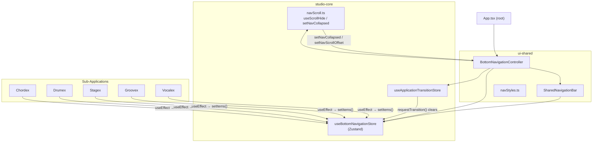
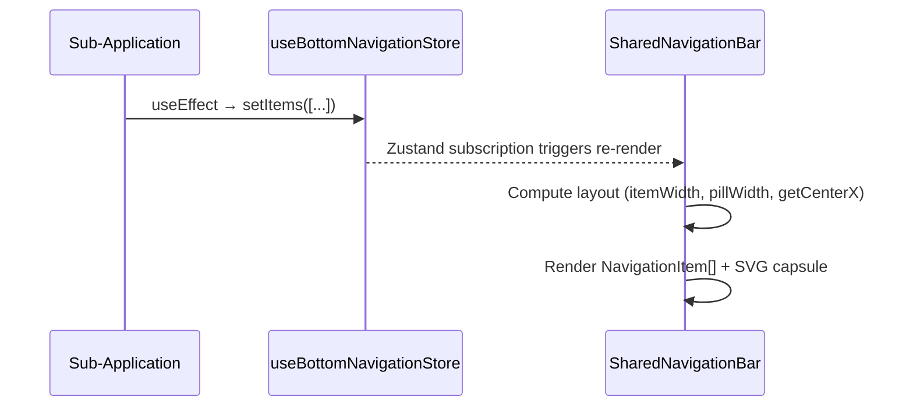
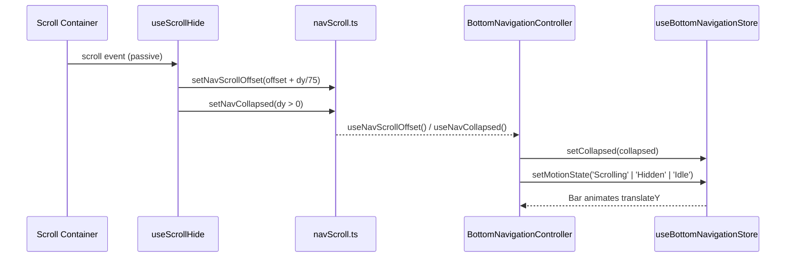
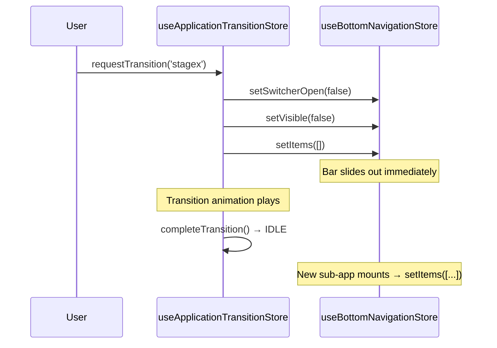
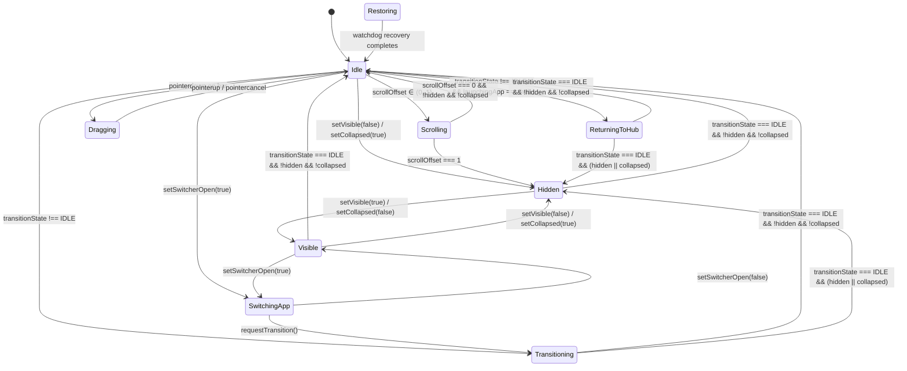

# Bottom Navigation System

## Purpose

Provides a centralized, animated bottom navigation bar for mobile/hybrid interfaces. The bar supports dynamic item registration by sub-applications, scroll-driven hide/reveal, a drag-to-scrub interaction model, an app switcher overlay, and a motion state machine that coordinates with the application transition engine.

## Responsibilities

| Concern                                                       | Owner                                                                                                                                                                            |
| ------------------------------------------------------------- | -------------------------------------------------------------------------------------------------------------------------------------------------------------------------------- |
| Global navigation state (visibility, collapse, items, motion) | [useBottomNavigationStore.ts](file:///c:/Users/ayuda/Documents/.gemini/antigravity/scratch/Studio/packages/studio-core/src/lib/navigation/useBottomNavigationStore.ts)           |
| Scroll-driven hide/reveal + watchdog recovery                 | [navScroll.ts](file:///c:/Users/ayuda/Documents/.gemini/antigravity/scratch/Studio/packages/studio-core/src/lib/navigation/navScroll.ts)                                         |
| State synchronization and platform gating                     | [BottomNavigationController.tsx](file:///c:/Users/ayuda/Documents/.gemini/antigravity/scratch/Studio/packages/ui-shared/src/navigation/BottomNavigationController.tsx)           |
| Rendering, capsule animation, pointer scrubbing               | [SharedNavigationBar.tsx](file:///c:/Users/ayuda/Documents/.gemini/antigravity/scratch/Studio/packages/ui-shared/src/navigation/SharedNavigationBar.tsx)                         |
| CSS transform/transition helpers                              | [navStyles.ts](file:///c:/Users/ayuda/Documents/.gemini/antigravity/scratch/Studio/packages/ui-shared/src/navigation/navStyles.ts)                                               |
| Cross-store cleanup at transition boundaries                  | [useApplicationTransitionStore.ts](file:///c:/Users/ayuda/Documents/.gemini/antigravity/scratch/Studio/packages/studio-core/src/lib/navigation/useApplicationTransitionStore.ts) |

## Architecture



### Layer Separation

- **`studio-core`** — State-only. No rendering. Exports the Zustand store, scroll-hide primitives, and transition coordination.
- **`ui-shared`** — Rendering layer. `BottomNavigationController` is the bridge that reads reactive hooks (`useNavHidden`, `useNavCollapsed`, `useNavScrollOffset`) and synchronizes them into the Zustand store. `SharedNavigationBar` is the pure renderer.

## Dependencies

| Dependency               | Package       | Used For                                                       |
| ------------------------ | ------------- | -------------------------------------------------------------- |
| `zustand`                | `studio-core` | `useBottomNavigationStore`, `useApplicationTransitionStore`    |
| `motion/react`           | `ui-shared`   | Spring animations, `useMotionValue`, `useTransform`, `animate` |
| `@workspace/studio-core` | `ui-shared`   | Store access, scroll hooks, navigation dispatcher              |
| Material Symbols         | `ui-shared`   | Icon font for string-based `BottomNavItem.icon` values         |

## Data Flow

### Item Registration



### Scroll-Hide Cycle



### App Transition Cleanup



## Lifecycle

1. **Boot** — `BottomNavigationController` is mounted once in `App.tsx`. Store initializes to `{ motionState: 'Idle', visible: true, collapsed: false, items: [] }`.
2. **Sub-app mount** — Each sub-app calls `useBottomNavigationStore.getState().setItems(myItems)` inside a `useEffect`. Items are replaced wholesale (not merged).
3. **Scrolling** — `useScrollHide` binds to scroll containers. Scroll-down collapses the bar (`setNavCollapsed(true)`), scroll-up or near-top expands it. Progressive `scrollOffset` (0–1) controls `translateY` for smooth intermediate positions.
4. **App switch** — User taps the app switcher button → `setSwitcherOpen(true)` → bar renders `switcherApps` instead of the sub-app's registered items. On selection, `NavigationDispatcher.push()` fires → `useApplicationTransitionStore.requestTransition()` synchronously clears the bottom nav store.
5. **Transition complete** — Transition store returns to `IDLE` → Controller sets `motionState` back to `'Idle'` or `'Hidden'` depending on current `hidden`/`collapsed` state. New sub-app mounts and registers its items.
6. **Recovery** — If the bar gets stuck hidden/collapsed due to an interrupted transition, the watchdog system in `navScroll.ts` auto-resets after 200ms (hidden) or immediately (collapsed with no active scroll owners).

### Platform Gating

`BottomNavigationController` returns `null` on desktop web viewports (`window.innerWidth > 768` and non-Capacitor). The bar is mobile/tablet only.

## Controllers / Services

### BottomNavigationController

[BottomNavigationController.tsx](file:///c:/Users/ayuda/Documents/.gemini/antigravity/scratch/Studio/packages/ui-shared/src/navigation/BottomNavigationController.tsx)

Acts as the **synchronization bridge** between reactive hooks and the Zustand store. It does not render UI directly — it delegates to `SharedNavigationBar`.

| Effect                    | Trigger                         | Store Action                                                                |
| ------------------------- | ------------------------------- | --------------------------------------------------------------------------- |
| `hidden` changed          | `useNavHidden()`                | `setVisible(!hidden)`                                                       |
| `collapsed` changed       | `useNavCollapsed()`             | `setCollapsed(collapsed)`                                                   |
| `scrollOffset` changed    | `useNavScrollOffset()`          | `setMotionState('Scrolling' \| 'Hidden' \| 'Idle')`                         |
| `transitionState` changed | `useApplicationTransitionStore` | `setMotionState('ReturningToHub' \| 'Transitioning' \| 'Idle' \| 'Hidden')` |

### navScroll.ts — Scroll-Hide Engine

[navScroll.ts](file:///c:/Users/ayuda/Documents/.gemini/antigravity/scratch/Studio/packages/studio-core/src/lib/navigation/navScroll.ts)

Module-level singletons manage `hidden`, `collapsed`, and `scrollOffset` states outside React. This is intentional for performance — scroll listeners fire at high frequency and must not trigger React re-renders on every event.

**Key APIs:**

| Function                     | Description                                                                                                                                          |
| ---------------------------- | ---------------------------------------------------------------------------------------------------------------------------------------------------- |
| `setNavHidden(boolean)`      | Programmatic full-hide (e.g., preset editor, modals). 4-second auto-show timer if not locked.                                                        |
| `setNavCollapsed(boolean)`   | Scroll-driven collapse. Sets `data-nav-collapsed` attribute on `<html>`.                                                                             |
| `setNavScrollOffset(number)` | Progressive 0–1 offset for intermediate slide translation. Clamped.                                                                                  |
| `setNavLocked(boolean)`      | Prevents show/expand while locked. Unlocking auto-resets both hidden and collapsed.                                                                  |
| `resetNav()`                 | Full reset: unlocks, un-hides, un-collapses, zeroes scroll offset.                                                                                   |
| `useScrollHide(ref, dep?)`   | React hook. Binds scroll listener to a `ref`. Scroll-down → collapse, scroll-up → expand. Jitter filter at 2px. Progressive offset ratio: `dy / 75`. |
| `onStateChanged()`           | Self-healing watchdog. Checks for orphaned collapsed/hidden states and auto-recovers.                                                                |

**Global event bindings** (initialized at module load on `window`):

- `useNavigationStore.subscribe` — resets nav on route change
- `MutationObserver` on `document.body` — triggers `onStateChanged` when DOM changes while hidden/collapsed
- `fullscreenchange` events — triggers `onStateChanged`
- `focus` / `visibilitychange` — calls `resetNav()` on app resume
- `resize` / `orientationchange` — calls `resetNav()`

## Public API

### useBottomNavigationStore (Zustand)

[useBottomNavigationStore.ts](file:///c:/Users/ayuda/Documents/.gemini/antigravity/scratch/Studio/packages/studio-core/src/lib/navigation/useBottomNavigationStore.ts)

#### State Shape

| Field            | Type                   | Default  | Description                           |
| ---------------- | ---------------------- | -------- | ------------------------------------- |
| `motionState`    | `BottomNavMotionState` | `'Idle'` | Current animation/interaction phase   |
| `visible`        | `boolean`              | `true`   | Programmatic visibility flag          |
| `collapsed`      | `boolean`              | `false`  | Scroll-driven collapse flag           |
| `isSwitcherOpen` | `boolean`              | `false`  | App switcher overlay is showing       |
| `items`          | `BottomNavItem[]`      | `[]`     | Currently registered navigation items |
| `isLight`        | `boolean`              | `false`  | Light theme variant                   |
| `debugLog`       | `boolean`              | `true`   | Console logging for state transitions |

#### BottomNavItem

```typescript
interface BottomNavItem {
  key: string; // Unique identifier
  icon: string | React.JSX.Element; // Material Symbol name OR JSX component
  label: string; // Accessibility label
  isActive: boolean; // Whether this item is currently selected
  onClick: () => void; // Tap handler
}
```

#### Actions

All actions perform **dedup checks** — they no-op if the new value equals the current value.

| Action                    | Side Effect                                                  |
| ------------------------- | ------------------------------------------------------------ |
| `setMotionState(state)`   | Logs `prev -> next` transition                               |
| `setVisible(visible)`     | Auto-derives `motionState` → `'Visible'` or `'Hidden'`       |
| `setCollapsed(collapsed)` | Auto-derives `motionState` → `'Hidden'` or `'Visible'`       |
| `setSwitcherOpen(open)`   | Auto-derives `motionState` → `'SwitchingApp'` or `'Visible'` |
| `setItems(items)`         | Direct set, no dedup (array identity)                        |
| `setIsLight(isLight)`     | Direct set                                                   |
| `setDebugLog(enabled)`    | Direct set                                                   |
| `logState(action)`        | Logs full state snapshot to console when `debugLog` is true  |

## Internal API

### SharedNavigationBar — Renderer

[SharedNavigationBar.tsx](file:///c:/Users/ayuda/Documents/.gemini/antigravity/scratch/Studio/packages/ui-shared/src/navigation/SharedNavigationBar.tsx)

#### Layout Model

```
Screen width (windowWidth)
├── Switcher button: 54px (46px circle + 8px gap) — only when currentApp !== 'hub'
└── Bar: min(330px, windowWidth - 32 - switcherButtonWidth)
    ├── paddingX: 4px each side
    └── Usable width = barWidth - 8px
        ├── itemWidth = usableWidth / N
        └── pillWidth = itemWidth - 12px (insetX * 2)
```

#### Active Capsule (pillPathD)

The active highlight is a **dynamic SVG Bezier path** computed reactively from two motion values:

- `pillSkewX` — velocity-driven skew during drag (clamped ±10°)
- `pressureOffset` — 4px inset on press-down, spring-released on pointer-up

**Geometry constants:**

- Height `H = 38px`
- Corner radius `R = 19px` (half-height, full pill shape)
- Minimum width clamp: `if (rightX - leftX < H)` → pad both edges equally to `H`

The min-width clamp prevents the capsule from collapsing into a vertical lemon shape when 6+ items compress the available space. See [app-switcher-capsule-deformation.md](file:///c:/Users/ayuda/Documents/.gemini/antigravity/scratch/Studio/docs/bugs/app-switcher-capsule-deformation.md).

#### Pointer Interaction Model

| Phase                   | Behavior                                                                                                                                                          |
| ----------------------- | ----------------------------------------------------------------------------------------------------------------------------------------------------------------- |
| `pointerdown`           | Captures pointer. Starts 200ms press timer. Applies `pressureOffset` spring (4px). Sets `motionState → 'Dragging'`.                                               |
| Hold ≥ 200ms            | Enters scrubbing mode. Haptic feedback (15ms vibrate). Pill snaps to pointer position.                                                                            |
| Drag > 10px             | Enters scrubbing mode early (before timer). Pill follows pointer with velocity-based skew. Haptic tick on item boundary crossings (5ms vibrate).                  |
| `pointerup` (scrubbing) | Snaps pill to nearest item center via spring. Invokes `onClick()` of the landing item if it differs from the original active item. Resets `motionState → 'Idle'`. |
| `pointerup` (tap)       | Computes clicked item from pointer position. Invokes `onClick()`.                                                                                                 |
| `pointercancel`         | Snaps pill back to original active item. Full spring reset.                                                                                                       |

#### Spring Configuration

| Animation               | Stiffness | Damping | Mass |
| ----------------------- | --------- | ------- | ---- |
| Pill snap to active tab | 380       | 22      | 0.5  |
| Container show/hide     | 380       | 24      | 0.35 |
| Skew reset              | 400       | 20      | —    |
| Pressure offset reset   | 400       | 20      | —    |
| Pressure offset apply   | 500       | 25      | —    |

#### App Switcher Overlay

When `isSwitcherOpen === true`, the bar replaces the current sub-app's items with a hardcoded list of 6 app entries:

| Key       | Label   | Icon Component   |
| --------- | ------- | ---------------- |
| `hub`     | Hub     | `StudioLogo`     |
| `chords`  | Chordex | `ChordexLogo`    |
| `drums`   | Drumex  | `DrumexLogo`     |
| `stage`   | Stagex  | `StagexLogoIcon` |
| `groovex` | Groovex | `GroovexLogo`    |
| `vocalex` | Vocalex | `VocalexLogo`    |

Selection triggers `NavigationDispatcher.push({ app: key })` + `useChordStore.updateSettings({ appMode: key })`.

The switcher toggle button (circular, 46px) only renders when `currentApp !== 'hub'` — the Hub has no need to switch to itself.

### NavigationItem (memoized sub-component)

Per-item button with two proximity-driven motion transforms keyed to `pillX`:

- **Scale**: 1.0 → 1.18 → 1.0 (peak at item center ± 1.2× itemWidth)
- **Opacity**: 0.55 → 1.0 → 0.55 (same range)

Supports both string icons (Material Symbols with `FILL` variation toggle) and JSX element icons.

### navStyles.ts — Transform Helpers

[navStyles.ts](file:///c:/Users/ayuda/Documents/.gemini/antigravity/scratch/Studio/packages/ui-shared/src/navigation/navStyles.ts)

| Export                                               | Description                                                                                                             |
| ---------------------------------------------------- | ----------------------------------------------------------------------------------------------------------------------- |
| `SHARED_NAV_TRANSITION`                              | CSS transition string: `transform 250ms cubic-bezier(0.2, 0.8, 0.2, 1)` + border-radius, background, border, box-shadow |
| `getSharedNavTransform(hidden, collapsed, entered?)` | Returns CSS `transform` string. Hidden → full offscreen. Collapsed → `scaleX(0.33) scaleY(0.045)`. Normal → identity.   |
| `getSharedNavOpacity(hidden, collapsed, entered?)`   | Returns `0` before entry, `1` otherwise.                                                                                |

## Shared Components

### useStartupComplete (internal hook)

Polls `window.__studioStartupComplete` via 100ms interval and listens for `studio-launch-complete` custom event. Returns `true` once startup is confirmed. Used to prevent the bar from rendering prematurely during app boot.

## Motion State Machine



### State Descriptions

| State            | Trigger                                                 | Behavior                                             |
| ---------------- | ------------------------------------------------------- | ---------------------------------------------------- |
| `Idle`           | Default / resting                                       | Bar fully visible, no animations in flight           |
| `Scrolling`      | `scrollOffset` between 0 and 1                          | Bar partially translated downward                    |
| `Hidden`         | `visible=false` or `collapsed=true` or `scrollOffset=1` | Bar fully offscreen (translateY 150px)               |
| `Visible`        | `setVisible(true)` or `setCollapsed(false)`             | Bar animating into view (transient before `Idle`)    |
| `Dragging`       | `pointerdown` on the bar                                | Pointer captured, pill following finger              |
| `SwitchingApp`   | `setSwitcherOpen(true)`                                 | App switcher items rendered instead of sub-app items |
| `ReturningToHub` | Transition active with `launchingApp === 'hub'`         | Specialized transition state for hub return          |
| `Transitioning`  | Transition active (non-hub target)                      | Bar hidden during app-to-app animation               |
| `Restoring`      | Watchdog self-healing                                   | Recovery from stuck hidden/collapsed state           |

### Auto-Derived Transitions

Several store actions automatically derive `motionState`:

- `setVisible(true)` → `motionState = 'Visible'`
- `setVisible(false)` → `motionState = 'Hidden'`
- `setCollapsed(true)` → `motionState = 'Hidden'`
- `setCollapsed(false)` → `motionState = 'Visible'`
- `setSwitcherOpen(true)` → `motionState = 'SwitchingApp'`
- `setSwitcherOpen(false)` → `motionState = 'Visible'`

## Design Decisions

| Decision                                                       | Rationale                                                                                                                                                                                                                                            |
| -------------------------------------------------------------- | ---------------------------------------------------------------------------------------------------------------------------------------------------------------------------------------------------------------------------------------------------- |
| **Module-level singletons for scroll state** (`navScroll.ts`)  | Scroll listeners fire at 60Hz+. React state updates per-frame would cause excessive re-renders. Module-level variables with manual listener sets provide O(1) updates.                                                                               |
| **Dedup guards on all store actions**                          | Prevents redundant Zustand notifications and avoids infinite loops from bidirectional sync (controller ↔ store).                                                                                                                                     |
| **Synchronous cross-store cleanup in `requestTransition()`**   | Prevents ghost UI from the previous app's bottom nav appearing during transition animations. See [bottom-navigation-overlap.md](file:///c:/Users/ayuda/Documents/.gemini/antigravity/scratch/Studio/docs/bugs/bottom-navigation-overlap.md).         |
| **SVG Bezier path for active capsule** (not CSS border-radius) | Enables velocity-based skew deformation, per-corner radius variation, and pressure squeeze — impossible with CSS alone.                                                                                                                              |
| **Min-width clamp at `H` (38px) for capsule**                  | Prevents lemon deformation when 6+ items compress per-item width below capsule height. See [app-switcher-capsule-deformation.md](file:///c:/Users/ayuda/Documents/.gemini/antigravity/scratch/Studio/docs/bugs/app-switcher-capsule-deformation.md). |
| **Controller returns `null` on desktop web**                   | The bottom navigation is a mobile pattern. Desktop uses sidebar navigation. Threshold: `768px` width and non-Capacitor.                                                                                                                              |
| **Hardcoded switcher app list**                                | The set of apps is fixed and known at build time. Dynamic discovery would add complexity for no benefit.                                                                                                                                             |
| **Haptic feedback on scrub boundaries**                        | Provides tactile confirmation of item traversal during drag, critical for eyes-free operation.                                                                                                                                                       |

## Known Constraints

- **No automatic store cleanup registry.** When a new global UI store is added that needs transition cleanup, it must be manually wired into `requestTransition()`. There is no discovery mechanism.
- **Items replaced wholesale.** `setItems()` replaces the entire array. No merge/patch API exists. Sub-apps must provide the full items list on every update.
- **Switcher app list is hardcoded.** Adding a new app requires modifying `SharedNavigationBar.tsx`.
- **Desktop breakpoint is simplistic.** The `768px` cutoff in the controller does not account for tablets in landscape or split-screen modes.
- **`MutationObserver` on `document.body`** in `navScroll.ts` fires broadly. It is filtered (only acts when `_hidden || _collapsed`), but still observes all subtree mutations.
- **Scroll jitter filter at 2px** may swallow legitimate small scrolls on very precise trackpads.
- **`useStartupComplete` polls at 100ms.** If boot takes longer than expected, the bar may render before the app is interactive.

## Future Improvements

- **Transition cleanup registry** — A `transitionCleanup` registration pattern where stores subscribe to transition lifecycle events instead of being manually called from `requestTransition()`.
- **Responsive breakpoint system** — Replace the hard `768px` gate with a layout-aware system that considers device type, orientation, and split-screen mode.
- **Dynamic switcher app list** — Source from `appRegistry.ts` instead of hardcoding in the renderer.
- **Gesture-based dismiss** — Swipe-down on the bar itself to collapse, instead of relying solely on scroll container events.
- **Visual regression tests** — Snapshot tests for the capsule at item counts 3–6 and extreme screen widths to catch geometry bugs.
- **Accessibility** — Add `role="tablist"` / `role="tab"` semantics to the navigation items and capsule, and ensure focus management during scrub interactions.
