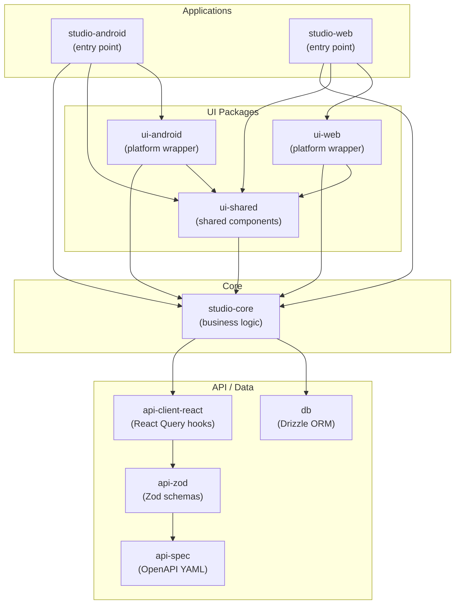
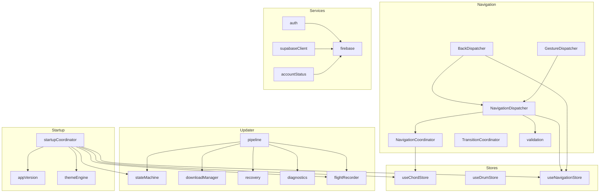
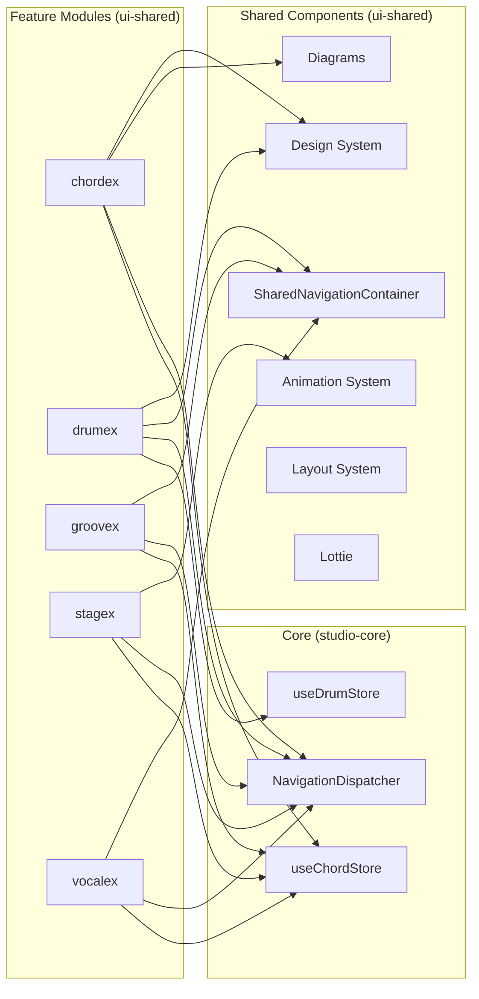
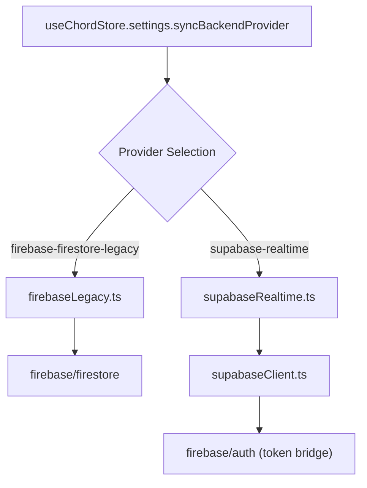
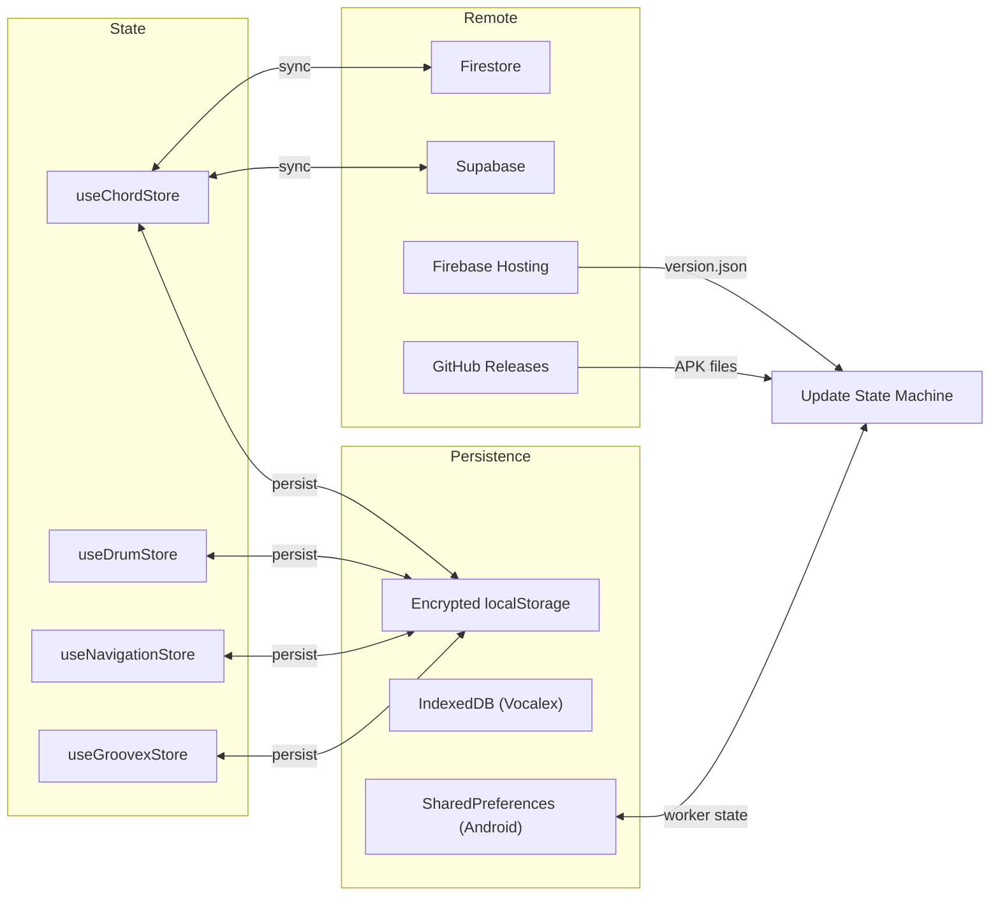

# Dependency Graph

## Package Dependency Matrix

## Strict Boundary Rules

| Rule | Enforcement |
|------|-------------|
| Web app cannot import `ui-android` | Build-time |
| Android app cannot import `ui-web` | Build-time |
| `studio-core` cannot import any UI package | Build-time |
| `ui-shared` cannot import platform-specific UI | Build-time |

## Package → External Dependencies

### studio-core

| Category | Dependencies |
|----------|-------------|
| State | `zustand`, `zustand/middleware` |
| Platform | `@capacitor/core` |
| Auth | `firebase/auth`, `@capacitor-firebase/authentication` |
| Database | `firebase/firestore`, `firebase/storage`, `@supabase/supabase-js` |
| i18n | `i18next`, `@tolgee/react` |
| Utilities | Various small utilities |

### ui-shared

| Category | Dependencies |
|----------|-------------|
| Framework | `react`, `react-dom` |
| Animation | `motion` (Framer Motion), `gsap`, `lottie-react` |
| State | `zustand` (via `@workspace/studio-core`) |
| Platform | `@capacitor/core` |
| Audio | `pitchy` (pitch detection) |
| i18n | `@tolgee/react` |

### ui-android

| Category | Dependencies |
|----------|-------------|
| Re-exports | `@workspace/ui-shared`, `@workspace/studio-core` |
| Platform | `@capacitor/core`, Capacitor plugins |
| Animation | `motion`, `gsap`, `lottie-react` |
| Auth | `firebase` |

### ui-web

| Category | Dependencies |
|----------|-------------|
| Re-exports | `@workspace/ui-shared`, `@workspace/studio-core` |
| Same as ui-android | (identical dependency list) |

## Internal Module Dependencies

### studio-core Internal

### Feature Module Dependencies

## Sync Backend Dependencies

## Data Flow

## Version Dependencies (pnpm catalog)

All workspace packages share versions via `pnpm-workspace.yaml` catalog:

| Dependency | Catalog Version |
|------------|-----------------|
| React | 19.2.7 |
| Vite | 8.1.4 |
| TypeScript | ~5.7.2 |
| Zustand | 5.0.14 |
| Framer Motion (`motion`) | 12.42.2 |
| Tailwind CSS | 4.3.2 |
| Capacitor | 8.4.1 |
| Firebase | 12.16.0 |
| Supabase JS | 2.110.2 |
| i18next | (catalog) |
