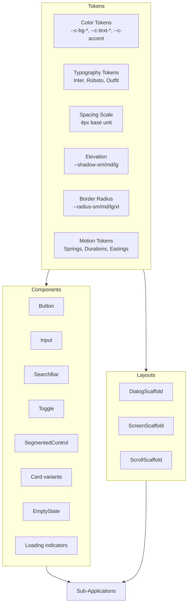

# Livex Design System

The design system provides the foundational visual tokens, reusable components, and layout primitives that ensure visual consistency across all Livex sub-applications and platforms.

---

## Purpose

Establish a single source of truth for colors, typography, spacing, elevation, motion, and component APIs so that every screen in Livex looks and feels like part of the same product — across Hub, Chordex, Drumex, Groovex, Stagex, and Vocalex.

## Responsibilities

| Responsibility                            | Owner                                                                                                                                                                                                                                                      |
| ----------------------------------------- | ---------------------------------------------------------------------------------------------------------------------------------------------------------------------------------------------------------------------------------------------------------- |
| Token definitions (CSS custom properties) | `index.css` in [studio-android](file:///c:/Users/ayuda/Documents/.gemini/antigravity/scratch/Studio/apps/studio-android/src/index.css) and [studio-web](file:///c:/Users/ayuda/Documents/.gemini/antigravity/scratch/Studio/apps/studio-web/src/index.css) |
| Component library                         | [packages/ui-shared/src/components/design-system/](file:///c:/Users/ayuda/Documents/.gemini/antigravity/scratch/Studio/packages/ui-shared/src/components/design-system/)                                                                                   |
| Design system reference                   | [StudioDesignSystem.tsx](file:///c:/Users/ayuda/Documents/.gemini/antigravity/scratch/Studio/packages/ui-shared/src/components/design-system/StudioDesignSystem.tsx) (~25KB)                                                                               |
| Motion tokens                             | [motion-system.md](file:///c:/Users/ayuda/Documents/.gemini/antigravity/scratch/Studio/docs/architecture/motion-system.md)                                                                                                                                 |
| Theme switching                           | [themeTransitionEngine.ts](file:///c:/Users/ayuda/Documents/.gemini/antigravity/scratch/Studio/packages/studio-core/src/lib/themeTransitionEngine.ts)                                                                                                      |

## Architecture

## Token System

### Colors (~40 CSS custom properties)

| Token                | Purpose                 | Light     | Dark      | AMOLED    |
| -------------------- | ----------------------- | --------- | --------- | --------- |
| `--c-bg-primary`     | Main background         | `#ffffff` | `#09090b` | `#000000` |
| `--c-bg-secondary`   | Card/surface background | `#f4f4f5` | `#18181b` | `#09090b` |
| `--c-bg-tertiary`    | Nested surface          | `#e4e4e7` | `#27272a` | `#18181b` |
| `--c-text-primary`   | Headings, body text     | `#09090b` | `#fafafa` | `#fafafa` |
| `--c-text-secondary` | Captions, hints         | `#71717a` | `#a1a1aa` | `#a1a1aa` |
| `--c-accent`         | Primary accent          | `#a855f7` | `#a855f7` | `#a855f7` |
| `--c-border`         | Borders, dividers       | `#e4e4e7` | `#27272a` | `#18181b` |
| `--c-success`        | Success states          | `#22c55e` | `#22c55e` | `#22c55e` |
| `--c-error`          | Error states            | `#ef4444` | `#ef4444` | `#ef4444` |
| `--c-warning`        | Warning states          | `#f59e0b` | `#f59e0b` | `#f59e0b` |

### Typography

| Font       | Usage                         |
| ---------- | ----------------------------- |
| **Inter**  | Body text, UI labels, buttons |
| **Roboto** | Secondary text, metadata      |
| **Outfit** | Headings, display text        |

### Elevation (Material 3 inspired)

| Token         | Value                          | Usage            |
| ------------- | ------------------------------ | ---------------- |
| `--shadow-sm` | `0 1px 2px rgba(0,0,0,0.05)`   | Subtle cards     |
| `--shadow-md` | `0 4px 6px rgba(0,0,0,0.1)`    | Elevated cards   |
| `--shadow-lg` | `0 10px 15px rgba(0,0,0,0.15)` | Modals, overlays |

### Border Radius

| Token         | Value  | Usage                     |
| ------------- | ------ | ------------------------- |
| `--radius-sm` | `6px`  | Small chips, badges       |
| `--radius-md` | `12px` | Cards, inputs             |
| `--radius-lg` | `16px` | Modals, sheets            |
| `--radius-xl` | `24px` | Full-round buttons, pills |

### Motion Tokens

Defined in [motion-system.md](file:///c:/Users/ayuda/Documents/.gemini/antigravity/scratch/Studio/docs/architecture/motion-system.md):

| Category  | Tokens                                                       |
| --------- | ------------------------------------------------------------ |
| Durations | veryFast (100ms), fast (200ms), normal (300ms), slow (500ms) |
| Easings   | emphasized, standard, accelerate, decelerate, linear         |
| Springs   | soft (120/14/1), medium (200/20/1), expressive (300/22/1)    |

## Platform Adaptation

| Concern         | Implementation                                                           |
| --------------- | ------------------------------------------------------------------------ |
| Safe areas      | `--nav-safe-bottom: max(24px, calc(env(safe-area-inset-bottom) + 12px))` |
| Touch targets   | Minimum 44px tap targets on all interactive elements                     |
| Android WebView | GPU layer promotion via `willChange` for animation performance           |
| Desktop hover   | Hover states only on non-touch devices (`@media (hover: hover)`)         |
| Reduced motion  | `prefers-reduced-motion` media query reduces or disables animations      |

## Core Components

| Component          | Props                            | Description                               |
| ------------------ | -------------------------------- | ----------------------------------------- |
| `Button`           | variant, size, icon, loading     | Primary action button with loading states |
| `Input`            | label, error, icon               | Text input with validation                |
| `SearchBar`        | query, onChange, placeholder     | Animated search input                     |
| `Toggle`           | checked, onChange, label         | Switch toggle                             |
| `SegmentedControl` | items, activeIndex, onChange     | Tab-like segmented selector               |
| `EmptyState`       | icon, title, description, action | Empty content placeholder                 |
| `DialogScaffold`   | title, onClose, children         | Modal dialog frame                        |
| `ScreenScaffold`   | title, onBack, children          | Full-screen page frame                    |
| `ScrollScaffold`   | children, onScroll               | Scrollable content frame                  |

## Design Decisions

1. **CSS custom properties over JS tokens**: Enables instant theme switching without React re-renders — the View Transitions API snapshots and cross-fades the CSS changes.
2. **Material 3 inspired, not Material 3 clone**: We adopt M3's elevation, motion, and layout principles but customize colors, typography, and component shapes for the Livex brand identity.
3. **Platform-neutral in `ui-shared`**: All design system components live in the shared package. Platform-specific adaptations are handled via CSS media queries and safe area variables, not separate component variants.

## Known Constraints

- No design token file (e.g., Style Dictionary or Figma Token Studio export). Tokens are defined directly in CSS.
- The `StudioDesignSystem.tsx` reference component (~25KB) is a monolithic showcase. Consider splitting into per-category pages.
- Some older components still use hardcoded colors instead of CSS custom properties.

## Future Improvements

- Design token file (JSON/YAML) with automated CSS generation.
- Figma ↔ code token synchronization.
- Component documentation site (Storybook or similar).
- Accessibility audit and WCAG 2.1 AA compliance verification.
- Dark mode contrast ratio validation tool.
