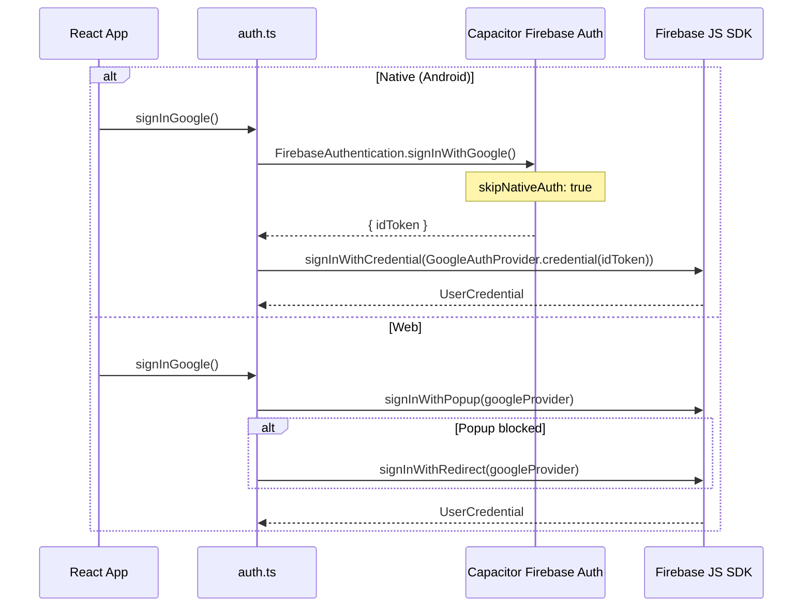
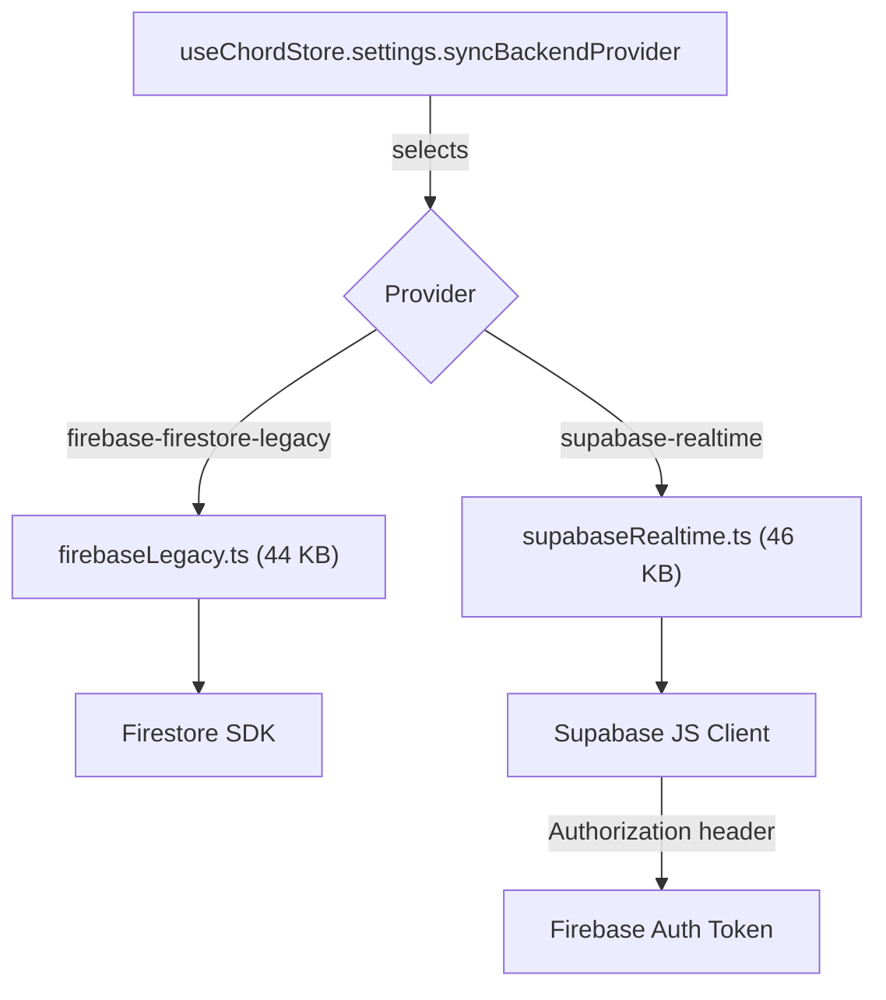

# Firebase Architecture

## Overview

Studio uses Firebase for **authentication**, **Firestore** (legacy sync backend), **Storage** (user avatars), and **Hosting** (OTA update metadata and APK serving). Supabase is the current default sync backend, but Firebase remains as a legacy option.

## Configuration

Firebase is initialized in `packages/studio-core/src/lib/services/firebase.ts` (295 lines).

**Two-layer configuration:**
1. Environment variables (`VITE_FIREBASE_*`) — override for CI/dev
2. Bundled `firebase.config.json` — fallback

**Lazy initialization:** `init()` is called on first access via getter functions.

## Authentication (`services/auth.ts`)

### Exports

| Function | Purpose |
|----------|---------|
| `subscribeAuth(callback)` | Subscribe to auth state changes (callback registry pattern) |
| `signInGoogle()` | Google Sign-In (dual path: native vs web) |
| `signInEmail(email, password)` | Email/password sign-in |
| `registerEmail(email, password)` | Email registration |
| `signOut()` | Sign out |
| `deleteAccount()` | Account deletion |
| `getCurrentEmail()` | Current user email |
| `updateDisplayName(name)` | Update display name |
| `sendPasswordReset(email)` | Send password reset email |
| `sendVerificationEmail()` | Send email verification |
| `isEmailVerified()` | Check verification status |
| `getSignInProviders()` | List available sign-in methods |

### Google Sign-In Architecture



**Key detail:** On Android, `skipNativeAuth: true` means Capacitor's Firebase Auth plugin obtains the Google ID token via the native Google Sign-In SDK, then bridges it back to the Firebase JS SDK via `signInWithCredential`. This avoids initializing Firebase Auth natively.

## Firestore

### Initialization

Firestore is only initialized when `syncBackendProvider === 'firebase-firestore-legacy'`:

```typescript
// Uses experimentalAutoDetectLongPolling for WebView compatibility
const db = initializeFirestore(app, {
  experimentalAutoDetectLongPolling: true,
  localCache: persistentLocalCache({
    tabManager: persistentMultipleTabManager()
  })
});
```

Falls back to `memoryLocalCache` if persistent cache fails.

### Security Rules (`firestore.rules`)

Simple user-scoped rules:

```
rules_version = '2';
service cloud.firestore {
  match /databases/{database}/documents {
    match /users/{userId}/{document=**} {
      allow read, write: if request.auth != null && request.auth.uid == userId;
    }
  }
}
```

Users can only read/write their own `/users/{userId}` document and all sub-paths.

### Data Model

| Path | Purpose |
|------|---------|
| `/users/{uid}` | User profile root |
| `/users/{uid}/meta/account` | Account deletion state (soft-delete with 7-day grace period) |
| `/users/{uid}/**` | All user data (sync state, preferences, etc.) |

## Storage

### Security Rules (`storage.rules`)

```
rules_version = '2';
service firebase.storage {
  match /b/{bucket}/o {
    match /users/{userId}/avatar.{ext} {
      allow read: if request.auth != null;
      allow write: if request.auth != null
        && request.auth.uid == userId
        && request.resource.size < 2 * 1024 * 1024    // 2MB
        && request.resource.contentType.matches('image/.*')
        && ext in ['jpg', 'webp'];
    }
    match /users/{userId}/{allPaths=**} {
      allow read: if request.auth != null;
      allow write: if request.auth != null
        && request.auth.uid == userId
        && request.resource.size < 5 * 1024 * 1024    // 5MB
        && request.resource.contentType.matches('image/.*');
    }
  }
}
```

**Constraints:**
- All reads require authentication
- Avatar: ≤ 2 MB, image only, JPG/WebP only
- General user files: ≤ 5 MB, image only
- Users can only write to their own path

## Hosting (`firebase.json`)

### Structure

| Public Dir | Purpose |
|------------|---------|
| `firebase-public/` | Primary hosting directory |

### Caching Headers

| Path | Cache Control |
|------|---------------|
| `/` | `no-cache` |
| `/assets/**` | `immutable, max-age=31536000` (1 year) |
| `/version.json` | `no-cache` |
| `/app-release.json` | `no-cache` |
| `/ota/**` | `immutable, max-age=31536000` |
| `*.apk` | Content-Type: `application/vnd.android.package-archive` |

### APK Serving

Redirects for APK downloads:

| Rule | Target |
|------|--------|
| `/apk/studio-latest.apk` | GitHub Releases (v4.0.31, status 302) |
| `/apk/studio-:version.apk` | GitHub Releases (dynamic version, status 302) |

### Predeploy Hook

```bash
node scripts/verify-release-signatures.mjs
```

Validates APK signatures before deployment.

### SPA Rewrite

All unmatched routes rewrite to `/index.html` (SPA behavior).

## Remote Metadata Files

The OTA update system depends on two hosted JSON files:

### `version.json`

Lightweight version manifest consumed by the web updater and `UpdateCheckWorker`:

```json
{
  "version": "4.0.84",
  "versionCode": 40084,
  "changelog": ["..."],
  "releaseNotes": { "added": ["..."] }
}
```

### `app-release.json`

Full release manifest consumed by the APK updater pipeline:

```json
{
  "platform": "android",
  "version": "4.0.84",
  "versionCode": 40084,
  "download_url": "https://github.com/.../studio-4.0.84.apk",
  "apkUrl": "...",
  "manual_download_url": "https://studio-30f44.web.app/apk/studio-4.0.84.apk",
  "fallback_download_url": "...",
  "sha256": "...",
  "apkSizeBytes": 52807395,
  "description": "...",
  "whatsNew": "...",
  "releaseNotes": { "added": ["..."] },
  "signatures": "900cf259...",
  "installMode": "reinstall-required",
  "reinstallRequired": true
}
```

## Supabase Integration (`services/supabaseClient.ts`)

Supabase is the current default sync backend, initialized with Firebase token bridging:

```typescript
const supabase = createClient(SUPABASE_URL, SUPABASE_ANON_KEY, {
  global: {
    headers: {
      get Authorization() {
        return `Bearer ${firebaseIdToken}`;
      }
    }
  }
});
```

This allows Supabase to accept Firebase Auth tokens for authentication.

## Sync Backend Architecture



Both providers implement `SyncBackendProvider` interface (30+ methods, 337 lines of types):
- Direct write testing, sync probes, device registration, heartbeat
- Profile/appearance/preferences CRUD with real-time subscriptions
- Photo upload, device management, cloud backup
- Comprehensive diagnostics

## Account Deletion (`services/accountStatus.ts`)

Soft-delete with 7-day grace period:

1. `scheduleAccountDeletion()` → writes `{ status: 'pending', deletionDate: +7d }` to Firestore
2. Real-time subscription monitors `/users/{uid}/meta/account`
3. User sees `PendingDeletionScreen` during grace period
4. `cancelAccountDeletion()` → restores account
5. `finalizeAccountDeletion()` → permanent deletion after grace period
