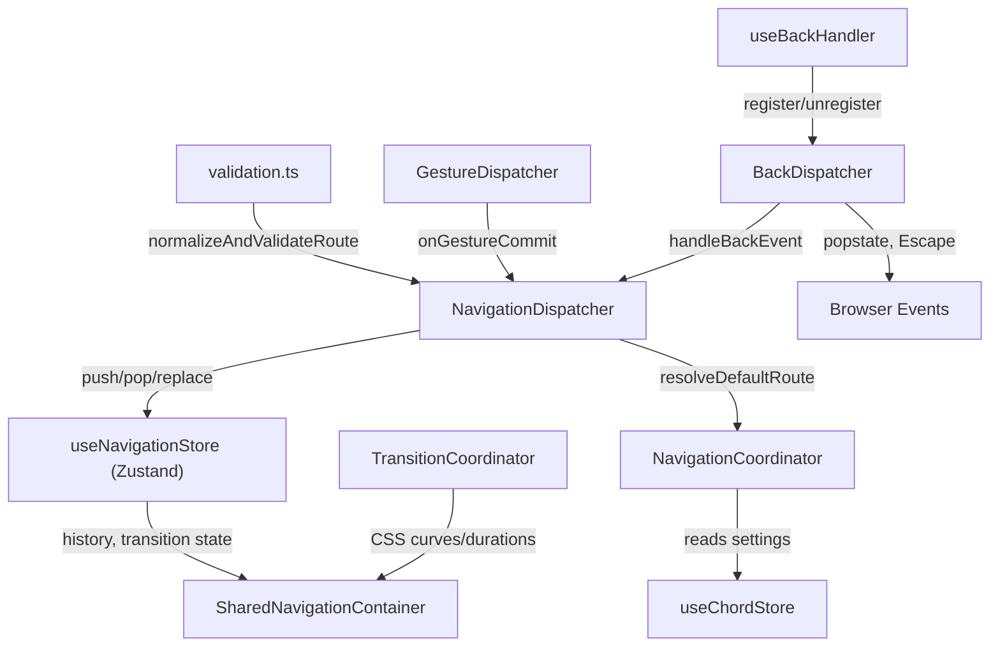
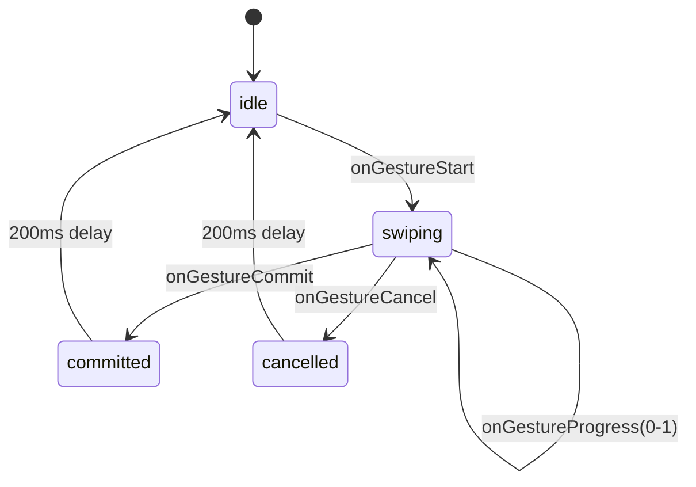
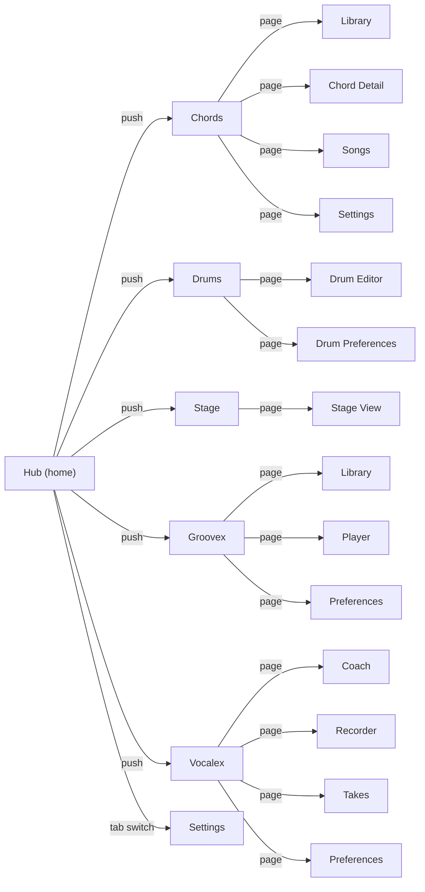

# Navigation System

Studio uses a **custom stack-based navigation system** built on Zustand — there is no React Router or third-party routing library.

## Architecture



## Route Model

```typescript
type NavigationRoute = {
  app: 'hub' | 'chords' | 'drums' | 'stage' | 'groovex' | 'vocalex';
  tab?: string; // Hub tabs: 'home' | 'settings' | ...
  page?: string; // Sub-pages within an app
  subView?: string; // Nested views within a page
  id?: string; // Entity identifiers
  type?: 'screen' | 'modal' | 'sheet' | 'overlay';
};

type NavigationHistory = NavigationRoute[];
```

The history is a simple stack of `NavigationRoute` objects, persisted to encrypted localStorage.

## Core Components

### NavigationDispatcher (`lib/navigation/NavigationDispatcher.ts`)

**Static class** — the central command API for all navigation actions.

| Method             | Behavior                                                                               |
| ------------------ | -------------------------------------------------------------------------------------- |
| `push(route)`      | Validates route, checks duplicate/recursion guards, resolves defaults, pushes to stack |
| `replace(route)`   | Replaces the top-of-stack route                                                        |
| `pop()`            | Pops the top route (prevents popping past root)                                        |
| `popTo(predicate)` | Finds first matching route and slices history back to it                               |
| `reset(stack)`     | Validates and replaces entire navigation stack                                         |
| `canGoBack()`      | Returns `true` if history has > 1 entry                                                |
| `currentRoute()`   | Returns the top-of-stack route                                                         |
| `previousRoute()`  | Returns the second-from-top route                                                      |
| `subscribe(fn)`    | Subscribes to navigation state changes                                                 |

**Key behaviors:**

- Routes pass through `NavigationCoordinator.resolveDefaultRoute()` to fill in default pages
- Transition type is inferred from `route.type` (modal → modal transition, sheet → sheet, etc.)
- Transition lock is auto-released after 300ms
- Duplicate and recursion (A→B→A→B pattern) guards are active

### NavigationCoordinator (`lib/navigation/NavigationCoordinator.ts`)

**Static class** — resolves default pages for each app based on user preferences.

| App       | Default Resolution Source                        |
| --------- | ------------------------------------------------ |
| `hub`     | Keeps as-is                                      |
| `chords`  | `settings.defaultTab` → page (e.g., `'library'`) |
| `drums`   | `settings.defaultDrumTab` → page                 |
| `groovex` | `settings.defaultGroovexView` → page             |
| `vocalex` | `settings.defaultVocalexTab` → page              |
| `stage`   | `settings.defaultStageView` → page               |

Also provides `restoreLastSession()` which builds a 2-entry history `[hub, restoredApp]` from saved session state in `useChordStore.lastSession`.

### useNavigationStore (`lib/navigation/useNavigationStore.ts`)

**Zustand store** with `persist` middleware + encrypted localStorage.

```typescript
interface NavigationState {
  history: NavigationHistory; // Stack of routes (persisted)
  transitionType: TransitionType | null; // 'forward' | 'backward' | 'replace' | 'modal' | 'sheet'
  isTransitioning: boolean;
  gestureState: GestureState; // 'idle' | 'swiping' | 'cancelled' | 'committed'
  predictiveProgress: number; // 0–1 gesture progress
  activeHandlers: BackHandlerInfo[]; // Registered back handlers with priority
}
```

Only `history` is persisted via `partialize`.

### BackDispatcher (`lib/navigation/BackDispatcher.ts`)

**Static class** — prioritized back navigation handler.

Listens for `popstate` and `Escape` key globally. Handlers are sorted by priority:

```
modal > sheet > overlay > nested > panel
```

Handlers are executed in priority order; the first to return `true` consumes the event. Falls back to `NavigationDispatcher.pop()` if no handler consumes.

**React integration**: `useBackHandler(priority, callback)` hook registers/unregisters on mount/unmount.

### GestureDispatcher (`lib/navigation/GestureDispatcher.ts`)

**Static class** — swipe-back gesture state machine.



On commit, triggers `NavigationDispatcher.pop()`.

### TransitionCoordinator (`lib/navigation/TransitionCoordinator.ts`)

**Static class** — provides CSS transition parameters for native and web navigation.

| Transition Type        | Easing                                          | Duration |
| ---------------------- | ----------------------------------------------- | -------- |
| `modal`                | `cubic-bezier(0.34, 1.56, 0.64, 1)` (elastic)   | 300ms    |
| `sheet`                | `cubic-bezier(0.22, 1, 0.36, 1)` (quintic)      | 300ms    |
| `forward` / `backward` | `cubic-bezier(0.16, 1, 0.3, 1)` (M3 Decelerate) | 300ms    |
| `replace`              | instant                                         | 0ms      |

Respects `prefers-reduced-motion` and user `animationSpeed` settings.

### Route Validation (`lib/navigation/validation.ts`)

- Validates `app` against whitelist of known apps
- Strips unknown properties from routes
- Cycle detection prevents A→B→A→B navigation loops
- `printDiagnosticsDump()` dumps full navigation state to `console.error` on failures

## Navigation Map



## UI Transition Engines

### SharedNavigationContainer (CSS-based)

Used by: Groovex, Drumex, Vocalex, and the main app shell.

- **Material 3 "Fade-Through"** transitions between panels
- **Keep-alive**: visited views stay mounted in the DOM (not unmounted)
- Directional transitions (left/right) based on `viewOrder` array
- CSS classes: `m3-nav-active`, `m3-nav-exit-left/right`, `m3-nav-enter-left/right`, `m3-nav-hidden`
- 280ms active, 150ms exit, `cubic-bezier(0.2, 0, 0, 1)` easing

### AppAnimationSystem (Framer Motion-based)

The core Framer Motion transition engine. See the detailed [Material 3 Motion System](file:///C:/Users/ayuda/Documents/.gemini/antigravity/scratch/Studio/docs/architecture/motion-system.md) documentation for full implementation patterns.

- `PageTransition` — Framer Motion page wrapper (`slide`, `fade`, `scale` types)
- `FadeThroughTransition` — standard M3 peer-view fade-through helper
- `SharedAxisTransition` — directional back/next wizard transition helper
- `ContainerTransform` — card-to-page layout projection morphing component
- `AppEntryTransition` — spring-based entry (opacity: 0→1, y: 16→0, scale: 0.972→1)
- `StaggeredReveal` — staggered children entrance with per-item delays
- `AnimatedAppHeader` — character-by-character title reveal

### BottomNav (Android only)

- 4-tab bar for the `chords` app mode: Songs, Library, Chord, Settings
- **Elastic sliding pill** indicator with stretch animation (90ms stretch, 300ms settle)
- LiquidGlass nav support
- Hides/collapses via `navHidden`/`navCollapsed` shared state
- Uses `NavigationDispatcher.push({ app: 'chords', page: panel })`
- Returns `null` on web desktop or when `appMode !== 'chords'`

### Scroll-Hide Engine (`navScroll.ts`)

- Programmatic show/hide with auto-show timeout (4000ms)
- Lock mechanism prevents unlocking during certain states
- Pill-collapse feature for compact navigation bar
- Hooks: `useNavHidden()`, `useNavCollapsed()`

## Session Restore

On app startup, `NavigationCoordinator.restoreLastSession()` reads `useChordStore.lastSession` (which tracks the last active app per `AppKey`) and constructs a 2-entry history stack: `[{ app: 'hub', tab: 'home' }, { app: lastApp, page: lastPage }]`.
