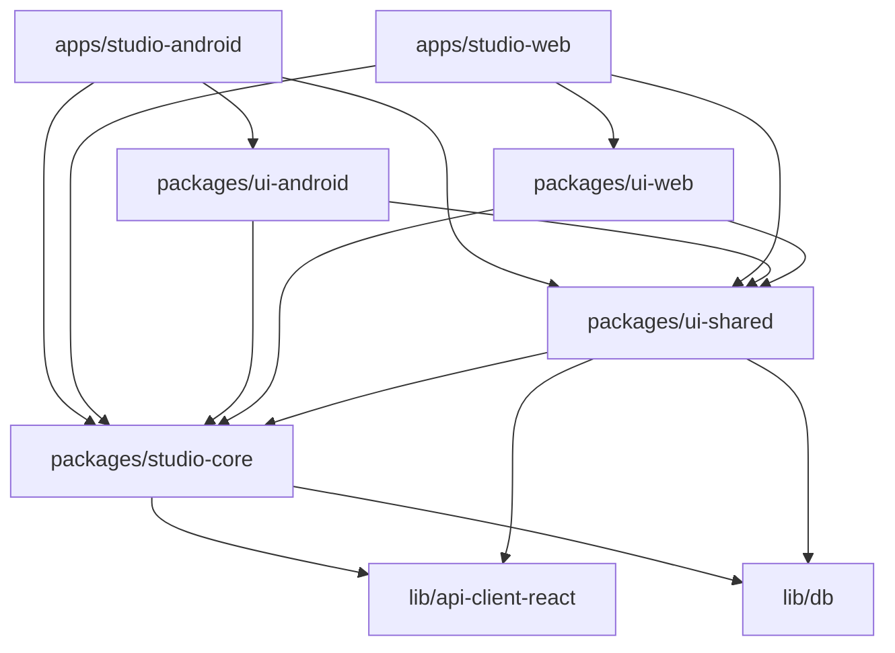

# Architecture Overview

## Project Structure

Studio is a **pnpm monorepo** that ships a single codebase as two distinct applications: a **Web SPA** (deployed to Netlify) and an **Android app** (Capacitor WebView distributed as a signed APK via GitHub Releases + Firebase Hosting).

```
Studio/
├── apps/
│   ├── studio-android/          # Android Capacitor app (entry + native shell)
│   └── studio-web/              # Web SPA (entry + landing page)
├── packages/
│   ├── studio-core/             # Pure TS business logic, state, navigation, services
│   ├── ui-shared/               # Cross-platform React components + feature modules
│   ├── ui-android/              # Thin Android-specific UI wrapper
│   └── ui-web/                  # Web-specific layout (sidebar, landing page)
├── lib/
│   ├── api-spec/                # OpenAPI YAML specification
│   ├── api-zod/                 # Generated Zod schemas from OpenAPI
│   ├── api-client-react/        # Generated React Query hooks
│   └── db/                      # Drizzle ORM database layer
├── scripts/                     # 52+ build, test, release, and CI scripts
├── firebase.json                # Firebase Hosting + Firestore + Storage config
├── firestore.rules              # Firestore security rules
├── storage.rules                # Firebase Storage security rules
└── pnpm-workspace.yaml          # Workspace definition
```

## Workspace Packages

| Package | Name | Version | Role |
|---------|------|---------|------|
| `apps/studio-android` | `@workspace/studio-android` | 4.0.84 | Android Capacitor shell |
| `apps/studio-web` | `@workspace/studio-web` | 4.0.84 | Web SPA shell |
| `packages/studio-core` | `@workspace/studio-core` | 4.0.83 | Business logic & state |
| `packages/ui-shared` | `@workspace/ui-shared` | 4.0.83 | Shared React components |
| `packages/ui-android` | `@workspace/ui-android` | 4.0.83 | Android UI wrapper |
| `packages/ui-web` | `@workspace/ui-web` | 4.0.83 | Web UI wrapper |
| `lib/api-spec` | — | — | OpenAPI specification |
| `lib/api-zod` | — | — | Generated Zod schemas |
| `lib/api-client-react` | — | — | Generated React Query hooks |
| `lib/db` | — | — | Drizzle ORM layer |

## Dependency Flow



**Strict rules enforced by CI:**
- Web app **cannot** import `ui-android`
- Android app **cannot** import `ui-web`
- `studio-core` **cannot** import from any UI package
- `ui-shared` **cannot** import from platform-specific UI packages

## Build Flow

### Web Build

```
pnpm build:web
  └─ pnpm --filter @workspace/studio-web build
       ├─ prebuild: node scripts/sync-version.mjs
       └─ vite build --config vite.config.ts
            └─ Output: dist/web/
```

### Android Web Assets Build

```
pnpm build:android:web
  └─ pnpm --filter @workspace/studio-android build
       ├─ prebuild: node scripts/sync-version.mjs
       └─ vite build --config vite.config.ts
            └─ Output: dist/android-web/  (Capacitor webDir)
```

### Full Android APK Build

```
pnpm build:android
  └─ pnpm --filter @workspace/studio-android android:build
       ├─ pnpm build  (web assets)
       ├─ npx cap sync android  (copy web assets into native project)
       └─ Gradle assembleRelease  (sign + package APK)
```

### Combined Build

```
pnpm build
  ├─ pnpm build:web        (web SPA)
  └─ pnpm build:android:web (android web assets)
```

## Entry Points

### Android — `apps/studio-android/src/main.tsx`

The Android entry point (157 lines) is significantly more complex than Web:

- Initializes DevTools framework and defers audio asset seeding by 2 seconds
- Lazy-loads `UpdateIndicator` and `EmergencyDebugOverlay`
- Creates a `RootAppContainer` with force-rerender capability (`window.__forceRerenderApp`)
- Creates a dedicated emergency overlay DOM root at max z-index
- Records React bootstrap timing via `performance.now()`
- Cleans up service workers AND cache storage on native version change
- Does **not** use `TolgeeProvider` (unlike Web)

### Web — `apps/studio-web/src/main.tsx`

The Web entry point (30 lines) is minimal:

- Initializes DevTools framework
- Exposes `NavigationDispatcher` on `window` for debugging
- Mounts React root with `TolgeeProvider` wrapping `<App />`
- Cleans up service workers

### Android `App.tsx` (2681 lines)

- Auth state machine, routing, panel switching
- Native-specific: APK updater, BackDispatcher, StatusBar, hardware back, safe-area-inset-top
- Lazy-loads all panels
- Uses `BottomNav` for navigation
- Imports `StageCorePanel` from `@workspace/ui-android`
- Does **not** include `StudioLandingPage`

### Web `App.tsx` (571 lines)

- Auth state machine, routing, panel switching, sidebar management
- Imports from `@workspace/ui-web` (WebSidebarLayout, SidebarProvider, StudioLandingPage)
- Uses `SharedNavigationContainer`
- Does **not** use `BottomNav`

## Capacitor Integration

**Configuration** (`apps/studio-android/capacitor.config.ts`):
- `appId`: `com.chordex.app`
- `appName`: `Studio`
- `webDir`: `../../dist/android-web`
- `server.androidScheme`: `https`
- Plugin: `FirebaseAuthentication` with `skipNativeAuth: true`

## Key Technology Stack

| Category | Technology | Version |
|----------|-----------|---------|
| Language | TypeScript | ~5.7.2 |
| UI Framework | React | 19.2.7 |
| Bundler | Vite | 8.1.4 |
| State Management | Zustand | 5.0.14 |
| Animation | Framer Motion (`motion`) | 12.42.2 |
| Styling | Tailwind CSS | 4.3.2 |
| Native Shell | Capacitor | 8.4.1 |
| Backend (Auth) | Firebase | 12.16.0 |
| Backend (Data) | Supabase JS | 2.110.2 |
| Internationalization | i18next + Tolgee | — |
| Package Manager | pnpm | catalog-based |

## TypeScript Configuration

Shared via `tsconfig.base.json`:
- `target`: ES2022, `module`: ESNext, `moduleResolution`: bundler
- `strictNullChecks`: true, `alwaysStrict`: true
- `strictFunctionTypes`: false, `noImplicitAny`: false (relaxed)
- `customConditions`: `["workspace"]`
- Project references used for incremental compilation across all packages
