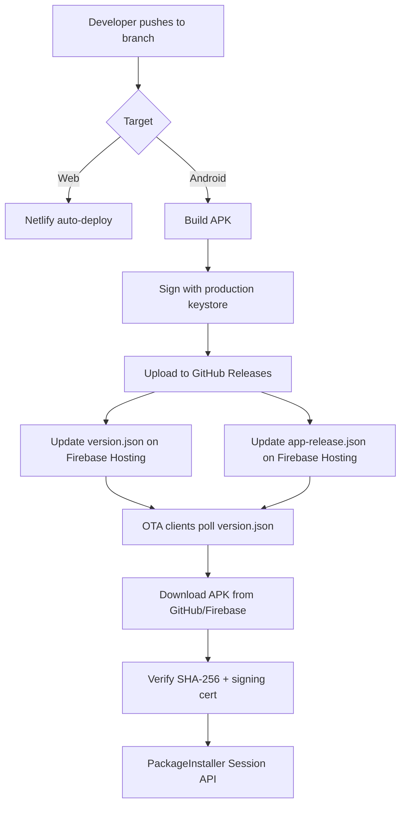

# Release Pipeline

## Overview

Studio uses a multi-target release pipeline: **Web** deploys to Netlify, **Android** distributes signed APKs via GitHub Releases + Firebase Hosting, and OTA metadata updates are pushed to Firebase Hosting.

## Versioning

### Single Source of Truth

`packages/studio-core/src/lib/startup/appVersion.ts` (311 lines):

```typescript
const NATIVE_VERSION = '4.0.84';
const WEB_VERSION    = '4.0.84';
const APP_VERSION    = Capacitor.isNativePlatform() ? NATIVE_VERSION : WEB_VERSION;
const APP_VERSION_TAG  = 'Beta';
const APP_VERSION_DATE = '2026-07-15';
```

### Version Sync Script

```bash
node scripts/sync-version.mjs
```

This runs as a **prebuild** hook in both `studio-android` and `studio-web` to synchronize version numbers across:

- `appVersion.ts` (NATIVE_VERSION, WEB_VERSION)
- `package.json` files (all workspace packages)
- `build.gradle` (versionName, versionCode)
- `capacitor.config.ts`

### Semver Utilities

`appVersion.ts` exports strict semver parsing:
- `parseAndNormalizeVersion()` — strict validation
- `parseSemver()` — extract major.minor.patch
- `normalizeSemver()` — pad to consistent format
- `compareSemver()` — comparison with pre-release support

## Build Targets

### Web Build

```bash
pnpm build:web
```

Pipeline:
1. `sync-version.mjs` — sync versions across packages
2. `vite build` — bundle with production config
3. Output: `dist/web/`

Deployment: **Netlify** (auto-deploy from branch)

### Android Web Assets

```bash
pnpm build:android:web
```

Pipeline:
1. `sync-version.mjs` — sync versions
2. `vite build` — bundle for Android WebView
3. Output: `dist/android-web/` (Capacitor `webDir`)

### Android APK

```bash
pnpm build:android
```

Pipeline:
1. Build web assets (`pnpm build:android:web`)
2. `npx cap sync android` — copy web assets into native project
3. Gradle `assembleRelease` — compile, sign, and package APK

### Full Build

```bash
pnpm build
```

Runs both `build:web` and `build:android:web` in parallel.

## APK Signing

### Debug

Debug keystore is **checked into the repository** to ensure consistent SHA-1 fingerprints across developer machines (required for Google Sign-In OAuth configuration).

### Production

Environment variables (from GitHub Secrets in CI):

| Variable | Purpose |
|----------|---------|
| `ANDROID_KEYSTORE_BASE64` | Base64-encoded production keystore |
| `ANDROID_KEYSTORE_PASSWORD` | Keystore password |
| `ANDROID_KEY_ALIAS` | Key alias |
| `ANDROID_KEY_PASSWORD` | Key password |

The signing certificate SHA-256 fingerprint is stored as `PRODUCTION_SIGNING_SHA256` in `appVersion.ts` for runtime verification.

## Release Artifacts

### Firebase Hosting

| File | Purpose | Cache |
|------|---------|-------|
| `version.json` | Lightweight version manifest | `no-cache` |
| `app-release.json` | Full release manifest with URLs and SHA-256 | `no-cache` |
| `ota/*.apk` | APK files | `immutable, 1 year` |
| `assets/**` | Static web assets | `immutable, 1 year` |

### GitHub Releases

APK files published as GitHub Release assets:
- Pattern: `Studio {version}.apk`
- API: `https://api.github.com/repos/MAGEXE1000/Studio/releases`

### Firebase Predeploy Verification

```bash
node scripts/verify-release-signatures.mjs
```

Runs before every Firebase deploy to validate APK signatures.

## Deployment Flow



## Scripts Directory

The `scripts/` directory contains 52+ scripts for build, test, release, and CI automation:

| Category | Examples |
|----------|---------|
| Version management | `sync-version.mjs`, version bumping |
| Release | `verify-release-signatures.mjs`, APK upload |
| Build | Various Vite/Capacitor build helpers |
| Testing | Test runners, validation scripts |
| CI/CD | GitHub Actions helpers |

## OTA Update Distribution

See [updater.md](updater.md) for the full OTA pipeline documentation.

### Download Source Priority

1. `app-release.json` → `download_url` (primary)
2. `app-release.json` → `manual_download_url`
3. `app-release.json` → `fallback_download_url`
4. GitHub Releases API (dynamic lookup)

### Background Polling

`UpdateCheckWorker.java` (WorkManager, 15-minute intervals) polls Firebase Hosting even when the app is closed, posting system notifications for new versions.

## Changelog System

`appVersion.ts` includes multi-language changelogs:

```typescript
const APP_CHANGELOG_SECTIONS: ChangelogSection[] = [
  { lang: 'en', title: '...', items: ['...'] },
  { lang: 'es', title: '...', items: ['...'] },
  { lang: 'de', title: '...', items: ['...'] },
];
```

Displayed in `ChangelogSheet.tsx` and `StudioUpdateScreen.tsx`.
