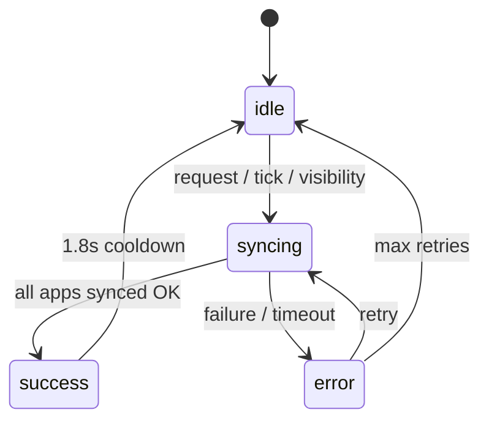
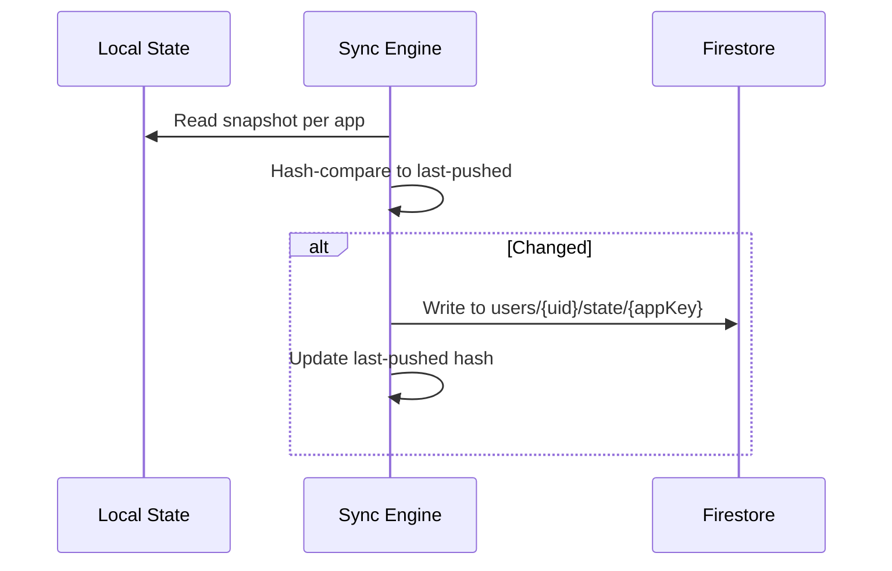
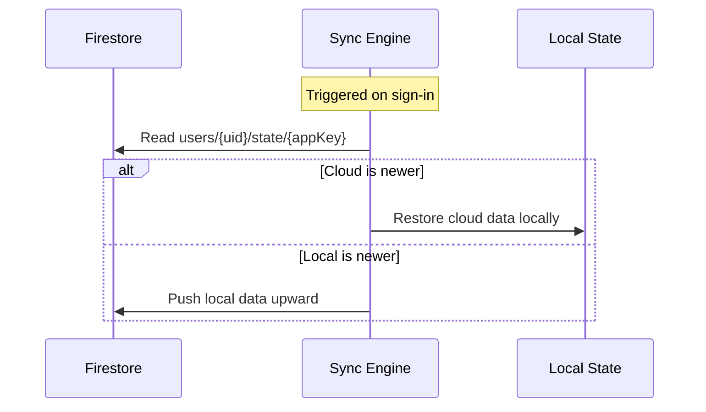

# Cloud Sync Engine

The sync engine provides bidirectional data synchronization between local state and Firestore for all Livex sub-applications, with offline-first semantics, conflict resolution, and structured safety guarantees.

---

## Purpose

Keep user data (settings, songs, drum patterns, stage projects, vocal takes) synchronized across devices via Firestore, with resilient handling of network failures, auth changes, and concurrent writes.

## Responsibilities

| Responsibility | Owner |
|---|---|
| Sync orchestration & state machine | [sync.ts](file:///c:/Users/ayuda/Documents/.gemini/antigravity/scratch/Studio/packages/studio-core/src/lib/sync/sync.ts) (2854 lines) |
| Device ID, session classification, Firestore sanitization | [syncEngine.ts](file:///c:/Users/ayuda/Documents/.gemini/antigravity/scratch/Studio/packages/studio-core/src/lib/sync/syncEngine.ts) |
| Backend provider abstraction | [syncBackends/index](file:///c:/Users/ayuda/Documents/.gemini/antigravity/scratch/Studio/packages/studio-core/src/lib/syncBackends/index.ts) |
| Auth subscription | [services/auth.ts](file:///c:/Users/ayuda/Documents/.gemini/antigravity/scratch/Studio/packages/studio-core/src/lib/services/auth.ts) |

## Architecture

## Dependencies

| Dependency | Purpose |
|---|---|
| `@capacitor/core` | Native platform detection |
| `services/auth` | Auth subscription, sign-out handling |
| `startup/appVersion` | APP_VERSION for metadata |
| `syncEngine` | Device ID generation, session classification, Firestore field sanitization |
| `syncBackends/index` | Active sync provider (Firestore), init/dispose lifecycle |
| `vocalex/takesDb` | IndexedDB CRUD for vocal takes |
| `vocalex/labSessionDb` | IndexedDB CRUD for lab sessions |
| `store/useChordStore` | Main application state store |
| `utilities/security` | Encrypted local storage |
| `diagnostics/activityLogger` | Structured logging |

## Data Flow

### Push (Local → Cloud)

### Pull (Cloud → Local)

## Safety Guarantees

| Guarantee | Mechanism |
|---|---|
| **Exactly-one-in-flight** | All callers funnel through `enqueueRun`. Returns existing Promise if a run is active. |
| **10s overall timeout** | Watchdog aborts run → error state → retryable. |
| **6s per-Firestore-op timeout** | Apps processed in parallel (`Promise.allSettled`). Worst case ~6s instead of 60s+. |
| **EPOCH counter** | Bumped on auth-change/detach. In-flight runs check after every await and discard stale-UID writes. |
| **Fire-and-forget initial pull** | Regular tick starts immediately so engine can't hang on first sync. |
| **Structured logging** | `[sync]` console prefix for every state transition. |

## Per-App Sync Strategy

| App | Storage | Sync Document | Special Handling |
|---|---|---|---|
| Chordex | `useChordStore` | `users/{uid}/state/chordex` | Standard push/pull |
| Drumex | `useDrumStore` | `users/{uid}/state/drumex` | Standard push/pull |
| Groovex | `useChordStore` (shared) | `users/{uid}/state/groovex` | Standard push/pull |
| Stagex | Iframe state | `users/{uid}/state/stagex` | Snapshots via `postMessage` |
| Vocalex | IndexedDB | `users/{uid}/state/vocalex` | Takes & lab sessions, audio blobs as base64 |

## Sync Triggers

| Trigger | Description |
|---|---|
| `syncNow()` | Manual sync (user-initiated) |
| `requestFlush()` | Programmatic flush request |
| Periodic tick | Automatic background sync on interval |
| Visibility change | Syncs when app becomes visible |
| `beforeunload` | Last-chance sync before page unload |
| Auth change | Pulls cloud data on sign-in, flushes on sign-out |

## Storage Keys

| Key | Purpose |
|---|---|
| `chordex_sync_meta_v1` | Sync metadata (last-pushed hashes, timestamps) |
| `chordex_device_id` | Unique device identifier |

## Design Decisions

1. **Parallel app sync**: All apps sync concurrently via `Promise.allSettled` rather than sequentially, reducing worst-case time from 60s+ to ~6s.
2. **EPOCH counter**: Prevents stale-UID writes after sign-out by invalidating in-flight runs when auth changes.
3. **Hash-based change detection**: Avoids unnecessary Firestore writes by comparing content hashes before pushing.
4. **Encrypted local metadata**: Sync metadata stored via `secureWriteLocal` to protect user data at rest.

## Known Constraints

- Vocalex audio blobs are serialized as base64, which inflates storage by ~33%. Large recording libraries can hit Firestore document size limits.
- StageX sync relies on `postMessage` to the iframe, which requires the iframe to be mounted.
- No real-time listeners — sync is poll-based with triggers, not Firestore `onSnapshot`.

## Future Improvements

- Firestore `onSnapshot` real-time listeners for instant cross-device sync.
- Chunked upload for large Vocalex audio blobs (Cloud Storage instead of Firestore documents).
- Conflict resolution UI for manual merge when both local and cloud have diverged.
- Sync progress indicators in the Notification Center.
