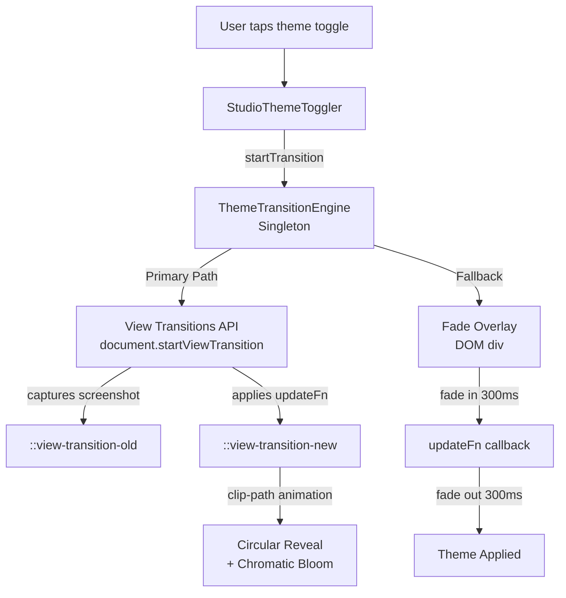

# Theme Engine

The Theme Engine manages animated switching between Light, Dark, and AMOLED themes using the View Transitions API with a chromatic bloom circular reveal, with graceful fallback for unsupported browsers.

---

## Purpose

Provide a premium, GPU-composited theme transition animation that avoids main-thread jank, while maintaining a clean API for theme consumers and a consistent CSS custom property system.

## Responsibilities

| Responsibility | Owner |
|---|---|
| Theme transition animation | [themeTransitionEngine.ts](file:///c:/Users/ayuda/Documents/.gemini/antigravity/scratch/Studio/packages/studio-core/src/lib/themeTransitionEngine.ts) |
| Theme toggle UI | `StudioThemeToggler` in `packages/ui-shared/` |
| CSS custom properties | `index.css` in each app (`apps/studio-android/src/`, `apps/studio-web/src/`) |
| Theme persistence | `useChordStore` settings → `settings.darkMode`, `settings.amoled` |

## Architecture



## Dependencies

None — the engine uses only vanilla DOM APIs (`document.startViewTransition`, `document.createElement`, CSS animations). No external library dependencies.

## Data Flow

1. **User** taps theme toggle, providing click coordinates (startX, startY).
2. **StudioThemeToggler** calls `ThemeTransitionEngine.startTransition({ nextTheme, amoled, startX, startY, updateFn })`.
3. **Engine** checks `isTransitioning` guard. If already transitioning, calls `updateFn()` directly (no animation).
4. **Primary path** (View Transitions API supported):
   - Sets `--theme-transition-x` and `--theme-transition-y` CSS vars on `<html>`.
   - Injects `<style id="view-transition-styles">` once with `::view-transition-new(root)` animation.
   - Calls `document.startViewTransition(updateFn)` → API captures screenshot → applies `updateFn` → cross-fades with circular clip-path expansion.
5. **Fallback path** (no API support):
   - Creates full-screen fixed `<div>` overlay at z-index 999999.
   - Fades in (300ms) → waits 150ms → calls `updateFn()` → fades out (300ms) → removes overlay.

## Public API

```typescript
interface ThemeTransitionOptions {
  nextTheme: string;     // Target theme name
  amoled: boolean;       // AMOLED mode flag
  startX: number;        // Click X coordinate (reveal origin)
  startY: number;        // Click Y coordinate (reveal origin)
  updateFn: () => void;  // Callback that applies the theme change
}

// Singleton instance
ThemeTransitionEngine.startTransition(options: ThemeTransitionOptions): Promise<void>
```

## Internal API

| Element | Description |
|---|---|
| `isTransitioning` | Boolean concurrency guard — prevents overlapping transitions |
| `::view-transition-old(root)` | CSS pseudo-element at z-index 1 (screenshot of old theme) |
| `::view-transition-new(root)` | CSS pseudo-element at z-index 999999 with `theme-reveal-clip` animation |
| `@keyframes theme-reveal-clip` | Circular `clip-path` expanding from `0px` to `150%` viewport radius, with `brightness(1.2) contrast(1.2) saturate(1.5) blur(4px)` chromatic bloom at leading edge |

## CSS Custom Property System

The theme is defined by ~40 CSS custom properties on `:root`. Key tokens:

| Token | Light | Dark | AMOLED |
|---|---|---|---|
| `--c-bg-primary` | `#ffffff` | `#09090b` | `#000000` |
| `--c-bg-secondary` | `#f4f4f5` | `#18181b` | `#09090b` |
| `--c-text-primary` | `#09090b` | `#fafafa` | `#fafafa` |
| `--c-text-secondary` | `#71717a` | `#a1a1aa` | `#a1a1aa` |
| `--c-accent` | `#a855f7` | `#a855f7` | `#a855f7` |

## Design Decisions

1. **View Transitions API first**: Moves the entire transition to the compositor thread, eliminating the 45ms+ main-thread style recalculation that caused jank with JavaScript-driven animations.
2. **Click-origin reveal**: The circular clip-path expands from the user's click coordinates, creating a natural spatial connection between action and result.
3. **Chromatic bloom**: The brightness/contrast/saturation boost at the leading edge creates a premium "energy wave" effect with minimal GPU cost (single pseudo-element).
4. **Singleton pattern**: Prevents multiple engine instances and guarantees the concurrency guard works globally.
5. **Graceful fallback**: Older WebViews get a functional fade transition instead of nothing.

## Known Constraints

- View Transitions API requires Chromium 111+. Android WebView versions older than this get the fallback fade.
- The chromatic bloom filter adds GPU memory pressure during the 500ms transition. Not an issue on modern devices.
- AMOLED mode uses pure black (`#000000`) which can cause visible banding on some OLED panels during the transition.

## Related Bug Documentation

- [theme-transition-jank.md](file:///c:/Users/ayuda/Documents/.gemini/antigravity/scratch/Studio/docs/bugs/theme-transition-jank.md) — Main-thread blocking resolved by migrating to View Transitions API.

## Future Improvements

- Per-component view transitions (shared element transforms between theme variants).
- `performance_mode` check that disables the bloom filter on low-end devices.
- Custom theme support beyond Light/Dark/AMOLED (user-defined accent colors).
