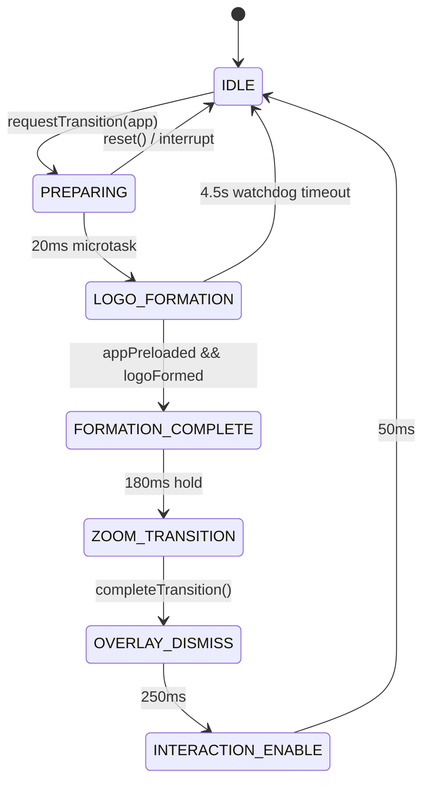
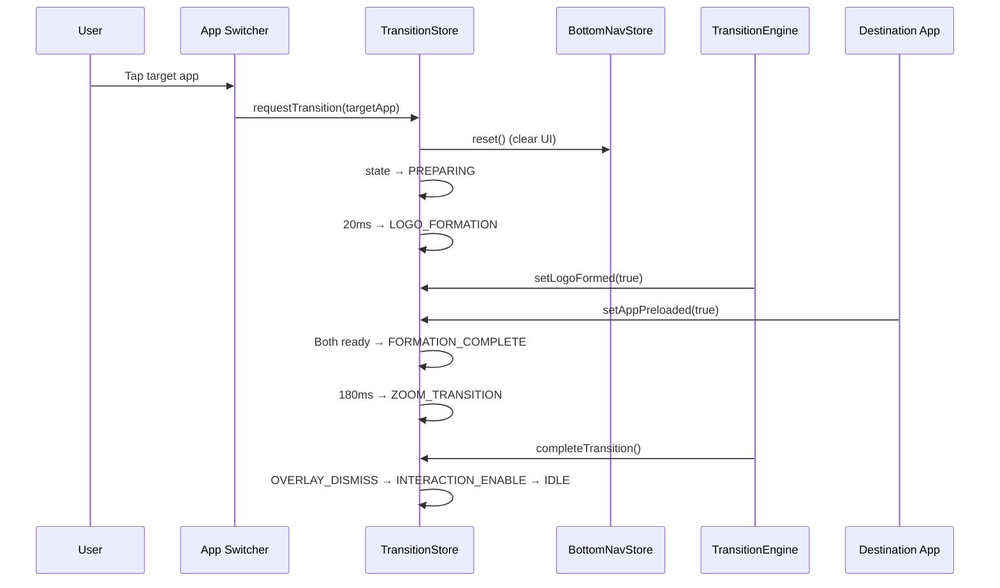

# Application Transition Engine

The transition engine orchestrates animated visual transitions when the user switches between Livex sub-applications. It is a Zustand-based finite state machine that coordinates logo formation animations, destination app preloading, and zoom reveals.

---

## Purpose

Provide smooth, interruptible, and deadlock-free animated transitions between Livex applications (Hub ↔ Chordex, Groovex ↔ Stagex, etc.) while preventing blank screens, frozen states, or overlapping UI artifacts.

## Responsibilities

| Responsibility | Owner |
|---|---|
| State machine lifecycle | [useApplicationTransitionStore.ts](file:///c:/Users/ayuda/Documents/.gemini/antigravity/scratch/Studio/packages/studio-core/src/lib/navigation/useApplicationTransitionStore.ts) |
| Visual animation rendering | [ApplicationTransitionEngine.tsx](file:///c:/Users/ayuda/Documents/.gemini/antigravity/scratch/Studio/packages/ui-shared/src/components/launch/ApplicationTransitionEngine.tsx) |
| Bottom nav cleanup on transition | Cross-store call to `useBottomNavigationStore.reset()` |
| Safety watchdog | 4.5s `window.__transitionWatchdog` timer |

## Architecture

## Dependencies

- `zustand` — State management
- `AppKey` type from `useChordStore` — Target app identification
- `useBottomNavigationStore` — Cross-store cleanup on transition start/reset

## Data Flow

## Lifecycle

| Phase | Duration | Description |
|---|---|---|
| IDLE | — | No transition active |
| PREPARING | ~20ms | Clears bottom nav, sets watchdog, queues microtask |
| LOGO_FORMATION | Variable | Waits for both `appPreloaded` and `logoFormed` |
| FORMATION_COMPLETE | 180ms | Brief hold for visual rhythm |
| ZOOM_TRANSITION | ~300ms | Zoom animation via Framer Motion |
| OVERLAY_DISMISS | 250ms | Overlay fade-out |
| INTERACTION_ENABLE | 50ms | Re-enables pointer events |

## Public API

| Action | Signature | Description |
|---|---|---|
| `requestTransition` | `(targetApp: AppKey) => boolean` | Entry point. Resets in-flight transitions. Clears bottom nav. Sets 4.5s watchdog. |
| `setAppPreloaded` | `(preloaded: boolean) => void` | Called when destination app assets load. Triggers zoom if both conditions met. |
| `setLogoFormed` | `(formed: boolean) => void` | Called when logo animation completes. Triggers zoom if both conditions met. |
| `completeTransition` | `() => void` | Called when zoom animation ends. Clears watchdog. Starts dismiss sequence. |
| `reset` | `() => void` | Force-resets to IDLE. Clears watchdog and bottom nav store. |

## Internal API

| Action | Description |
|---|---|
| `startZoom` | Sets FORMATION_COMPLETE, then advances to ZOOM_TRANSITION after 180ms hold. |

## Design Decisions

1. **Dual-condition gate**: Both `appPreloaded` and `logoFormed` must be true before zooming. Both setters check both conditions regardless of current state, preventing ordering deadlocks.
2. **Interruption support**: If `requestTransition` is called during an active transition, it force-resets first, preventing stacked/overlapping transitions.
3. **Cross-store cleanup**: `requestTransition` and `reset` synchronously call `useBottomNavigationStore.getState().reset()` to prevent ghost UI during transitions.
4. **Watchdog timer**: 4.5s safety timeout resets to IDLE if the transition gets stuck (e.g., animation callbacks fail to fire).

## Known Constraints

- The watchdog timer could prematurely complete a transition on very slow devices. 4.5s is chosen as a generous threshold.
- Force-resetting mid-transition may cause a brief visual flash (acceptable vs. permanent black screen).
- No queuing mechanism — rapid transitions interrupt each other rather than queuing.

## Related Bug Documentation

- [hub-transition-black-screen.md](file:///c:/Users/ayuda/Documents/.gemini/antigravity/scratch/Studio/docs/bugs/hub-transition-black-screen.md) — Deadlock between appPreloaded and logoFormed resolved by dual-condition checking.
- [bottom-navigation-overlap.md](file:///c:/Users/ayuda/Documents/.gemini/antigravity/scratch/Studio/docs/bugs/bottom-navigation-overlap.md) — Overlapping UI resolved by cross-store cleanup.

## Future Improvements

- Transition queuing for rapid sequential switches.
- Per-app custom transition animations (e.g., shared element transforms).
- Performance telemetry (frame drop tracking during transitions).
