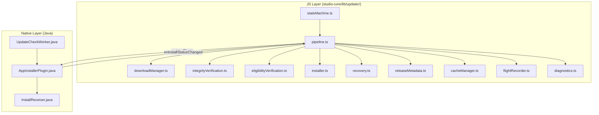
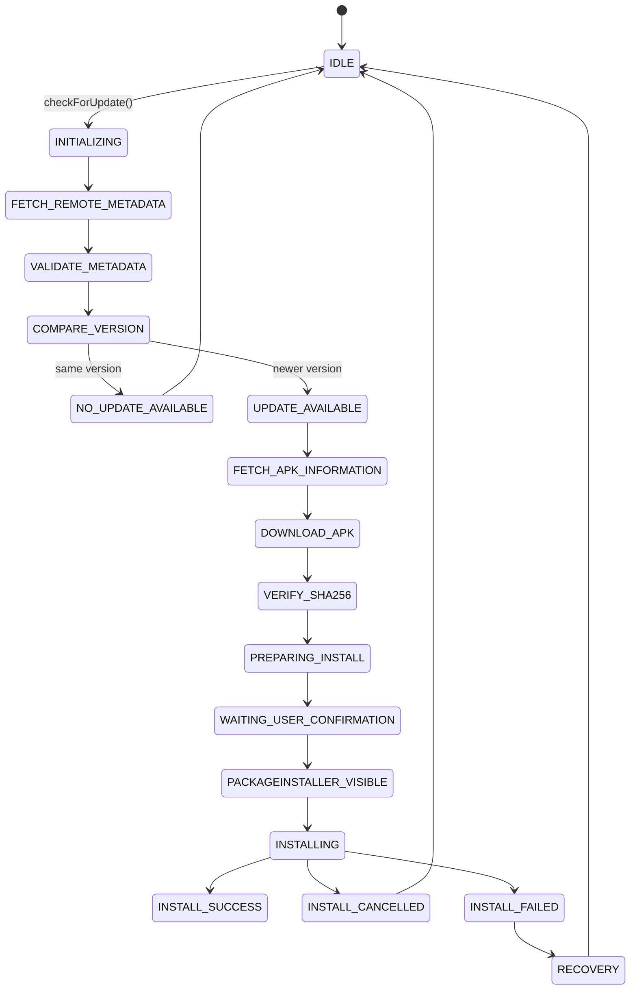
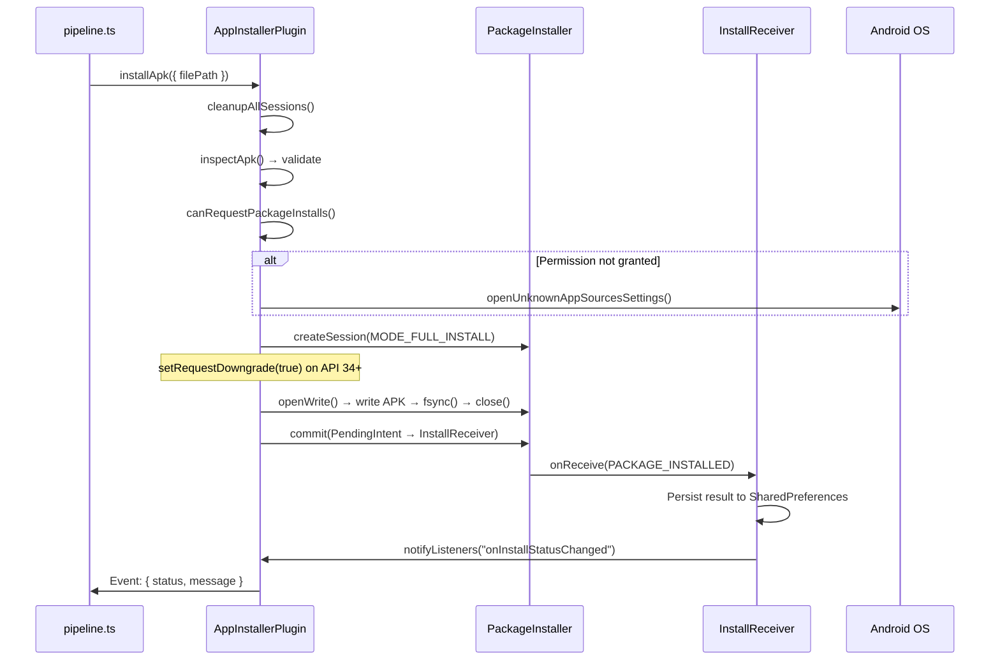

# OTA Update Pipeline

## Overview

Studio ships OTA updates as full APK replacements via the Android PackageInstaller Session API. The pipeline spans JS (state machine + coordination) and native Java (download + install + verify). There is no Play Store involvement.

## Architecture



## State Machine (18 States)



Source: `stateMachine.ts` (1033 lines, 41 KB)

**Key exports:**

- `globalUpdateState` — mutable state object tracking current FSM state
- `updateGlobalState()` — state mutation function
- `transitionToState()` — validated state transition
- `isInstallationLocked()` — prevents concurrent update operations
- `ActiveUpdateSession` — tracks in-flight update sessions

## Pipeline Coordinator (`pipeline.ts`, 1695 lines, 75 KB)

The central orchestrator managing the full update lifecycle.

### Public API

| Function                            | Purpose                                                         |
| ----------------------------------- | --------------------------------------------------------------- |
| `checkForUpdate()`                  | Fetches remote metadata, compares versions, returns update info |
| `downloadUpdate()`                  | Downloads APK with multi-source fallback and retry              |
| `applyUpdate()`                     | Triggers PackageInstaller installation                          |
| `enforceStartupRecovery()`          | Cold-start recovery for interrupted updates                     |
| `initializeGlobalUpdateListeners()` | Sets up PackageInstaller event listeners                        |

### Download Sources (Priority Order)

1. **Primary URL** — from `app-release.json` `download_url` field
2. **Manual APK URL** — from `manual_download_url` field
3. **Fallback URL** — from `fallback_download_url` field
4. **GitHub Releases API** — dynamic lookup via `https://api.github.com/repos/MAGEXE1000/Studio/releases`

Each source retries 3 times with exponential backoff. HTTP Range header resume is supported.

## Verification (3 Layers)

### Layer 1: SHA-256 File Hash

```
integrityVerification.ts → AppInstaller.verifySha256()
```

Computes SHA-256 of the downloaded APK and compares against `apkSha256` from the remote manifest. FSM state: `VERIFY_SHA256`.

### Layer 2: APK Signing Certificate

```
eligibilityVerification.ts → AppInstaller.inspectApk()
```

Extracts the signing certificate SHA-256 fingerprint from both the installed app and the downloaded APK. Verifies against `PRODUCTION_SIGNING_SHA256` constant.

**Full inspection data:**

- `packageName`, `versionName`, `versionCode`
- `signingSha256` (certificate fingerprint)
- `debuggable` flag, `minSdk`, `targetSdk`
- `isValidApk`, `isUniversalApk`
- `certificateSubject`, `certificateIssuer`

### Layer 3: OS-Level Verification

The Android PackageInstaller performs its own signature verification. Status code 5 (`STATUS_FAILURE_CONFLICT`) indicates a signature mismatch, which triggers the recovery flow.

## APK Installation Flow



### Install Status Codes

| Code | Meaning              | Handling                                  |
| ---- | -------------------- | ----------------------------------------- |
| 0    | `SUCCESS`            | Update complete, `INSTALL_SUCCESS` state  |
| 3    | `CANCELLED`          | User cancelled, `INSTALL_CANCELLED` state |
| 5    | `SIGNATURE_MISMATCH` | Triggers 4-stage recovery                 |
| 6    | `STORAGE`            | Insufficient storage                      |
| 7    | `VERSION_DOWNGRADE`  | Version code too low                      |

## Recovery Flow (`recovery.ts`)

4-stage automated recovery when signature mismatch is detected:

1. **Revalidate** — Re-check signing certificate against known production fingerprint
2. **Clear session** — Clean all PackageInstaller sessions
3. **Retry** — Attempt installation again
4. **Re-download** — Download fresh APK and retry from scratch

## Background Update Polling (`UpdateCheckWorker.java`)

WorkManager periodic worker running every 15 minutes:

1. Fetches `app-release.json` from Firebase Hosting
2. Falls back to `version.json` if primary fails
3. Compares remote version against `installed_version` from SharedPreferences
4. Posts Android system notification if update available
5. Works even when app is closed/killed

State shared between JS and native via `@capacitor/preferences` (CapacitorStorage SharedPreferences).

## Diagnostics (`diagnostics.ts`, 1483 lines, 52 KB)

Comprehensive diagnostic system:

- Exception tracking with failure reasons
- Download details (bytes, duration, source URL)
- SHA-256 verification results
- PackageInstaller session state dumps
- Pipeline tracking (ID, trigger, owner, queue depth, duration)
- Device info (Android version, model, architecture, locale, storage, network, battery, RAM)
- Health checks and timeline events
- Install lock event logging

## Flight Recorder (`flightRecorder.ts`)

Ring-buffer event log for post-mortem analysis:

- 2000 events maximum
- 2 MB size limit
- 7-day retention
- Severity levels: TRACE → DEBUG → INFO → WARN → ERROR → FATAL

## Supporting Modules

| Module                      | Size   | Purpose                                 |
| --------------------------- | ------ | --------------------------------------- |
| `releaseMetadata.ts`        | 20 KB  | Remote manifest fetching and validation |
| `downloadManager.ts`        | 5.4 KB | Multi-source download orchestration     |
| `cacheManager.ts`           | 4.3 KB | Local APK cache lifecycle               |
| `sessionStorage.ts`         | 2.4 KB | Session/localStorage wrappers           |
| `versionComparison.ts`      | 4.6 KB | Semver comparison logic                 |
| `packageInstallerStatus.ts` | 1 KB   | Status code → name mapping              |
| `telemetry.ts`              | 3 KB   | Diagnostic event logging                |
| `updateHistory.ts`          | 1.6 KB | Update transition history log           |
| `versionLogger.ts`          | 2.4 KB | Version transformation audit trail      |
| `versionManager.ts`         | 808 B  | Just-updated detection                  |
| `updaterSimulation.ts`      | 6 KB   | Dev-mode update simulation harness      |
| `installActions.ts`         | 3.9 KB | Direct install, share, dismiss actions  |
