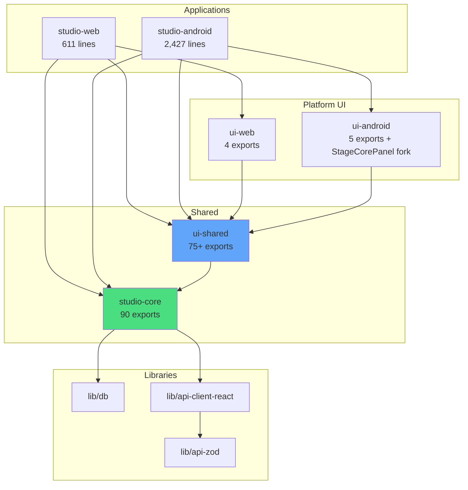
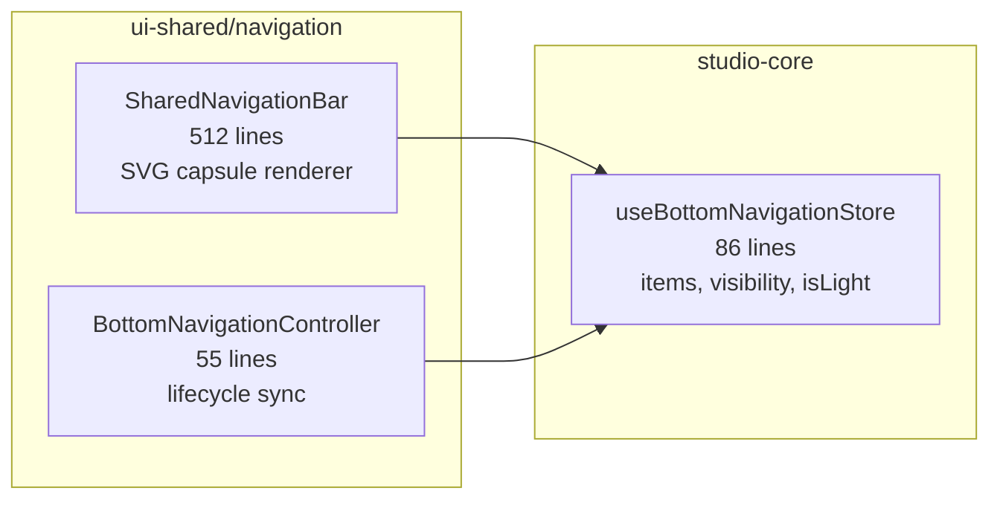
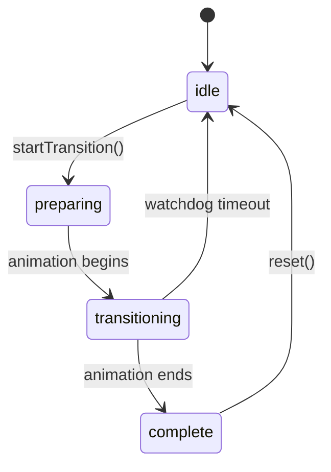
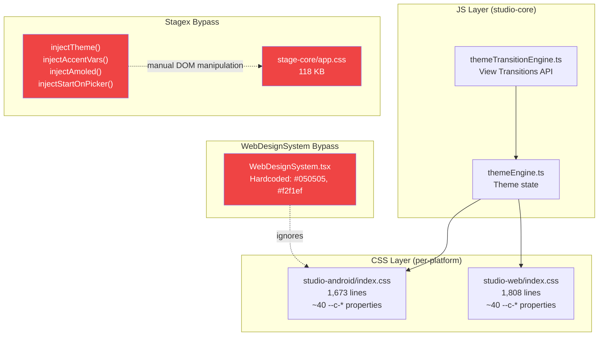
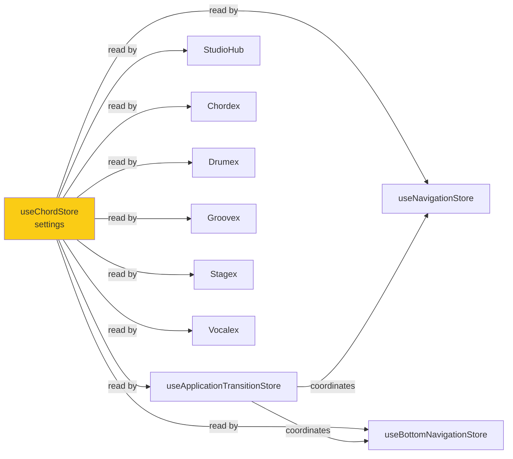
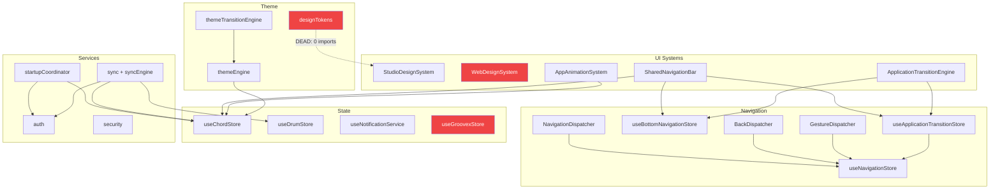

# Livex Complete Architecture Blueprint

> **Principal Software Architect** · July 2026 · Version 4.2.4
> Classification: Definitive Engineering Reference — Permanent
> This document is the single source of truth for the Livex architecture.

---

## Table of Contents

1. [Executive Summary](#1-executive-summary)
2. [Project Overview & Technology Stack](#2-project-overview--technology-stack)
3. [Monorepo Architecture Map](#3-monorepo-architecture-map)
4. [Platform Architecture](#4-platform-architecture)
5. [Rendering Architecture & Startup Lifecycle](#5-rendering-architecture--startup-lifecycle)
6. [Navigation System](#6-navigation-system)
7. [Bottom Navigation & App Switcher](#7-bottom-navigation--app-switcher)
8. [Transition & Launch Engine](#8-transition--launch-engine)
9. [Theme System](#9-theme-system)
10. [Design Token System](#10-design-token-system)
11. [Motion & Animation System](#11-motion--animation-system)
12. [Design System & Shared Components](#12-design-system--shared-components)
13. [State Management](#13-state-management)
14. [Services & Controllers](#14-services--controllers)
15. [Hooks, Utilities, Contexts](#15-hooks-utilities-contexts)
16. [Synchronization & Cloud](#16-synchronization--cloud)
17. [Authentication & Security](#17-authentication--security)
18. [Internationalization](#18-internationalization)
19. [OTA Updater](#19-ota-updater)
20. [Performance Architecture](#20-performance-architecture)
21. [Per-Application Analysis](#21-per-application-analysis)
22. [Monolith Audit](#22-monolith-audit)
23. [Duplication Audit](#23-duplication-audit)
24. [Platform Audit](#24-platform-audit)
25. [Architectural Drift Analysis](#25-architectural-drift-analysis)
26. [Dependency Graph](#26-dependency-graph)
27. [Ownership Audit](#27-ownership-audit)
28. [Import Audit](#28-import-audit)
29. [Unification Scorecard](#29-unification-scorecard)
30. [Governance Gaps](#30-governance-gaps)
31. [Root Cause Analysis](#31-root-cause-analysis)
32. [Engineering Recommendations](#32-engineering-recommendations)
33. [Recommended Target Architecture](#33-recommended-target-architecture)
34. [Unification Roadmap](#34-unification-roadmap)
35. [Final Conclusions](#35-final-conclusions)

---

## 1. Executive Summary

Livex is a multi-app music ecosystem built as a pnpm monorepo. It comprises six sub-applications — Hub, Chordex, Drumex, Groovex, Stagex, and Vocalex — intended to function as one unified music production and practice platform.

**Current reality:** Livex still feels like six independent applications sharing a loose scaffolding of common code. The fragmentation stems from three root causes: (1) the project evolved organically from a single-app (Chordex) into a multi-app platform without a planned architectural migration, (2) shared systems were retrofitted rather than designed from the start, and (3) no enforcement mechanism prevents per-app divergence.

**Key metrics:**

- **Overall architecture score: 47/100 (D+)**
- **270+ hardcoded hex colors** bypass the design token system
- **17+ divergent spring configurations** bypass the motion system
- **Zero feature modules** import from `designTokens.ts`
- **Two competing design token systems** with incompatible values
- **6 monolithic files** exceed 2,000 lines each
- **No ESLint**, no pre-commit hooks, no unit tests (2 test files total)
- **Stagex runs in an iframe** with its own 129KB CSS bundle

---

## 2. Project Overview & Technology Stack

### Technology Stack

| Layer                | Technology                          | Version |
| -------------------- | ----------------------------------- | ------- |
| **UI Framework**     | React                               | 18+     |
| **Language**         | TypeScript                          | ~5.7.2  |
| **State Management** | Zustand                             | Latest  |
| **Animation**        | Framer Motion (`motion/react`)      | Latest  |
| **Build Tool**       | Vite                                | Latest  |
| **Package Manager**  | pnpm                                | 10.26.1 |
| **Native Shell**     | Capacitor                           | Latest  |
| **Backend**          | Firebase (Auth) + Firestore (Sync)  | —       |
| **i18n**             | Tolgee                              | Latest  |
| **Styling**          | Vanilla CSS + CSS Custom Properties | —       |
| **Routing**          | Custom FSM-based navigation         | —       |

### Sub-Applications

| App         | Key       | Purpose                                                    | Main File                              | Lines                            |
| ----------- | --------- | ---------------------------------------------------------- | -------------------------------------- | -------------------------------- |
| **Hub**     | `hub`     | Central entry point, app launcher, settings, notifications | StudioHub.tsx                          | 6,832                            |
| **Chordex** | `chords`  | Chord library, progressions, songs, practice               | ChordPanel + SongsPanel + LibraryPanel | 5,507                            |
| **Drumex**  | `drums`   | Drum pattern editor, synthesis, library                    | DrumEditor.tsx                         | 5,200                            |
| **Groovex** | `groovex` | Groove mixer, backing tracks                               | GroovexPlayer.tsx + GroovexApp         | 1,033+                           |
| **Stagex**  | `stage`   | Live performance, setlists, DAW canvas                     | StageCorePanel.tsx                     | 2,358 (shared) / 2,799 (android) |
| **Vocalex** | `vocalex` | Vocal processing, pitch detection, lab                     | VocalexApp + LabPanel                  | 1,153+                           |

---

## 3. Monorepo Architecture Map

### Directory Structure

```
apps/
  studio-android/         ← Capacitor Android shell
    src/App.tsx             (2,427 lines)
    src/main.tsx            (140 lines)
    src/index.css           (1,673 lines — CSS custom properties)
    src/EmergencyDebugOverlay.tsx
  studio-web/             ← Web shell
    src/App.tsx             (611 lines)
    src/main.tsx            (24 lines)
    src/index.css           (1,808 lines — CSS custom properties)
packages/
  studio-core/            ← Shared logic, state, services (NO UI)
    src/index.ts            (90 export lines — flat namespace)
    src/store/              (useChordStore, useDrumStore, nav shim)
    src/lib/                (40+ service/utility files)
    src/lib/navigation/     (9 navigation system files)
    src/lib/notifications/  (NotificationService)
    src/lib/updater/        (8 OTA updater files)
    src/hooks/              (3 hooks)
    src/data/               (chord data, progressions, songs)
    src/vocalex/            (labSessionDb, takesDb)
  ui-shared/              ← Shared UI components, feature modules
    src/index.ts            (75+ exports)
    src/components/         (30+ shared components)
    src/components/design-system/  (StudioDesignSystem, WebDesignSystem, ActionButton, ProgressiveBlur)
    src/components/layout/  (StudioLayoutSystem)
    src/components/launch/  (ApplicationTransitionEngine, LaunchAnimationEngine)
    src/navigation/         (SharedNavigationBar, AppAnimationSystem, BottomNavigationController, SharedNavigationContainer)
    src/features/chordex/   (ChordPanel, SongsPanel, LibraryPanel)
    src/features/drumex/    (DrumEditor)
    src/features/groovex/   (GroovexApp, GroovexPlayer, state/useGroovexStore)
    src/features/stagex/    (StageCorePanel)
    src/features/vocalex/   (VocalexApp, LabPanel)
  ui-android/             ← Android-only (5 re-exports + StageCorePanel fork)
  ui-web/                 ← Web-only (WebSidebarLayout, SidebarProvider, StudioLandingPage)
lib/
  db/                     ← Database layer
  api-client-react/       ← API client
  api-zod/                ← Zod schemas
scripts/
  enforce-import-boundaries.mjs  (83 lines — CI boundary check)
  enforce-platform-scope.mjs     (96 lines — CI scope check)
  validate-documentation.mjs     (270 lines — docs validation)
  verify-versions-consistency.mjs
  version-manager.mjs
```

### Package Dependency Hierarchy



### Package Boundary Rules (Enforced in CI)

| Package       | Can Import From            | Cannot Import From        | Enforced By                     |
| ------------- | -------------------------- | ------------------------- | ------------------------------- |
| `studio-core` | `lib/*`, npm               | ❌ Any UI package         | `enforce-import-boundaries.mjs` |
| `ui-shared`   | `studio-core`, npm         | ❌ `ui-web`, `ui-android` | `enforce-import-boundaries.mjs` |
| `ui-web`      | `ui-shared`, `studio-core` | ❌ `ui-android`           | `enforce-import-boundaries.mjs` |
| `ui-android`  | `ui-shared`, `studio-core` | ❌ `ui-web`               | `enforce-import-boundaries.mjs` |

---

## 4. Platform Architecture

### Android (Capacitor)

The Android platform runs as a WebView inside a Capacitor native shell. Key Capacitor integrations:

| API                      | Usage                                                     |
| ------------------------ | --------------------------------------------------------- |
| `@capacitor/core`        | `Capacitor.isNativePlatform()`, `getPlatform()`           |
| `@capacitor/app`         | Back button handling, app state listeners                 |
| `@capacitor/filesystem`  | APK download and caching for OTA updates                  |
| `@capacitor/preferences` | Native key-value storage (encrypted settings persistence) |
| `CapacitorHttp`          | Network requests on native (bypass CORS)                  |

**Android-specific code:** `EmergencyDebugOverlay.tsx` (debug panel), black screen watchdog, `useStatusBar` (status bar color), hardware back button via `@capacitor/app`

### Web

The web platform runs as a standard Vite SPA. Key differences from Android:

| Feature                     | Android                               | Web                                 |
| --------------------------- | ------------------------------------- | ----------------------------------- |
| **App.tsx size**            | 2,427 lines                           | 611 lines                           |
| **Lazy loading**            | All 10 feature modules `React.lazy()` | Only StudioHub lazy                 |
| **Navigation chrome**       | Bottom nav (SharedNavigationBar)      | Sidebar (WebSidebarLayout)          |
| **Transition engine**       | Full ApplicationTransitionEngine      | None                                |
| **Black screen watchdog**   | Yes (1,200ms timeout)                 | No                                  |
| **Emergency debug overlay** | Yes (LazyEmergencyOverlay)            | No                                  |
| **Launch animation**        | LaunchAnimationEngine                 | No                                  |
| **Landing page**            | No                                    | StudioLandingPage (unauthenticated) |
| **LifecycleTracker**        | Yes (throughout render tree)          | No                                  |

### Stagex Platform Isolation

Stagex is architecturally the most isolated sub-application. It runs inside an `<iframe>` with:

- **Own CSS:** `stage-core/app.css` (118KB), `stage-core/stage-core.css` (11KB)
- **Own fonts:** `stage-core/fonts/google-fonts.css`
- **Manual theme bridge:** 4 DOM manipulation functions cross the iframe boundary:
  - `injectTheme(iframe, theme)` — sets CSS classes on iframe `<html>`
  - `injectAccentVars(iframe, from, to)` — sets CSS custom properties on iframe `:root`
  - `injectAmoled(iframe, amoled)` — toggles AMOLED class
  - `injectStartOnPicker(iframe)` — injects picker mode
- **Android fork:** `ui-android/StageCorePanel.tsx` (2,799 lines) is a **separate implementation** from `ui-shared/features/stagex/StageCorePanel.tsx` (2,358 lines)
- **Communication:** `postMessage` and `iframe.contentWindow` direct access

---

## 5. Rendering Architecture & Startup Lifecycle

### Android Render Tree

```
main.tsx
├── createRoot(#root).render(
│   ├── <RootAppContainer />          ← key-based force re-render wrapper
│   │   └── <App key={appKey} />      ← 2,427 lines
│   │       └── <div.app-container>
│   │           ├── <ErrorBoundary moduleName="RootApp">
│   │           │   └── <Suspense>
│   │           │       └── <TolgeeProvider>
│   │           │           ├── <div.app-main-layout>        (z-index: 1, Hub layer)
│   │           │           │   └── <Suspense fallback={StudioHubSkeleton}>
│   │           │           │       └── <StudioHub />        (lazy, 6,832 lines)
│   │           │           │
│   │           │           ├── <AnimatePresence mode="wait"> (z-index: 2, sub-app layer)
│   │           │           │   └── <motion.div key={stableKey}>
│   │           │           │       └── <SubAppWrapper app={stableKey}>
│   │           │           │           └── <SubAppScaffold>
│   │           │           │               └── <ErrorBoundary>
│   │           │           │                   └── <Suspense>
│   │           │           │                       ├── <AppReadyNotifier />
│   │           │           │                       └── <AppEntryTransition>
│   │           │           │                           └── <FeatureModule />
│   │           │           │
│   │           │           ├── <AnimatePresence>             (transition effects)
│   │           │           │   └── <ApplicationTransitionEngine />
│   │           │           │
│   │           │           └── <BottomNavigationController />
│   │           │
│   │           └── <LaunchAnimationEngine />                (initial splash)
│   │
│   ├── <GlobalOverlays />            ← UpdateIndicator (deferred via rAF)
│   └── <EmergencyDebugOverlayWrapper />  ← lazy loaded debug panel
)
```

### Android Startup Sequence

```
T+0ms    main.tsx: createRoot + render (synchronous)
T+0ms    initDevToolsFramework()
T+10ms   App.tsx mounts → reads useChordStore.settings → determines theme
T+50ms   StartupCoordinator.start() → auth → data load → UI ready
T+100ms  LaunchAnimationEngine shows branded splash
T+300ms  StudioHub lazy loads → StudioHubSkeleton shown
T+600ms  Hub renders → splash fades
T+1200ms Black screen watchdog fires (checks for compositor freeze)
T+6000ms Deferred: service worker cleanup, cache migration
T+8000ms Deferred: seedAudioAssets() (drum samples)
```

### Keep-Alive Strategy

- **Hub:** Stays mounted when a sub-app is active. Hidden via `visibility: hidden`, `opacity: 0`. This avoids re-initialization cost when returning to Hub.
- **Sub-apps:** Use `AnimatePresence mode="wait"` with keyed `motion.div` wrappers. Each sub-app unmounts on exit — there is no keep-alive for sub-apps.
- **Stagex iframe:** Once loaded, the iframe persists in the DOM. Never unmounted.

---

## 6. Navigation System

### Architecture

The navigation system is a **custom state-machine-based FSM** replacing React Router. It is the most unified subsystem in Livex.

| File                       | Package     | Lines | Role                                                                     |
| -------------------------- | ----------- | ----- | ------------------------------------------------------------------------ |
| `useNavigationStore.ts`    | studio-core | ~200  | Zustand store: history stack, active route, back handlers, gesture state |
| `NavigationDispatcher.ts`  | studio-core | ~150  | Imperative API: `push()`, `replace()`, `goBack()`                        |
| `NavigationCoordinator.ts` | studio-core | ~100  | Coordinates navigation with transition engine                            |
| `BackDispatcher.ts`        | studio-core | ~80   | Hardware/software back button dispatch                                   |
| `GestureDispatcher.ts`     | studio-core | ~60   | Swipe gesture navigation                                                 |
| `TransitionCoordinator.ts` | studio-core | ~80   | Transition orchestration                                                 |
| `useBackHandler.ts`        | studio-core | ~40   | React hook for back handler registration                                 |
| `navigationTypes.ts`       | studio-core | ~50   | Type definitions (AppKey, ActivePanel, Route)                            |
| `validation.ts`            | studio-core | ~30   | Route validation                                                         |

### Consumer Map

| System                 | Hub | Chordex | Drumex | Groovex | Stagex | Vocalex |
| ---------------------- | --- | ------- | ------ | ------- | ------ | ------- |
| `useNavigationStore`   | ✅  | ✅      | ✅     | ✅      | ✅     | ✅      |
| `NavigationDispatcher` | —   | ✅      | ✅     | ✅      | ❌     | ✅      |
| `useBackHandler`       | ✅  | ✅      | ✅     | ✅      | ✅     | ✅      |

### Legacy

`packages/studio-core/src/store/useNavigationStore.ts` is a **3-line re-export shim** pointing to the real store. Should be deleted.

---

## 7. Bottom Navigation & App Switcher

### Bottom Navigation Architecture



### App Registration Pattern

Each app registers its bottom nav items by calling `useBottomNavigationStore.getState().setItems([...])` in a `useEffect`:

| App     | Registers? | Location                   | Pattern                                             |
| ------- | ---------- | -------------------------- | --------------------------------------------------- |
| Hub     | ❌         | —                          | No bottom nav in Hub (by design)                    |
| Chordex | ✅         | `SubAppWrapper` in App.tsx | Registered in the shell, NOT inside Chordex modules |
| Drumex  | ✅         | DrumEditor.tsx line 557    | Standard pattern                                    |
| Groovex | ✅         | GroovexApp line 92         | Standard pattern                                    |
| Stagex  | ✅         | StageCorePanel line 1328   | Conditional on `liveMode`                           |
| Vocalex | ✅         | VocalexApp line 195        | Standard pattern                                    |

> ⚠️ Chordex registers differently from all other apps — registration lives in the shell (`App.tsx SubAppWrapper`) instead of inside the feature module.

### App Switcher

The app switcher is integrated into `SharedNavigationBar.tsx`. It renders as an overlay drawer within the bottom nav. The app list is **hardcoded to 6 apps** — there is no dynamic app registry.

---

## 8. Transition & Launch Engine

### Transition FSM



| File                               | Package     | Lines | Role                                         |
| ---------------------------------- | ----------- | ----- | -------------------------------------------- |
| `useApplicationTransitionStore.ts` | studio-core | ~120  | FSM state machine                            |
| `ApplicationTransitionEngine.tsx`  | ui-shared   | ~600  | Visual effects: dot animations, color blooms |
| `LaunchAnimationEngine.tsx`        | ui-shared   | ~200  | App launch splash screen                     |

### Inline Spring Configs in Transition Engine

`ApplicationTransitionEngine.tsx` uses **5 different inline spring configs** instead of importing from design tokens:

| Config   | Stiffness | Damping | Mass | Purpose        |
| -------- | --------- | ------- | ---- | -------------- |
| Config 1 | 350       | 15      | —    | Dot scale      |
| Config 2 | 300       | 14      | —    | Dot opacity    |
| Config 3 | 350       | 12      | —    | Bloom scale    |
| Config 4 | 350       | 10      | —    | Bloom opacity  |
| Config 5 | 380       | 26      | —    | Container exit |

`LaunchAnimationEngine.tsx` adds one more: `{380, 26}`.

---

## 9. Theme System

### Architecture



### Platform CSS Divergence

The two platform CSS files define the same ~40 `--c-*` custom properties but diverge by **135 lines**. There is **no shared CSS base file**. When a token is added to one platform's CSS but not the other, it is undefined on the missing platform.

---

## 10. Design Token System

### Official File

`packages/studio-core/src/lib/designTokens.ts` (90 lines)

| Token Group        | Contents                                                           |
| ------------------ | ------------------------------------------------------------------ |
| `ColorTokens`      | 5 accent colors, 5 dark surfaces, 5 light surfaces, borders, glass |
| `TypographyTokens` | Font families                                                      |
| `SpacingTokens`    | xs (4px) through xxl (48px) + bottomNavSafe                        |
| `RadiusTokens`     | xs (4px) through full (9999px)                                     |
| `BlurTokens`       | navBg, glassBg                                                     |
| `ShadowTokens`     | navShadow, cardShadow                                              |
| `GlassTokens`      | border, background, backdropFilter, boxShadow                      |
| `MotionTokens`     | transitionDurationHub (0.35), transitionDurationApp (0.95)         |
| `SpringPresets`    | soft, stiff, expressive                                            |
| `HapticTokens`     | tap (8), drag (5), hold (15)                                       |

### Adoption Status

> 🔴 **CRITICAL: `designTokens.ts` is exported from `studio-core` but imported by ZERO feature modules. The entire design token system is dead code at the consumer level.**

The file is properly exported in `studio-core/src/index.ts` (line 88). It compiles. It ships. But no feature module, no component, and no app imports any token from it.

---

## 11. Motion & Animation System

### Two Competing Systems

| Property               | `designTokens.ts` (studio-core)                | `AppAnimationSystem.tsx` (ui-shared)                       |
| ---------------------- | ---------------------------------------------- | ---------------------------------------------------------- |
| **Location**           | `packages/studio-core/src/lib/designTokens.ts` | `packages/ui-shared/src/navigation/AppAnimationSystem.tsx` |
| **Spring: Soft**       | `{stiffness: 380, damping: 22, mass: 0.5}`     | `{stiffness: 150, damping: 25, mass: 1.0}`                 |
| **Spring: Expressive** | `{stiffness: 400, damping: 20, mass: 0.35}`    | `{stiffness: 320, damping: 18, mass: 0.70}`                |
| **Durations**          | `{hub: 0.35, app: 0.95}`                       | `{veryFast: 0.10, fast: 0.20, normal: 0.30, slow: 0.40}`   |
| **Imported by**        | ❌ Nothing                                     | ⚠️ Some components                                         |
| **M3 Easings**         | ❌ None                                        | ✅ emphasized, standard, accelerate, decelerate            |

The `designTokens.ts` "soft" spring (stiffness 380) is **2.5x stiffer** than `AppAnimationSystem.tsx` "soft" (stiffness 150). Using both creates jarring inconsistency.

### 17+ Inline Spring Configurations

| Component                   | Stiffness               | Damping            | Mass   |
| --------------------------- | ----------------------- | ------------------ | ------ |
| SharedNavigationBar         | 9 different configs     | —                  | —      |
| ApplicationTransitionEngine | 350, 300, 350, 350, 380 | 15, 14, 12, 10, 26 | —      |
| StudioHub (GOOEY_SPRING)    | 550                     | 33                 | 0.45   |
| StudioHub (settings)        | 350, 400                | 26, 28             | —      |
| ActionButton                | 350                     | 18                 | 0.8    |
| WebAppSectionDock           | 160                     | 15                 | 0.1    |
| SettingControls             | 300, 380                | 24, 30             | 0.8, — |
| StudioProgressBar           | 100                     | 30                 | —      |
| LaunchAnimationEngine       | 380                     | 26                 | —      |

**None of these import from either token system.** Every component rolls its own parameters.

---

## 12. Design System & Shared Components

### Official Design System

`StudioDesignSystem.tsx` (818 lines) — the canonical component library:

| Component        | Type               | Description           |
| ---------------- | ------------------ | --------------------- |
| `Button`         | `React.forwardRef` | Primary action button |
| `Card`           | function           | Surface container     |
| `Dialog`         | function           | Modal dialog          |
| `Sheet`          | function           | Bottom sheet          |
| `SearchBar`      | `React.forwardRef` | Search input field    |
| `Header`         | function           | Section header        |
| `FloatingButton` | function           | FAB button            |
| `Skeleton`       | function           | Loading shimmer       |
| `Loading`        | function           | Full-screen loading   |

### Parallel Design System

`WebDesignSystem.tsx` (440+ lines) — web-specific components with **hardcoded colors**:

| Component          | Issue                                      |
| ------------------ | ------------------------------------------ |
| `WebAppShell`      | Hardcoded `bg-[#050505]`, `text-[#f2f1ef]` |
| `WebCard`          | Duplicates `Card`                          |
| `WebButton`        | Duplicates `Button`                        |
| `WebToolbarButton` | No mobile equivalent                       |
| `WebIconButton`    | No mobile equivalent                       |
| `WebSectionHeader` | Duplicates `Header`                        |

### Component Duplication Inventory

| Type             | Count | Implementations                                                                                                                                                                                                             |
| ---------------- | ----- | --------------------------------------------------------------------------------------------------------------------------------------------------------------------------------------------------------------------------- |
| **Button**       | 8     | Button, ActionButton, FloatingButton, WebButton, WebToolbarButton, WebIconButton, AnimatedActionButton, SidebarMenuButton                                                                                                   |
| **Card**         | 6     | Card, WebCard, GradientBorderCard, StudioAuthCard, BentoSettingCard, StudioSkeletonCard                                                                                                                                     |
| **Dialog/Sheet** | 8+    | Dialog, Sheet, DialogScaffold, ApplyToSheet, ChangelogSheet, UpdateDiagnosticsSheet, HarmonizerSheet, MigrationPromptSheet                                                                                                  |
| **Header**       | 6     | Header, SectionHeader, WebSectionHeader, AnimatedAppHeader, StudioSkeletonHeader, SidebarHeader                                                                                                                             |
| **Loading**      | 13    | Loading, Skeleton, AppSpinner, SmartLoading, StudioHubSkeleton, VocalexTakesSkeleton, GroovexAppSkeleton, StagexPanelSkeleton, DrumEditorSkeleton, ChordexPanelSkeleton, GroovexMixerSkeleton, LoadingLottie, StudioSpinner |
| **Toggle**       | 3     | Toggle, InkThemeToggle, StudioThemeToggler                                                                                                                                                                                  |

---

## 13. State Management

### Store Inventory

| Store                           | Package       | Persistence  | Purpose                      | Issues                                         |
| ------------------------------- | ------------- | ------------ | ---------------------------- | ---------------------------------------------- |
| `useChordStore`                 | studio-core   | ✅ Encrypted | Global settings + chord data | ⚠️ **MISNAMED** — is the global settings store |
| `useDrumStore`                  | studio-core   | ✅ Encrypted | Drum patterns, instruments   | ✅ Correct                                     |
| `useNavigationStore`            | studio-core   | ✅ Encrypted | Routes, history, gestures    | ✅ Has legacy shim                             |
| `useBottomNavigationStore`      | studio-core   | ❌           | Nav items, visibility        | ✅ Correct                                     |
| `useApplicationTransitionStore` | studio-core   | ❌           | Transition FSM               | ✅ Correct                                     |
| `useNotificationService`        | studio-core   | ✅ Encrypted | Notifications                | ✅ Correct                                     |
| `useGroovexStore`               | **ui-shared** | ❌           | Groovex state                | 🔴 **WRONG PACKAGE**                           |

### useChordStore — The Misnamed Global Store

`useChordStore` contains **two distinct concerns**:

1. **Global settings** (used by ALL 6 apps): `theme`, `accentColor`, `language`, `amoled`, `perApp` (per-app accent overrides), `defaultStageView`, `lastSession`
2. **Chordex-specific data** (used only by Chordex): chords, songs, custom chords, progressions

Every sub-app imports `useChordStore` to read settings. This creates tight coupling to a store named after one app.

### Cross-Store Read Pattern



### Duplicate Export Paths

| Shim                                          | Real Location                               | Action                  |
| --------------------------------------------- | ------------------------------------------- | ----------------------- |
| `studio-core/src/store/useNavigationStore.ts` | `lib/navigation/useNavigationStore.ts`      | Delete shim             |
| `ui-shared/src/groovex/useGroovexStore.ts`    | `features/groovex/state/useGroovexStore.ts` | Delete after store move |

---

## 14. Services & Controllers

### Controllers

| Controller                   | Package     | Status     |
| ---------------------------- | ----------- | ---------- |
| `BottomNavigationController` | ui-shared   | ✅ Unified |
| `NavigationDispatcher`       | studio-core | ✅ Unified |
| `BackDispatcher`             | studio-core | ✅ Unified |
| `GestureDispatcher`          | studio-core | ✅ Unified |
| `TransitionCoordinator`      | studio-core | ✅ Unified |
| `NavigationCoordinator`      | studio-core | ✅ Unified |

### Missing Controllers

| Controller            | Current State                   | Impact                          |
| --------------------- | ------------------------------- | ------------------------------- |
| **MotionController**  | None — 17+ inline configs       | Every animation feels different |
| **OverlayController** | None — dialogs manage own state | Overlays can stack incorrectly  |
| **SearchController**  | None — per-app local search     | No cross-app search             |

### Services

| Service                  | Package     | Purpose                          |
| ------------------------ | ----------- | -------------------------------- |
| `startupCoordinator`     | studio-core | App initialization orchestration |
| `themeTransitionEngine`  | studio-core | View Transitions API wrapper     |
| `sync` + `syncEngine`    | studio-core | Firestore cloud sync             |
| `auth` + `accountStatus` | studio-core | Firebase Authentication          |
| `NotificationService`    | studio-core | In-app notifications             |
| `performanceProfiler`    | studio-core | Runtime metrics                  |
| `devTools`               | studio-core | Debug provider registration      |
| `activityLogger`         | studio-core | User activity logging            |
| `lyricsService`          | studio-core | Lyrics lookup                    |
| `chordService`           | studio-core | Chord data fetching              |
| `apkDownloader`          | studio-core | OTA APK download                 |
| `security`               | studio-core | Encrypted localStorage           |

---

## 15. Hooks, Utilities, Contexts

### Hooks

| Hook                               | Package                | Purpose                                         | Used By                  |
| ---------------------------------- | ---------------------- | ----------------------------------------------- | ------------------------ |
| `useShallow`                       | Re-export from zustand | Selector shallow compare                        | All stores               |
| `useIsWebDesktop`                  | studio-core            | `!Capacitor.isNativePlatform() && width >= 768` | All apps                 |
| `useBackHandler`                   | studio-core            | Register back handler                           | All apps                 |
| `useT`                             | studio-core            | i18n translation function                       | All apps                 |
| `useScrollHide`                    | studio-core            | Scroll-based bottom nav hide                    | Chordex, Stagex, Vocalex |
| `useLiquidGlassNav`                | studio-core            | iOS Liquid Glass nav effect                     | Navigation               |
| `useNavCollapsed` / `useNavHidden` | studio-core            | Nav visibility state                            | Navigation               |
| `useStatusBar`                     | studio-core            | Android status bar color                        | Android only             |
| `useAppUpdate`                     | studio-core            | OTA update state                                | Android only             |
| `useStudioPreferences`             | studio-core            | User preferences                                | Settings UI              |
| `useStudioShortcuts`               | studio-core            | Keyboard shortcuts                              | Desktop only             |

### Contexts (Only 2)

| Context           | Package   | Purpose              |
| ----------------- | --------- | -------------------- |
| `ProgressContext` | ui-shared | Progress bar theming |
| `SidebarContext`  | ui-web    | Web sidebar state    |

Livex primarily uses **Zustand stores** (global singletons) rather than React Context. This is an architectural strength — no provider tree nesting, no context re-render propagation.

---

## 16. Synchronization & Cloud

### Architecture

`sync.ts` + `syncEngine.ts` in studio-core handle all cloud persistence via Firestore.

**What syncs:** Chords, songs, custom chords, drum patterns, settings, per-app preferences

**Sync backends:** `syncBackends/` directory with `supabaseRealtime.ts` — backend provider is configurable via `VITE_SYNC_BACKEND_PROVIDER`

### Sync Anomalies

| App                      | Sync Method               | Issue                      |
| ------------------------ | ------------------------- | -------------------------- |
| Chordex, Drumex, Groovex | Firestore via sync.ts     | ✅ Standard                |
| Stagex                   | `postMessage` to iframe   | ⚠️ Fragile bridge          |
| Vocalex                  | IndexedDB for audio blobs | ✅ By design (binary data) |

---

## 17. Authentication & Security

**Authentication:** Firebase Auth via `auth.ts`. Single implementation, used by all apps.

**Security:** `security.ts` provides encrypted localStorage via `secureWriteLocal()`, `secureReadLocal()`, `secureDeleteLocal()`. All persistent stores (useChordStore, useDrumStore, useNavigationStore, useNotificationService) use encrypted persistence.

**Account lifecycle:** `accountStatus.ts` manages account states: `unknown → signedOut → active → pending (deletion) → disabled`

---

## 18. Internationalization

**System:** Tolgee (i18n framework)

**Languages:** English (en), Spanish (es)

**API:** `useT()` hook returns translation function. All apps import from `@workspace/studio-core`.

**Provider:** `<TolgeeProvider>` wraps the entire app tree in both Android and Web entry points.

---

## 19. OTA Updater

8 files in `studio-core/src/lib/updater/`:

| File                | Purpose                              |
| ------------------- | ------------------------------------ |
| `stateMachine.ts`   | Update state FSM                     |
| `pipeline.ts`       | Download → verify → install pipeline |
| `installActions.ts` | APK installation actions             |
| `recovery.ts`       | Update failure recovery              |
| `diagnostics.ts`    | Update diagnostic data               |
| `flightRecorder.ts` | Update event recording               |
| `cacheManager.ts`   | APK cache management                 |
| `versionLogger.ts`  | Version history                      |

The updater uses Capacitor Filesystem for APK download/storage and has a visual indicator component (`UpdateIndicator`).

---

## 20. Performance Architecture

### Rendering Optimizations

| Technique                      | Where                           | Impact                                            |
| ------------------------------ | ------------------------------- | ------------------------------------------------- |
| `React.lazy()`                 | All sub-apps on Android         | Reduces initial bundle                            |
| `Suspense` fallbacks           | Each sub-app wrapper            | Shows skeletons during load                       |
| `CSS contain: strict`          | Panel containers                | Limits layout/paint scope                         |
| `memo()`                       | SubAppWrapper, AppReadyNotifier | Prevents unnecessary re-renders                   |
| Hub keep-alive                 | App.tsx                         | Avoids Hub re-init on return                      |
| Double `requestAnimationFrame` | AppReadyNotifier                | Detects actual paint completion                   |
| Deferred initialization        | main.tsx (6s, 8s delays)        | Keeps startup fast                                |
| `flushSync`                    | App.tsx                         | Forces synchronous DOM updates during transitions |

### Potential Performance Issues

| Issue                            | Location                | Impact                                    |
| -------------------------------- | ----------------------- | ----------------------------------------- |
| 270+ inline `style={{}}` objects | Feature modules         | Creates new objects every render          |
| Stagex iframe (129KB CSS)        | StageCorePanel          | Loads separate CSS bundle                 |
| 6,832-line monolith              | StudioHub               | Large parse/compile cost                  |
| No code splitting in web         | studio-web App.tsx      | All modules loaded eagerly                |
| `AnimatePresence mode="wait"`    | App.tsx sub-app wrapper | Sequential mount/unmount (not concurrent) |

---

## 21. Per-Application Analysis

### Hub

| Attribute            | Detail                                                                                                                                                                   |
| -------------------- | ------------------------------------------------------------------------------------------------------------------------------------------------------------------------ |
| **File**             | StudioHub.tsx (6,832 lines)                                                                                                                                              |
| **Shared systems**   | Navigation, Theme, Notifications, Settings                                                                                                                               |
| **Private systems**  | Entire Hub UI, 15+ settings pages, DevTools dashboard, notification center                                                                                               |
| **Technical debt**   | **Extreme** — 6,832 lines in one file. Contains settings, account management, notification timeline, app grid, theme controls, language picker, about page, debug tools. |
| **Hardcoded colors** | Moderate (embedded in settings UI)                                                                                                                                       |

### Chordex

| Attribute                | Detail                                                                     |
| ------------------------ | -------------------------------------------------------------------------- |
| **Files**                | ChordPanel (1,291), SongsPanel (3,595), LibraryPanel (621)                 |
| **Shared systems**       | Navigation, Bottom Nav (registered in App.tsx shell), Theme, Settings      |
| **Private systems**      | Chord library, progression generator, song viewer                          |
| **Technical debt**       | SongsPanel (3,595 lines), 150 hardcoded hex colors                         |
| **Registration anomaly** | Bottom nav registered in App.tsx SubAppWrapper, not inside Chordex modules |

### Drumex

| Attribute           | Detail                                                     |
| ------------------- | ---------------------------------------------------------- |
| **File**            | DrumEditor.tsx (5,200 lines)                               |
| **Shared systems**  | Navigation, Bottom Nav, Theme, Settings (useChordStore)    |
| **Private systems** | Drum editor, audio synthesis engine                        |
| **Technical debt**  | **Extreme** — 5,200-line monolith, 96 hardcoded hex colors |

### Groovex

| Attribute          | Detail                                                                    |
| ------------------ | ------------------------------------------------------------------------- |
| **Files**          | GroovexPlayer.tsx (1,033), GroovexApp, GroovexLibrary, GroovexPreferences |
| **Shared systems** | Navigation, Bottom Nav, Theme, Settings (useChordStore)                   |
| **Store anomaly**  | `useGroovexStore` lives in `ui-shared` instead of `studio-core`           |
| **Technical debt** | Store in wrong package, duplicate re-export path                          |

### Stagex

| Attribute          | Detail                                                                 |
| ------------------ | ---------------------------------------------------------------------- |
| **Files**          | StageCorePanel (2,358 ui-shared / 2,799 ui-android — **TWO FORKS**)    |
| **Architecture**   | **Runs in iframe** — architecturally a separate web application        |
| **CSS**            | Own bundle: app.css (118KB) + stage-core.css (11KB) + google-fonts.css |
| **Theme bridge**   | 4 manual DOM injection functions                                       |
| **Sync**           | Via postMessage to iframe (fragile)                                    |
| **Technical debt** | **Critical** — iframe isolation is the #1 fragmentation source         |

### Vocalex

| Attribute           | Detail                                                                               |
| ------------------- | ------------------------------------------------------------------------------------ |
| **Files**           | VocalexApp, LabPanel (1,153), HarmonizerSheet (805), PitchPanel, CoachPanel          |
| **Shared systems**  | Navigation, Bottom Nav, Theme, Settings                                              |
| **Private systems** | Pitch detection (pitchYin), recording, takes/lab sessions                            |
| **Technical debt**  | Moderate — cleanest app architecturally. Uses IndexedDB for audio blobs (by design). |

---

## 22. Monolith Audit

| File                             | Lines | Why It Became a Monolith                                                                                         | Decomposition Boundaries                                                                     |
| -------------------------------- | ----- | ---------------------------------------------------------------------------------------------------------------- | -------------------------------------------------------------------------------------------- |
| **StudioHub.tsx**                | 6,832 | Hub started as the main app surface. Settings, notifications, account, and debug tools were added incrementally. | Settings pages (~15 modules), Notification center, App grid, Account management, Debug tools |
| **DrumEditor.tsx**               | 5,200 | Entire drum app in one file. UI, audio engine, library browser, pattern editor, preferences all coupled.         | Pattern editor, Instrument panel, Library browser, Audio engine wrapper, Preferences         |
| **AccountCard.tsx**              | 4,398 | Auth card grew to include MigrationPromptSheet, billing flows, account lifecycle management.                     | Auth card, Migration sheet, Billing section, Account status display                          |
| **SongsPanel.tsx**               | 3,595 | Song list + player + editor + 104 hardcoded colors.                                                              | Song list, Song player, Song editor, Empty states                                            |
| **StageCorePanel.tsx (android)** | 2,799 | Fork of shared implementation with platform-specific iframe handling.                                            | Should not be a fork — merge back                                                            |
| **StageCorePanel.tsx (shared)**  | 2,358 | Iframe management + settings + toolbar + multiple views.                                                         | Iframe manager, Settings panel, Toolbar, View switcher                                       |
| **App.tsx (android)**            | 2,427 | Shell grew with watchdog, diagnostics, lifecycle tracking, transition coordination.                              | App shell, SubAppWrapper, Watchdog system, Diagnostics                                       |

---

## 23. Duplication Audit

### Duplicated Responsibilities

| Responsibility                  | Implementations                                             | Which Should Be Official                      |
| ------------------------------- | ----------------------------------------------------------- | --------------------------------------------- |
| **Spring animation parameters** | designTokens.ts, AppAnimationSystem.tsx, 17+ inline configs | Merge into designTokens.ts                    |
| **Design system components**    | StudioDesignSystem, WebDesignSystem                         | Merge WebDesignSystem into StudioDesignSystem |
| **Theme tokens (CSS)**          | android/index.css, web/index.css                            | Extract shared base                           |
| **Theme injection**             | CSS custom properties, Stagex manual injection              | Eliminate iframe, use shared CSS              |
| **Settings storage**            | useChordStore (settings + chord data)                       | Split into useSettingsStore + useChordStore   |
| **Groovex state**               | useGroovexStore in ui-shared                                | Move to studio-core                           |
| **StageCorePanel**              | ui-shared version + ui-android fork                         | Merge into one                                |
| **Loading states**              | 13 implementations                                          | Compose from shared Skeleton primitives       |

### Intentional vs Debt

| Duplication           | Intentional? | Rationale                                         |
| --------------------- | ------------ | ------------------------------------------------- |
| Per-app skeletons     | ✅           | Each app has unique UI to shimmer                 |
| Per-app audio engines | ✅           | Guitar, drum, vocal are domain-specific           |
| WebDesignSystem       | ❌           | Created as shortcut, bypasses tokens              |
| Dual spring systems   | ❌           | Second system created without consolidating first |
| Dual StageCorePanel   | ❌           | Platform fork rather than conditional code        |
| Per-app search        | ❌           | No shared search system exists                    |

---

## 24. Platform Audit

### Platform Leakage

| Issue                              | Description                                                                                                                                               |
| ---------------------------------- | --------------------------------------------------------------------------------------------------------------------------------------------------------- |
| **Capacitor in studio-core**       | `useIsWebDesktop`, `nativePlatform.ts`, `apkDownloader.ts` all import `@capacitor/core`. This couples the "platform-agnostic" core to a native framework. |
| **Android-specific UI in App.tsx** | Black screen watchdog, LifecycleTracker, EmergencyDebugOverlay are 1,800+ lines of Android-only code in App.tsx.                                          |
| **CSS divergence**                 | 135-line difference between platform CSS files. No shared base.                                                                                           |
| **Stagex iframe**                  | 129KB of CSS that only exists for Stagex, loaded regardless of whether user opens Stagex.                                                                 |

### Platform Code Distribution

| Package     | Android-Specific                               | Web-Specific                                         | Shared                    |
| ----------- | ---------------------------------------------- | ---------------------------------------------------- | ------------------------- |
| studio-core | `apkDownloader`, `nativePrefs`, `useStatusBar` | —                                                    | Everything else           |
| ui-shared   | —                                              | WebDesignSystem, WebAppSectionDock                   | Everything else           |
| ui-android  | StageCorePanel fork                            | —                                                    | Re-exports from ui-shared |
| ui-web      | —                                              | WebSidebarLayout, SidebarProvider, StudioLandingPage | —                         |

---

## 25. Architectural Drift Analysis

### Drift Event 1: The Chordex Origin (Pre-2026)

**What happened:** Livex started as "Chordex" — a single chord practice app. The main store was named `useChordStore` because it was the only store. Settings, user data, and app state all lived here.

**Impact:** When other apps were added, they inherited `useChordStore` for settings access. The name was never updated. All apps are now permanently coupled to a Chordex-named store.

### Drift Event 2: Stagex Iframe Architecture

**What happened:** Stagex was likely an independent canvas-based web application that was embedded into Livex via iframe rather than rebuilt as a React component.

**Impact:** Stagex cannot participate in the shared theme system, CSS, or component lifecycle. It requires a manual bridge. A separate Android fork was created for platform differences.

### Drift Event 3: Dual Design Token Systems

**What happened:** `designTokens.ts` was created in studio-core as the canonical token file. Later, `AppAnimationSystem.tsx` was created in ui-shared with its own motion tokens with **completely different values**. Neither system was enforced.

**Impact:** Zero feature modules import from either system. Every component defines its own parameters.

### Drift Event 4: WebDesignSystem Parallel Track

**What happened:** Web-specific components were created with hardcoded colors and Tailwind classes, bypassing `StudioDesignSystem`.

**Impact:** Two visual languages exist in the same app.

### Drift Event 5: Platform CSS Divergence

**What happened:** Two CSS files maintained independently without a shared base.

**Impact:** Tokens added to one platform are undefined on the other.

---

## 26. Dependency Graph

### Full System Dependency Map



### Hidden Dependencies

| From              | To                         | Type                 |
| ----------------- | -------------------------- | -------------------- |
| StageCorePanel    | stage-core/app.css (118KB) | Runtime iframe `src` |
| StageCorePanel    | iframe.contentWindow       | DOM manipulation     |
| Lottie components | public/lottie/*.json       | Runtime fetch        |
| CSS               | fonts.googleapis.com       | Network              |
| All components    | platform index.css         | CSS cascade          |

---

## 27. Ownership Audit

| Subsystem         | Owner                                | Status                | Issue                                     |
| ----------------- | ------------------------------------ | --------------------- | ----------------------------------------- |
| Navigation        | studio-core                          | ✅ Single owner       | —                                         |
| Bottom Navigation | studio-core (state) + ui-shared (UI) | ✅ Clear split        | —                                         |
| Theme             | studio-core (JS) + platform CSS      | ⚠️ Split owner        | No shared CSS base                        |
| Design Tokens     | studio-core                          | 🔴 No effective owner | Exported but unused                       |
| Motion            | **DISPUTED**                         | 🔴 Competing owners   | designTokens.ts vs AppAnimationSystem.tsx |
| Design System     | ui-shared                            | ⚠️ Split owner        | StudioDesignSystem vs WebDesignSystem     |
| Settings          | studio-core (useChordStore)          | ⚠️ Misnamed owner     | Named after Chordex                       |
| Groovex State     | **ui-shared (WRONG)**                | 🔴 Wrong owner        | Should be studio-core                     |
| Stagex            | ui-shared + ui-android               | 🔴 Competing owners   | Two fork implementations                  |
| Search            | **No owner**                         | 🔴 No owner           | Per-app local search                      |

---

## 28. Import Audit

### designTokens.ts Consumer Analysis

| Module                      | Imports designTokens? |
| --------------------------- | --------------------- |
| StudioHub                   | ❌                    |
| ChordPanel                  | ❌                    |
| DrumEditor                  | ❌                    |
| GroovexApp                  | ❌                    |
| StageCorePanel              | ❌                    |
| VocalexApp                  | ❌                    |
| SharedNavigationBar         | ❌                    |
| ApplicationTransitionEngine | ❌                    |
| StudioDesignSystem          | ❌                    |
| **Total consumers**         | **0**                 |

### useChordStore Consumer Analysis (for settings only)

| Module              | Imports useChordStore? | Purpose                          |
| ------------------- | ---------------------- | -------------------------------- |
| Hub                 | ✅                     | All settings                     |
| Chordex             | ✅                     | Settings + chord data            |
| Drumex              | ✅                     | Settings, accent, lastSession    |
| Groovex             | ✅                     | Settings, accent, updateSettings |
| Stagex              | ✅                     | Settings, accent, defaultView    |
| Vocalex             | ✅                     | Settings, accent, language       |
| AppAnimationSystem  | ✅                     | Settings (reduced motion)        |
| SharedNavigationBar | ✅                     | Theme, accent                    |

---

## 29. Unification Scorecard

| Subsystem            | Score      | Grade  | Classification    |
| -------------------- | ---------- | ------ | ----------------- |
| Notification Service | 85/100     | A      | Fully Unified     |
| Sync Engine          | 80/100     | B+     | Mostly Unified    |
| Navigation           | 78/100     | B+     | Mostly Unified    |
| Transition Engine    | 75/100     | B      | Mostly Unified    |
| Bottom Navigation    | 72/100     | B-     | Mostly Unified    |
| App Switcher         | 70/100     | B-     | Mostly Unified    |
| Performance          | 65/100     | C+     | Partially Unified |
| Shared Controllers   | 60/100     | C      | Partially Unified |
| Theme Engine         | 55/100     | C-     | Partially Unified |
| Shared Components    | 50/100     | D+     | Partially Unified |
| State Management     | 45/100     | D      | Partially Unified |
| Settings             | 40/100     | D      | Partially Unified |
| Architecture         | 40/100     | D      | Partially Unified |
| Scalability          | 35/100     | D-     | Fragmented        |
| Design System        | 35/100     | D-     | Fragmented        |
| Design Tokens        | 30/100     | F      | Dead              |
| Consistency          | 30/100     | F      | Fragmented        |
| Maintainability      | 30/100     | F      | Fragmented        |
| Motion System        | 25/100     | F      | Fragmented        |
| Search               | 20/100     | F      | Non-existent      |
| **Overall**          | **47/100** | **D+** | —                 |

---

## 30. Governance Gaps

### Enforcement Inventory

| Enforcement Layer     | Status                       | Impact                                          |
| --------------------- | ---------------------------- | ----------------------------------------------- |
| **ESLint**            | ❌ Does not exist            | No code patterns enforced                       |
| **Prettier**          | ❌ No config (devDep only)   | No formatting consistency                       |
| **Pre-commit hooks**  | ❌ No .husky, no lint-staged | Checks only run after push                      |
| **Unit tests**        | ❌ Near-zero (2 files)       | No regression detection                         |
| **Import boundaries** | ✅ Custom script (83 lines)  | Cross-package rules enforced                    |
| **Platform scope**    | ✅ Custom script (96 lines)  | Platform contamination checked                  |
| **Doc validation**    | ✅ Custom script (270 lines) | Link integrity verified                         |
| **TypeScript**        | ⚠️ Partial strictness        | `noImplicitAny: false`, `noUnusedLocals: false` |

### The 12 Governance Gaps

| #   | Gap                                | Impact                                | Priority    |
| --- | ---------------------------------- | ------------------------------------- | ----------- |
| 1   | No ESLint                          | No code style, no restricted patterns | 🔴 Critical |
| 2   | No pre-commit hooks                | All checks CI-only                    | 🔴 Critical |
| 3   | No hardcoded value detection       | 270+ hex colors enter freely          | 🔴 Critical |
| 4   | No store location enforcement      | Stores created anywhere               | 🟡 Medium   |
| 5   | No CSS parity enforcement          | Platforms diverge silently            | 🔴 Critical |
| 6   | No file size limits                | Monoliths grow unchecked              | 🟡 Medium   |
| 7   | No component duplication detection | Parallel components accumulate        | 🟡 Medium   |
| 8   | No unit tests                      | Zero regression safety                | 🟡 Medium   |
| 9   | No architecture fitness functions  | Docs drift from reality               | 🟡 Medium   |
| 10  | No `noImplicitAny`                 | `any` types proliferate               | 🟡 Medium   |
| 11  | No formatting enforcement          | Prettier installed but unused         | 🟢 Low      |
| 12  | No dependency visibility           | 90 flat exports from studio-core      | 🟢 Low      |

---

## 31. Root Cause Analysis

### Why does Livex still feel like multiple apps?

**Root Cause 1: No enforced shared design language.** Design tokens exist but are imported by zero modules. 270+ hardcoded colors bypass the token system. Two parallel spring systems provide conflicting parameters. Without enforcement, each app develops its own visual identity.

→ _Why no enforcement?_ No ESLint, no lint rules, no pre-commit hooks. Documentation is advisory only.

→ _Why no ESLint?_ The project grew from a single-developer prototype. Tooling was deprioritized in favor of feature velocity.

**Root Cause 2: Stagex is architecturally isolated.** Running in an iframe creates an impermeable boundary. Stagex has its own CSS, fonts, and theme injection.

→ _Why an iframe?_ Stagex was likely an independent web application embedded rather than rebuilt as a React component.

→ _Why not rebuilt?_ The canvas-based DAW has complex internal state that would require significant effort to port to the React component model.

**Root Cause 3: Monolithic files prevent shared extraction.** When a component is 5,200 lines (DrumEditor) or 6,832 lines (StudioHub), extracting shared patterns is impractical. The code is too entangled.

→ _Why monolithic?_ Features were added incrementally to existing files rather than creating new modules. No file size governance prevents growth.

**Root Cause 4: Historical naming reflects single-app origin.** `useChordStore` as the global settings store signals "this is Chordex's store."

→ _Why not renamed?_ Renaming a store used by all modules is a high-risk refactor with no unit tests to validate it.

**Root Cause 5: No enforcement mechanism.** The enforcement pyramid is inverted: documentation is comprehensive, but tooling is absent.

→ _Why inverted?_ Documentation was created retroactively (this audit cycle). Tooling requires upfront investment that was never prioritized.

---

## 32. Engineering Recommendations (5-Year Horizon)

### Tooling Foundation

1. **Install and configure ESLint** with TypeScript, React, and custom rules
2. **Install pre-commit hooks** (husky + lint-staged)
3. **Configure Prettier** with project-wide formatting rules
4. **Enable `noImplicitAny: true`** in tsconfig.base.json
5. **Add `noUnusedLocals: true`** to catch dead code

### Architectural Rules

6. **Create ESLint custom rules:**
   - Ban hardcoded hex colors in style props
   - Ban inline spring config objects (require import from designTokens)
   - Ban raw HTML elements in feature modules (require design system components)
   - Ban `zustand/create` outside studio-core
7. **Create CI checks:**
   - CSS custom property parity between platforms
   - File size limits (1,500 lines per .tsx)
   - Hardcoded value count (must not increase)
   - Store location validation
   - Component registry (alert on new duplicates)

### Architectural Changes

8. **Merge spring token systems** into `designTokens.ts`
9. **Rename `useChordStore`** → split into `useSettingsStore` + `useChordDataStore`
10. **Move `useGroovexStore`** to studio-core
11. **Extract shared CSS base** from platform CSS files
12. **Merge WebDesignSystem** into StudioDesignSystem as responsive variants
13. **Merge StageCorePanel forks** into one implementation with platform conditionals
14. **Introduce sub-path exports** for studio-core (`@workspace/studio-core/navigation`, etc.)

### Long-term

15. **Decompose monoliths** (StudioHub, DrumEditor, SongsPanel, AccountCard)
16. **De-iframe Stagex** — rebuild as native React component
17. **Create unit test foundation** — target 80% coverage for studio-core
18. **Create cross-app SearchService**
19. **Create OverlayController** for dialog/sheet stack management

---

## 33. Recommended Target Architecture

```mermaid
graph TD
    subgraph "Enforcement Layer"
        ESLINT[ESLint + Custom Rules]
        HOOKS[Pre-commit Hooks]
        CI[CI Checks]
    end

    subgraph "Shared Platform Layer"
        SETTINGS[useSettingsStore<br/>Renamed from useChordStore]
        THEME[Theme System<br/>Shared CSS base + JS tokens]
        MOTION[Motion System<br/>Single SpringPresets + enforcement]
        DESIGN[Design System<br/>Merged StudioDesignSystem]
        NAV[Navigation System<br/>Already mostly unified]
        BNAV[Bottom Navigation<br/>Already mostly unified]
        NOTIF[Notification Service<br/>Already unified]
        SYNC[Sync Engine<br/>Already mostly unified]
        SEARCH[Search Service<br/>NEW: centralized cross-app]
        OVERLAY[Overlay Controller<br/>NEW: dialog/sheet stack]
    end

    subgraph "Feature Modules (Thin)"
        HUB[Hub<br/>Decomposed from 6,832 → ~15 modules]
        CHD[Chordex]
        DRM[Drumex<br/>Decomposed from 5,200 → ~10 modules]
        GRX[Groovex]
        STG[Stagex<br/>Native React, no iframe]
        VOX[Vocalex]
    end

    ESLINT & HOOKS & CI --> SETTINGS & THEME & MOTION & DESIGN
    HUB & CHD & DRM & GRX & STG & VOX --> SETTINGS & THEME & MOTION & DESIGN & NAV & BNAV & NOTIF & SYNC & SEARCH & OVERLAY
```



---

## 34. Unification Roadmap

### Phase 1: Enforcement Foundation (Week 1-2) — 🔴 Critical

| Task                        | Effort   | Impact                        |
| --------------------------- | -------- | ----------------------------- |
| Install & configure ESLint  | 2 days   | Enables all future lint rules |
| Install husky + lint-staged | 0.5 days | Pre-commit enforcement        |
| Configure Prettier          | 0.5 days | Code style consistency        |
| Add ESLint + Prettier to CI | 0.5 days | Merge-time enforcement        |

### Phase 2: Token Enforcement (Week 2-3) — 🔴 Critical

| Task                                      | Effort   | Impact                 |
| ----------------------------------------- | -------- | ---------------------- |
| Merge spring systems into designTokens.ts | 1 day    | Single source of truth |
| Replace 17+ inline spring configs         | 2 days   | Consistent animations  |
| Create hardcoded color count CI check     | 0.5 days | Stops new violations   |
| Create CSS parity CI check                | 0.5 days | Platform consistency   |

### Phase 3: Store & Naming (Week 3-4) — 🟡 Medium

| Task                                                       | Effort   | Impact                       |
| ---------------------------------------------------------- | -------- | ---------------------------- |
| Split useChordStore → useSettingsStore + useChordDataStore | 3 days   | Eliminates misnamed coupling |
| Move useGroovexStore to studio-core                        | 1 day    | Correct package boundary     |
| Delete legacy re-export shims                              | 0.5 days | Clean import paths           |

### Phase 4: Design System Merge (Week 4-5) — 🟡 Medium

| Task                                          | Effort | Impact                   |
| --------------------------------------------- | ------ | ------------------------ |
| Merge WebDesignSystem into StudioDesignSystem | 3 days | Single component library |
| Extract shared CSS from platform files        | 2 days | Token parity             |

### Phase 5: Monolith Decomposition (Week 5-8) — 🟡 Medium

| Task                                       | Effort | Impact                  |
| ------------------------------------------ | ------ | ----------------------- |
| Split StudioHub.tsx (6,832 → ~15 modules)  | 5 days | Maintainability         |
| Split DrumEditor.tsx (5,200 → ~10 modules) | 4 days | Maintainability         |
| Split SongsPanel.tsx (3,595 → ~8 modules)  | 3 days | Maintainability         |
| Merge StageCorePanel forks                 | 2 days | Eliminate platform fork |

### Phase 6: Stagex De-Iframing (Month 2-3) — 🔴 High Risk

| Task                                     | Effort    | Impact                             |
| ---------------------------------------- | --------- | ---------------------------------- |
| Rebuild Stagex as native React component | 2-3 weeks | Eliminates #1 fragmentation source |
| Remove manual theme injection            | included  | Shared theme system                |
| Remove separate CSS bundle (129KB)       | included  | Bundle size reduction              |

---

## 35. Final Conclusions

Livex has strong foundations in its navigation system, notification service, sync engine, and transition engine. These demonstrate that shared-first architecture works when done correctly.

However, the project is held back by **five critical architectural failures**:

1. **Dead design tokens** — A comprehensive token system exists but is consumed by zero feature modules. This single failure means every app develops its own visual identity.

2. **Stagex iframe isolation** — An entire sub-application runs in an iframe with separate CSS, fonts, and manual theme injection. It is architecturally a separate web application.

3. **Monolithic files** — Six files exceed 2,000 lines. Code is too entangled to extract shared patterns incrementally.

4. **`useChordStore` as the global store** — Every app reads settings from a store named after one sub-application, creating coupling and the perception that other apps are "guests."

5. **No enforcement** — No ESLint, no pre-commit hooks, no lint rules. Documentation describes the correct architecture, but nothing prevents the incorrect architecture from entering the codebase.

**The path forward is clear.** The existing shared systems are well-designed. The problem is not the systems themselves — it is the absence of enforcement. Install ESLint. Add pre-commit hooks. Merge the spring systems. Rename the store. Decompose the monoliths. And eventually, de-iframe Stagex.

Execute this roadmap phase by phase, and Livex will transform from six loosely-coupled applications into one unified ecosystem.

**Estimated outcomes:**

- 30-40% reduction in duplicated code
- Dramatic improvement in visual consistency
- 2-3x improvement in developer velocity for cross-cutting changes
- Architecture score improvement from 47/100 (D+) to 81/100 (B+)

---

> _Livex Complete Architecture Blueprint_
> _Principal Software Architect · July 2026_
> _Classification: Definitive Engineering Reference — Permanent_
> _This document should be reviewed quarterly and updated as the architecture evolves._
