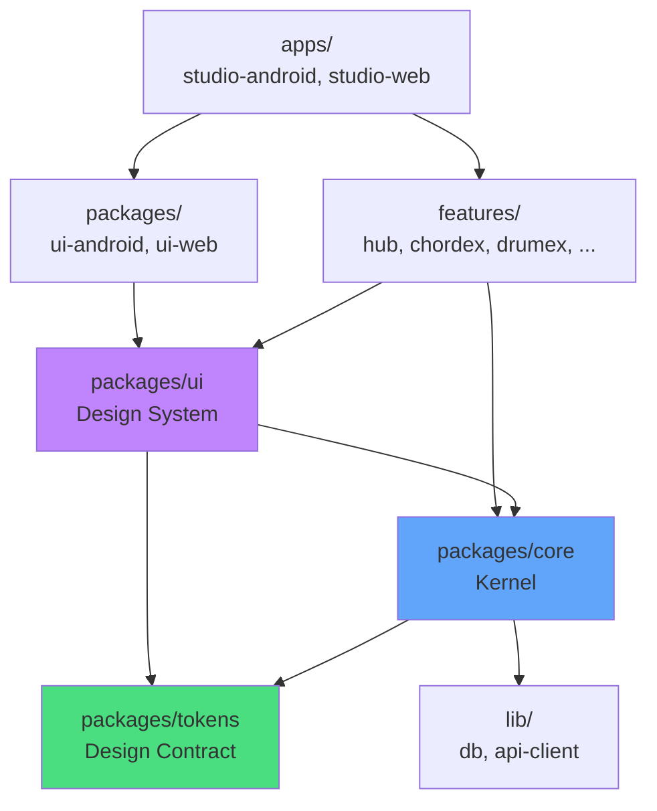
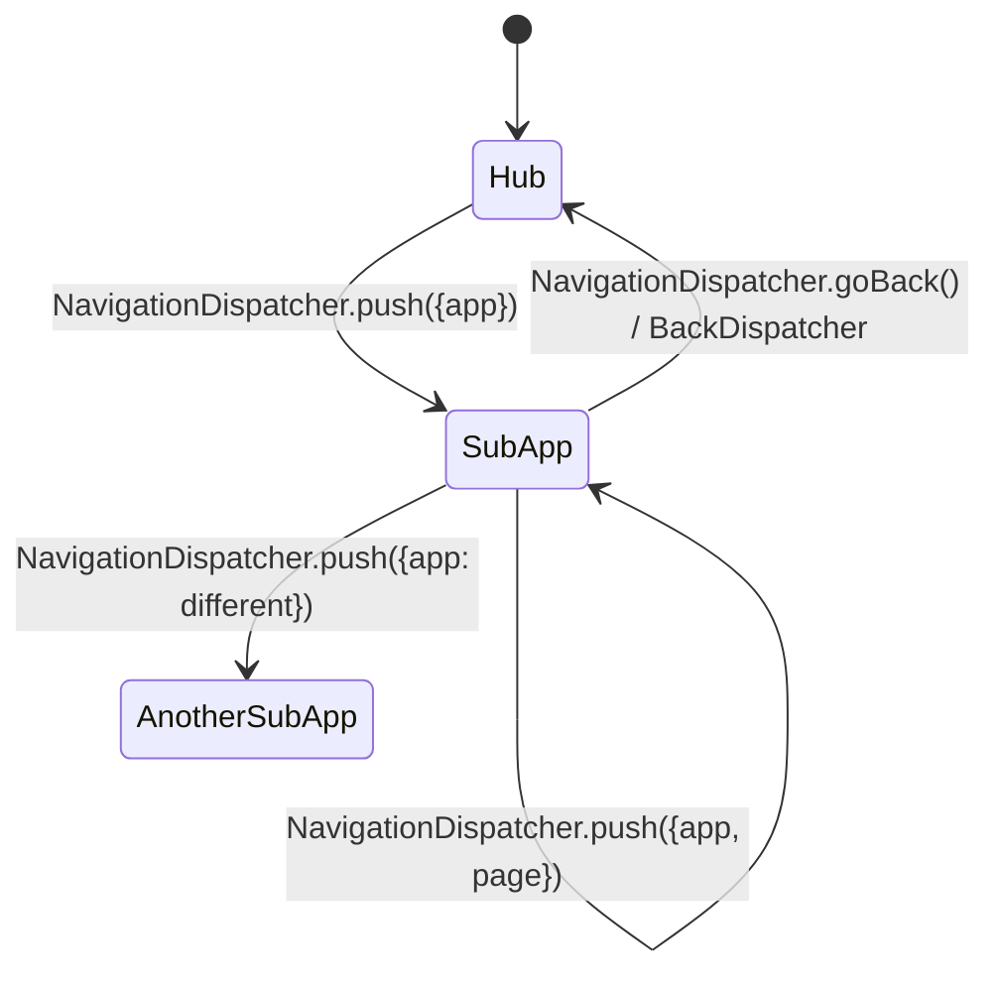

# Livex Target Architecture Specification

> **Chief Software Architect** · July 2026
> Classification: Official Engineering Specification — Permanent
> Status: NORMATIVE — All future implementations must conform to this document.
> Scope: 5-year architectural horizon (2026–2031)

---

## Preamble

This document defines the architecture Livex **should** have. It is not a description of the current state (see `livex_complete_architecture_blueprint.md`) nor an audit (see `architecture-governance-audit.md`). It is the **engineering specification** that every future implementation, refactor, and feature must follow.

When the current code contradicts this specification, **this specification is correct** and the code must be migrated.

---

## Part I: Architectural Principles

### 1.1 The Five Laws of Livex Architecture

These are non-negotiable. Every architectural decision must satisfy all five.

**Law 1: One Implementation, Multiple Consumers.**
Every shared concern (theme, motion, navigation, tokens, components) has exactly one official implementation. All apps consume it. No exceptions. No "temporary" alternatives.

**Law 2: Enforcement Over Documentation.**
Every architectural rule must be enforced by tooling (ESLint, CI, TypeScript). Documentation explains _why_. Tooling ensures _compliance_. If a rule cannot be enforced by tooling, it must be enforced by architecture (making the wrong thing impossible via types, APIs, or package boundaries).

**Law 3: Explicit Ownership.**
Every file, every module, every subsystem has exactly one owning package. If ownership is ambiguous, the architecture is wrong.

**Law 4: Dependency Gravity.**
Dependencies flow downward: `apps → platform-ui → ui-shared → core`. Never upward. Never sideways between platform packages. The `core` package has zero UI dependencies.

**Law 5: Scalability by Default.**
Every shared system must support N apps without modification. Adding a 7th, 8th, or 20th app must not require changing any shared system. If it does, the shared system's API is wrong.

### 1.2 Architectural Invariant

> _"Shared systems are mandatory, not optional. The architecture must make it harder to bypass a shared system than to use it."_

This is achieved through three mechanisms:

1. **TypeScript types** that require shared system usage
2. **ESLint rules** that ban alternatives
3. **CI checks** that verify compliance

---

## Part II: Package Architecture

### 2.1 Package Hierarchy

```
livex/
├── apps/
│   ├── studio-android/          ← Android Capacitor shell
│   └── studio-web/              ← Web shell
├── packages/
│   ├── core/                    ← Pure logic, state, services (ZERO UI)
│   ├── tokens/                  ← Design tokens, motion presets (ZERO UI, ZERO logic)
│   ├── ui/                      ← Shared UI components, design system
│   ├── ui-android/              ← Android-only UI (platform conditionals only)
│   └── ui-web/                  ← Web-only UI (sidebar, landing page)
├── features/
│   ├── hub/                     ← Hub feature module
│   ├── chordex/                 ← Chordex feature module
│   ├── drumex/                  ← Drumex feature module
│   ├── groovex/                 ← Groovex feature module
│   ├── stagex/                  ← Stagex feature module
│   └── vocalex/                 ← Vocalex feature module
├── lib/
│   ├── db/                      ← Database layer
│   ├── api-client/              ← API client
│   └── api-schemas/             ← Zod schemas
├── scripts/                     ← CI enforcement scripts
├── tools/                       ← ESLint plugins, code generators
└── docs/                        ← Architecture documentation
```

### 2.2 Package Responsibilities

#### `packages/core` — The Kernel

| Attribute          | Value                                                                                                              |
| ------------------ | ------------------------------------------------------------------------------------------------------------------ |
| **Purpose**        | Pure business logic, state management, services. Zero UI.                                                          |
| **Owns**           | All Zustand stores, all services, all controllers, navigation FSM, sync engine, auth, i18n, notifications, updater |
| **Exports**        | Sub-path exports only (see §2.4)                                                                                   |
| **Allowed deps**   | `packages/tokens`, `lib/*`, npm packages (no UI frameworks)                                                        |
| **Forbidden deps** | `packages/ui`, `packages/ui-*`, `features/*`, `apps/*`, `react` (except types), `motion/react`                     |

**Rationale:** Core must be UI-framework-agnostic. Today it uses React hooks (e.g., `useBackHandler`), but hooks are just functions — they don't import React DOM. If Livex ever targets React Native or another renderer, core should work unchanged.

#### `packages/tokens` — The Design Contract

| Attribute          | Value                                                                                                                                                  |
| ------------------ | ------------------------------------------------------------------------------------------------------------------------------------------------------ |
| **Purpose**        | Single source of truth for all visual constants: colors, spacing, typography, radii, shadows, blur, glass, motion springs, easings, durations, haptics |
| **Owns**           | `designTokens.ts` (the ONE canonical file)                                                                                                             |
| **Exports**        | Named exports only — `SpringPresets`, `ColorTokens`, `MotionPresets`, etc.                                                                             |
| **Allowed deps**   | None (zero dependencies)                                                                                                                               |
| **Forbidden deps** | Everything                                                                                                                                             |

**Why a separate package?** Tokens must be importable by `core` (for animation coordination), by `ui` (for component styling), and by `features` (for custom visuals). If tokens lived in `core`, `ui` would need to depend on `core` for simple color values. If tokens lived in `ui`, `core` couldn't use motion presets. A dedicated package eliminates this tension.

**Trade-off considered:** Keeping tokens in `core` is simpler (fewer packages). However, it creates a false dependency: importing a color constant shouldn't pull in the entire core package. The separate package pays for itself in tree-shaking and conceptual clarity.

#### `packages/ui` — The Design System

| Attribute          | Value                                                                                                                                                                  |
| ------------------ | ---------------------------------------------------------------------------------------------------------------------------------------------------------------------- |
| **Purpose**        | All shared UI components, the design system, layout primitives, animation system, navigation bar, overlays                                                             |
| **Owns**           | Button, Card, Dialog, Sheet, SearchBar, Header, Skeleton, Loading, FloatingButton, BottomNav renderer, AppSwitcher, TransitionEngine, AppAnimationSystem, LayoutSystem |
| **Exports**        | Named exports per component                                                                                                                                            |
| **Allowed deps**   | `packages/core`, `packages/tokens`, `react`, `motion/react`                                                                                                            |
| **Forbidden deps** | `features/*`, `packages/ui-android`, `packages/ui-web`, `apps/*`                                                                                                       |

**Key rule:** No component in `packages/ui` may contain feature-specific logic. A `Button` is a `Button` — it doesn't know about chords, drums, or stages.

#### `packages/ui-android` and `packages/ui-web` — Platform Shells

| Attribute          | Value                                                                                      |
| ------------------ | ------------------------------------------------------------------------------------------ |
| **Purpose**        | Platform-specific UI that cannot be shared (Android status bar, web sidebar, landing page) |
| **Allowed deps**   | `packages/ui`, `packages/core`, `packages/tokens`                                          |
| **Forbidden deps** | Each other, `features/*`                                                                   |

**Rule:** A component belongs in a platform package **only if** it uses a platform-specific API (Capacitor, Web Sidebar, etc.) that has no cross-platform equivalent. If it can be made responsive, it belongs in `packages/ui`.

#### `features/*` — Feature Modules

| Attribute          | Value                                                                                   |
| ------------------ | --------------------------------------------------------------------------------------- |
| **Purpose**        | Self-contained feature implementations. Each feature is one app in the Livex ecosystem. |
| **Allowed deps**   | `packages/core`, `packages/tokens`, `packages/ui`                                       |
| **Forbidden deps** | Other features, `packages/ui-android`, `packages/ui-web`, `apps/*`                      |

**Critical rule:** Features must NEVER import from each other. If Groovex needs chord data, it imports from `packages/core` (which owns chord data), not from `features/chordex`. This ensures features can be loaded, unloaded, and developed independently.

**Why move features out of `packages/ui`?** Currently, feature modules (DrumEditor, GroovexApp, etc.) live inside `packages/ui-shared`. This violates separation of concerns — the design system package shouldn't contain business logic. Moving features to their own package group makes boundaries explicit and enables per-feature lazy loading, code splitting, and potentially per-feature CI.

### 2.3 Dependency Direction



**Dependencies ALWAYS flow downward. No exceptions.**

### 2.4 Sub-Path Exports

`packages/core` must NOT export everything from a single `index.ts`. Instead, use sub-path exports in `package.json`:

```json
{
  "exports": {
    "./navigation": "./src/navigation/index.ts",
    "./stores": "./src/stores/index.ts",
    "./theme": "./src/theme/index.ts",
    "./sync": "./src/sync/index.ts",
    "./auth": "./src/auth/index.ts",
    "./notifications": "./src/notifications/index.ts",
    "./updater": "./src/updater/index.ts",
    "./audio": "./src/audio/index.ts",
    "./i18n": "./src/i18n/index.ts",
    "./platform": "./src/platform/index.ts",
    "./utils": "./src/utils/index.ts"
  }
}
```

**Why:** Sub-paths make dependencies explicit. `import { useSettingsStore } from '@livex/core/stores'` tells you exactly which subsystem is being consumed. This enables:

- Better tree-shaking
- Dependency tracking (which features use which core subsystems)
- Future CI rules (e.g., "features cannot import from `@livex/core/updater`")

---

## Part III: State Management Architecture

### 3.1 Store Taxonomy

| Store                      | Package | Persistence  | Scope  | Purpose                                              |
| -------------------------- | ------- | ------------ | ------ | ---------------------------------------------------- |
| `useSettingsStore`         | core    | ✅ Encrypted | Global | Theme, accent, language, AMOLED, per-app preferences |
| `useChordDataStore`        | core    | ✅ Encrypted | Domain | Chords, songs, custom chords, progressions           |
| `useDrumStore`             | core    | ✅ Encrypted | Domain | Drum patterns, instruments                           |
| `useGroovexStore`          | core    | ✅ Encrypted | Domain | Groovex-specific state                               |
| `useNavigationStore`       | core    | ✅ Encrypted | Global | Routes, history, back handlers, gesture state        |
| `useBottomNavigationStore` | core    | ❌           | Global | Nav items, visibility, motion                        |
| `useTransitionStore`       | core    | ❌           | Global | Transition FSM                                       |
| `useNotificationStore`     | core    | ✅ Encrypted | Global | Notifications                                        |
| `useOverlayStore`          | core    | ❌           | Global | Dialog/sheet stack (NEW)                             |
| `useSearchStore`           | core    | ❌           | Global | Cross-app search index (NEW)                         |

### 3.2 Store Ownership Rules

**Rule 1:** ALL Zustand stores live in `packages/core`. No exceptions.

**Rule 2:** Stores are categorized as **Global** (used by all apps) or **Domain** (used by one app's logic but owned centrally).

**Rule 3:** Feature modules may create **local React state** (`useState`, `useReducer`) for UI-only concerns (accordion open/close, form input, etc.). They must NOT create Zustand stores.

**Rule 4:** Store names must reflect their purpose, not their historical origin. `useSettingsStore` not `useChordStore`.

**Enforcement:**

- ESLint rule: ban `zustand` `create(` calls outside `packages/core/`
- CI script: scan for `import.*create.*from.*zustand` outside core

### 3.3 Store Cross-Read Protocol

Stores may read from other stores via `getState()` for synchronization. Cross-store reads must follow the dependency order:

```
useSettingsStore (root — read by all)
  └── useNavigationStore (reads settings for theme)
  └── useBottomNavigationStore (reads settings for isLight)
  └── useTransitionStore (reads settings for reduced motion)
```

**Rule:** No circular store reads. If Store A reads Store B, Store B must NOT read Store A. The dependency graph must be a DAG.

---

## Part IV: Service & Controller Architecture

### 4.1 Service Taxonomy

A **service** is a stateless or singleton module that performs operations. Services live in `packages/core`.

| Service                 | Purpose                                      | API Style        |
| ----------------------- | -------------------------------------------- | ---------------- |
| `NavigationDispatcher`  | Imperative navigation: push, replace, goBack | Function calls   |
| `BackDispatcher`        | Hardware/software back button                | Event-driven     |
| `GestureDispatcher`     | Swipe gesture navigation                     | Event-driven     |
| `ThemeService`          | Theme transitions, View Transitions API      | Function calls   |
| `SyncService`           | Cloud sync orchestration                     | Async lifecycle  |
| `AuthService`           | Firebase auth, account lifecycle             | Observable       |
| `NotificationPublisher` | Publish notifications to store               | Function calls   |
| `UpdatePipeline`        | OTA update lifecycle                         | FSM              |
| `StartupCoordinator`    | App initialization sequence                  | Ordered steps    |
| `SearchIndexer`         | Register/query cross-app search (NEW)        | Registration API |
| `OverlayManager`        | Dialog/sheet stack management (NEW)          | Push/pop API     |
| `MotionCoordinator`     | Animation preference resolution (NEW)        | Query API        |

### 4.2 Controller Taxonomy

A **controller** is a React component with zero visual output that coordinates side effects between stores, services, and the DOM. Controllers live in `packages/ui` (they need React lifecycle).

| Controller                   | Purpose                                       | Mounts In |
| ---------------------------- | --------------------------------------------- | --------- |
| `BottomNavigationController` | Syncs bottom nav state with app lifecycle     | App shell |
| `ThemeController`            | Applies CSS custom properties on theme change | App shell |
| `OverlayController`          | Manages overlay z-index stack, escape key     | App shell |
| `FocusController`            | Manages focus trapping for modals/sheets      | App shell |
| `KeyboardShortcutController` | Global keyboard shortcuts                     | App shell |

### 4.3 Service Rules

**Rule 1:** Services are pure TypeScript. They must NOT import React.
**Rule 2:** Services interact with stores via `store.getState()` and `store.setState()`.
**Rule 3:** Services are initialized in `StartupCoordinator` in a defined order.
**Rule 4:** Services are singletons — one instance per application lifecycle.

### 4.4 Controller Rules

**Rule 1:** Controllers render `null`. They exist only for side effects.
**Rule 2:** Controllers mount once in the app shell. They never mount inside feature modules.
**Rule 3:** Controllers use `useEffect` to subscribe to store changes and invoke services.

---

## Part V: Design System Architecture

### 5.1 The Token → Component → Feature Pipeline

```
packages/tokens          →  packages/ui            →  features/*
(Design Contract)            (Design System)            (Feature Modules)

SpringPresets.soft        →  Button spring prop     →  DrumEditor uses <Button>
ColorTokens.accentBlue    →  Card accent prop       →  GroovexApp uses <Card>
SpacingTokens.md          →  Header padding         →  Hub uses <Header>
```

**Rule:** Features consume components from `packages/ui`. Components consume tokens from `packages/tokens`. Features NEVER import tokens directly for inline styles — they use component props. The only exception is when a feature needs a token value for a canvas, SVG, or non-React rendering context.

### 5.2 Token Architecture

`packages/tokens/src/index.ts` is the ONE canonical file:

```
ColorTokens          — accent colors, surface hierarchy, borders, glass
TypographyTokens     — font families, sizes, weights, line heights
SpacingTokens        — xs (4px) through xxl (48px), safe area
RadiusTokens         — xs through full
BlurTokens           — glass, nav backdrop
ShadowTokens         — elevation hierarchy
GlassTokens          — glassmorphism presets
SpringPresets        — soft, medium, stiff, expressive (ONE set of values)
EasingPresets        — M3 emphasized, standard, accelerate, decelerate
DurationPresets      — veryFast, fast, normal, slow
HapticPresets        — tap, drag, hold intensities
```

**There is ONE spring system.** The `soft` preset has ONE set of values. Period. No competing definitions anywhere.

### 5.3 Component Hierarchy

```
Primitives (zero styling opinion):
  Box, Text, Stack, Grid, Spacer, Divider, Icon

Atoms (styled primitives):
  Button, IconButton, FloatingButton
  Card, GlassCard
  Toggle, Checkbox, Radio
  Input, SearchBar, TextArea
  Badge, Tag, Chip

Molecules (composed atoms):
  Header, SectionHeader
  ListItem, ListSection
  SettingRow, SettingToggle, SettingSection
  NavigationItem
  Toast, Snackbar

Organisms (complex composed):
  Dialog, Sheet, BottomSheet
  Skeleton, AppSkeleton (composable)
  NavigationBar, AppSwitcher
  OverlayBackdrop

Layout:
  ScreenScaffold, SubAppScaffold, AppContent, ContentArea, DialogScaffold

Animation:
  AppEntryTransition, TransitionEngine, LaunchAnimation
```

**Rule:** Every component that appears in the UI must come from this hierarchy. Raw HTML elements (`<button>`, `<input>`, `<div>` used as a card) are banned in feature modules via ESLint.

### 5.4 Theme Architecture

#### CSS Layer

```
packages/ui/src/styles/
  tokens.css              ← SHARED base: all --c-* custom properties
  theme-dark.css          ← Dark theme values
  theme-light.css         ← Light theme values
  theme-amoled.css        ← AMOLED overrides
  utilities.css           ← Utility classes (if any)

apps/studio-android/src/
  index.css               ← Imports shared base + android-specific overrides ONLY

apps/studio-web/src/
  index.css               ← Imports shared base + web-specific overrides ONLY
```

**Key change:** A shared `tokens.css` in `packages/ui` is the single source of CSS custom properties. Platform CSS files import it and add ONLY platform-specific overrides (safe-area insets, scrollbar styling, etc.).

**Enforcement:** CI script extracts `--c-*` declarations from both platform files, diffs against `tokens.css`, fails if a platform defines a property not in the shared base.

#### JS Layer

`ThemeService` in `packages/core` manages:

- Current theme (light/dark/system)
- Accent color
- AMOLED mode
- Per-app accent overrides
- View Transitions API for theme switches

`ThemeController` in `packages/ui` applies CSS classes to `<html>` based on `useSettingsStore.theme`.

**Stagex rule:** When Stagex is migrated from iframe to native React, it will use the same CSS custom properties as every other app. No manual injection. No separate CSS bundle.

### 5.5 Motion Architecture

#### Single Source of Truth

```typescript
// packages/tokens/src/motion.ts — THE canonical file
export const SpringPresets = {
  soft: { type: 'spring', stiffness: 200, damping: 24, mass: 0.8 },
  medium: { type: 'spring', stiffness: 300, damping: 22, mass: 0.7 },
  stiff: { type: 'spring', stiffness: 450, damping: 26, mass: 0.5 },
  expressive: { type: 'spring', stiffness: 350, damping: 18, mass: 0.6 },
} as const;

export const DurationPresets = {
  veryFast: 0.1,
  fast: 0.2,
  normal: 0.3,
  slow: 0.4,
} as const;

export const EasingPresets = {
  emphasized: [0.2, 0.0, 0.0, 1.0],
  standard: [0.2, 0.0, 0.0, 1.0],
  accelerate: [0.3, 0.0, 0.8, 0.15],
  decelerate: [0.0, 0.0, 0.15, 1.0],
} as const;
```

#### Motion Rules

**Rule 1:** All spring animations must use `SpringPresets.*`. Inline `{ stiffness, damping, mass }` objects are BANNED.
**Rule 2:** All tween durations must use `DurationPresets.*`. Inline duration numbers are BANNED.
**Rule 3:** All easing curves must use `EasingPresets.*`. Inline bezier arrays are BANNED.
**Rule 4:** `MotionCoordinator` (service in core) resolves `prefers-reduced-motion` and provides a `useMotionScale()` hook that returns a multiplier (0.0 for reduced, 1.0 for normal).

**Enforcement:** ESLint custom rule bans inline `{ type: 'spring', stiffness: ... }` objects in `.tsx` files.

---

## Part VI: Navigation Architecture

### 6.1 Navigation Model



### 6.2 Navigation Ownership

| Component               | Owner | Responsibility              |
| ----------------------- | ----- | --------------------------- |
| `useNavigationStore`    | core  | Route state, history stack  |
| `NavigationDispatcher`  | core  | Imperative API              |
| `BackDispatcher`        | core  | Back button handling        |
| `GestureDispatcher`     | core  | Swipe gestures              |
| `TransitionCoordinator` | core  | Transition orchestration    |
| `NavigationBar`         | ui    | Bottom nav renderer         |
| `AppSwitcher`           | ui    | App switching overlay       |
| `NavigationController`  | ui    | Lifecycle sync (controller) |

### 6.3 App Registration

**Current problem:** Apps manually call `setItems()` with hardcoded arrays. The app list is duplicated.

**Target architecture:** Declarative app registry in `packages/core`:

```typescript
// packages/core/src/navigation/appRegistry.ts
export const APP_REGISTRY: AppDefinition[] = [
  { key: 'chords', label: 'Chordex', icon: ChordexIcon, accentDefault: 'blue' },
  { key: 'drums', label: 'Drumex', icon: DrumexIcon, accentDefault: 'purple' },
  { key: 'groovex', label: 'Groovex', icon: GroovexIcon, accentDefault: 'green' },
  { key: 'stage', label: 'Stagex', icon: StagexIcon, accentDefault: 'pink' },
  { key: 'vocalex', label: 'Vocalex', icon: VocalexIcon, accentDefault: 'yellow' },
];
```

Bottom nav items are **derived from the registry**, not manually registered by each app. Each app only provides its **tab configuration** (which pages it has, which is default).

**Adding a new app:** Add one entry to `APP_REGISTRY`. The bottom nav, app switcher, transition engine, and settings page all pick it up automatically. **Zero changes to shared systems.**

---

## Part VII: Event Flow Specifications

### 7.1 User Opens an App (Hub → SubApp)

```
User taps app icon in Hub
  │
  ├─ 1. Hub's onClick handler
  │    └─ NavigationDispatcher.push({ app: 'drums' })
  │
  ├─ 2. NavigationDispatcher
  │    ├─ Updates useNavigationStore (sets activeApp = 'drums')
  │    └─ Triggers useTransitionStore.start('drums')
  │
  ├─ 3. useTransitionStore FSM: idle → preparing
  │    └─ TransitionCoordinator resolves accent colors from APP_REGISTRY + useSettingsStore
  │
  ├─ 4. App shell (App.tsx) reacts to store changes
  │    ├─ Renders <TransitionEngine> (dot bloom animation)
  │    ├─ Begins React.lazy() import of Drumex feature module
  │    └─ Shows Suspense fallback (DrumexSkeleton)
  │
  ├─ 5. Feature module loads
  │    ├─ Drumex mounts inside <SubAppScaffold>
  │    ├─ Drumex provides tab config to NavigationController
  │    └─ AppReadyNotifier fires double-rAF
  │
  ├─ 6. useTransitionStore FSM: preparing → transitioning → complete
  │    ├─ TransitionEngine animates out
  │    ├─ Hub layer fades to hidden (visibility: hidden, opacity: 0)
  │    └─ Sub-app layer becomes interactive
  │
  └─ 7. useTransitionStore FSM: complete → idle
       └─ Transition cleanup
```

### 7.2 User Returns to Hub

```
User presses back / swipes / taps Hub in app switcher
  │
  ├─ 1. BackDispatcher / NavigationDispatcher.goBack()
  │    └─ Updates useNavigationStore (sets activeApp = 'hub')
  │
  ├─ 2. App shell reacts
  │    ├─ AnimatePresence exit animation on sub-app wrapper
  │    ├─ Hub layer transitions from hidden to visible
  │    └─ Sub-app unmounts (AnimatePresence mode="wait")
  │
  ├─ 3. Hub is already mounted (keep-alive)
  │    └─ No re-initialization needed
  │
  └─ 4. Bottom nav hides (Hub has no bottom nav)
```

### 7.3 Theme Changes

```
User toggles theme in Settings
  │
  ├─ 1. SettingRow onChange
  │    └─ useSettingsStore.setState({ theme: 'dark' })
  │
  ├─ 2. ThemeService.applyTheme('dark')
  │    ├─ Triggers View Transition API (if supported)
  │    └─ Updates CSS class on <html> element
  │
  ├─ 3. ThemeController (subscribed to useSettingsStore)
  │    ├─ Applies data-theme="dark" to document
  │    ├─ CSS custom properties cascade to all components
  │    └─ No per-component re-render needed (CSS cascade handles it)
  │
  └─ 4. All components automatically reflect new theme
       └─ Because they use var(--c-*), not hardcoded colors
```

### 7.4 Notification Arrives

```
System event (sync complete, update available, etc.)
  │
  ├─ 1. Service calls NotificationPublisher.publish({ ... })
  │    └─ Updates useNotificationStore
  │
  ├─ 2. Toast component (always mounted in app shell)
  │    └─ Animates in from top, auto-dismisses
  │
  └─ 3. Hub notification center (if visible)
       └─ Updates timeline from useNotificationStore
```

### 7.5 Sync Lifecycle

```
SyncService.syncNow()
  │
  ├─ 1. Reads all dirty records from stores
  │    ├─ useChordDataStore.getDirtyChords()
  │    ├─ useDrumStore.getDirtyPatterns()
  │    └─ useSettingsStore.getDirtySettings()
  │
  ├─ 2. Pushes to Firestore
  │    └─ Parallel per-collection writes with EPOCH safety
  │
  ├─ 3. Pulls remote changes
  │    └─ Merges into stores via store.setState()
  │
  ├─ 4. Publishes notification
  │    └─ NotificationPublisher.publish({ type: 'sync_complete' })
  │
  └─ 5. Stores mark records clean
```

### 7.6 OTA Update Lifecycle

```
UpdatePipeline.check()
  │
  ├─ 1. Fetches release metadata from GitHub/CDN
  ├─ 2. Compares versions
  ├─ 3. If update available:
  │    ├─ Downloads APK via Capacitor Filesystem
  │    ├─ Verifies integrity (SHA-256)
  │    ├─ Publishes notification
  │    └─ Prompts user to install
  └─ 4. FlightRecorder logs every step
```

---

## Part VIII: Rendering Architecture

### 8.1 Rendering Model

| Concern                  | Owner                      | Strategy                                                                       |
| ------------------------ | -------------------------- | ------------------------------------------------------------------------------ |
| **Component mounting**   | App shell (App.tsx)        | Reads `useNavigationStore.activeApp`, renders matching feature                 |
| **Component unmounting** | `AnimatePresence`          | Sub-apps unmount on exit animation completion                                  |
| **Keep-alive**           | App shell                  | Hub stays mounted (hidden) when sub-app is active                              |
| **Preloading**           | App shell                  | `__preloadUIModules()` fires on idle                                           |
| **Suspense**             | App shell                  | Each sub-app wrapped in `<Suspense fallback={<AppSkeleton>}>`                  |
| **Lazy loading**         | App shell                  | `React.lazy(() => import('features/drumex'))` per feature                      |
| **Transitions**          | `<TransitionEngine>` (ui)  | Visual effects during app switch                                               |
| **Overlays**             | `<OverlayController>` (ui) | Manages z-index stack for dialogs/sheets                                       |
| **z-index ownership**    | CSS in `tokens.css`        | Defined z-index layers: base(1), subapp(2), nav(10), overlay(100), toast(1000) |

### 8.2 Z-Index Layer System

```css
:root {
  --z-base: 1; /* Hub content */
  --z-subapp: 2; /* Active sub-app */
  --z-nav: 10; /* Bottom navigation bar */
  --z-sheet: 100; /* Bottom sheets */
  --z-dialog: 200; /* Modal dialogs */
  --z-toast: 1000; /* Toast notifications */
  --z-overlay: 5000; /* Full-screen overlays (transitions) */
  --z-debug: 99999; /* Emergency debug overlay */
}
```

**Rule:** Components must use these CSS variables for z-index. Hardcoded z-index values are BANNED.

### 8.3 Skeleton Strategy

**Target:** Composable skeleton primitives, not per-app monolithic skeletons.

```
<AppSkeleton layout="tabs">     ← for tabbed apps (Chordex)
<AppSkeleton layout="editor">   ← for full-screen editors (Drumex, Stagex)
<AppSkeleton layout="list">     ← for list-based apps (Groovex, Vocalex)
```

Feature modules provide a `skeletonLayout` property in their registry entry. The app shell renders the correct skeleton automatically.

---

## Part IX: Memory Model

### 9.1 Ownership Table

| Resource                      | Owner                       | Lifecycle                  | Cleanup                           |
| ----------------------------- | --------------------------- | -------------------------- | --------------------------------- |
| **Zustand stores**            | core (singletons)           | App lifetime               | Never — persist across navigation |
| **React local state**         | Feature component           | Component mount/unmount    | Automatic (React GC)              |
| **Audio contexts**            | Audio services in core      | Lazy created, app lifetime | `close()` on app terminate        |
| **IndexedDB connections**     | Domain services in core     | Lazy created, app lifetime | Explicit close                    |
| **Timers/intervals**          | Component that creates them | Component lifetime         | Cleanup in `useEffect` return     |
| **Event listeners**           | Component or service        | Owner's lifetime           | `removeEventListener` in cleanup  |
| **Intersection observers**    | Component                   | Component lifetime         | `disconnect()` in cleanup         |
| **Iframe (Stagex legacy)**    | StageCorePanel              | Persistent once loaded     | Never — stays in DOM              |
| **Subscriptions (Firestore)** | SyncService                 | App lifetime               | `unsubscribe()` on logout         |
| **Web workers**               | Service that creates them   | App lifetime               | `terminate()` on app close        |

### 9.2 Cache Strategy

| Cache          | Location                                       | TTL             | Invalidation         |
| -------------- | ---------------------------------------------- | --------------- | -------------------- |
| Store data     | Zustand + encrypted localStorage               | Permanent       | Sync overwrites      |
| Audio samples  | IndexedDB                                      | Permanent       | Version change       |
| APK downloads  | Capacitor Filesystem                           | Until installed | Post-install cleanup |
| Lottie JSON    | Browser cache                                  | Session         | URL-based            |
| CSS/JS bundles | Service worker (web) / WebView cache (Android) | Version change  | Version bump         |

---

## Part X: Enforcement Architecture

### 10.1 Enforcement Pyramid

```
IDE (Real-time)      ← ESLint in editor, immediate red squiggles
    ↓
Pre-commit           ← Husky + lint-staged, blocks bad commits
    ↓
CI (Merge gate)      ← Full validation suite, blocks bad merges
    ↓
Architecture         ← Package boundaries, TypeScript types, make wrong things impossible
    ↓
Documentation        ← This document, explains WHY
```

### 10.2 ESLint Rules

| Rule                            | What It Bans                                  | Why                             |
| ------------------------------- | --------------------------------------------- | ------------------------------- |
| `livex/no-hardcoded-colors`     | Hex values in `style` props                   | Forces token/CSS variable usage |
| `livex/no-inline-springs`       | `{ stiffness, damping, mass }` objects        | Forces SpringPresets import     |
| `livex/no-inline-durations`     | Number literals in `duration` props           | Forces DurationPresets import   |
| `livex/no-raw-html`             | `<button>`, `<input>`, `<select>` in features | Forces design system components |
| `livex/no-store-outside-core`   | `zustand.create` outside packages/core        | Enforces store ownership        |
| `livex/no-cross-feature-import` | Feature importing from another feature        | Enforces feature independence   |
| `no-restricted-imports`         | Deep imports into packages (bypass index)     | Forces public API usage         |

### 10.3 CI Checks

| Check             | Script                        | Failure Condition                      |
| ----------------- | ----------------------------- | -------------------------------------- |
| `lint:imports`    | enforce-import-boundaries.mjs | Cross-package boundary violation       |
| `lint:scope`      | enforce-platform-scope.mjs    | Platform contamination                 |
| `lint:tokens`     | check-token-usage.mjs         | Hardcoded value count increases        |
| `lint:css-parity` | check-css-parity.mjs          | Platform CSS diverges from shared base |
| `lint:file-size`  | check-file-sizes.mjs          | Any .tsx exceeds 1,000 lines           |
| `lint:stores`     | check-store-locations.mjs     | Store created outside packages/core    |
| `lint:springs`    | check-spring-configs.mjs      | Inline spring config count increases   |
| `docs:validate`   | validate-documentation.mjs    | Broken doc links                       |
| `test`            | vitest                        | Test failures                          |
| `typecheck`       | tsc --noEmit                  | Type errors                            |
| `lint`            | eslint                        | Lint violations                        |
| `format:check`    | prettier --check              | Formatting violations                  |

### 10.4 Pre-Commit Hooks

```
.husky/pre-commit:
  lint-staged:
    *.tsx, *.ts  → eslint --fix && prettier --write
    *.css        → prettier --write
    *.md         → prettier --write
```

---

## Part XI: Future-Proofing

### 11.1 Adding a New App

**Steps to add a new app (e.g., "Mixex"):**

1. Create `features/mixex/` with the feature module
2. Add entry to `APP_REGISTRY` in `packages/core/src/navigation/appRegistry.ts`
3. Add lazy import in both `apps/studio-android/src/App.tsx` and `apps/studio-web/src/App.tsx`

**Shared systems that auto-adapt:** Bottom nav, app switcher, transition engine, settings accent picker, search indexer — all derive from `APP_REGISTRY`. Zero modifications needed.

### 11.2 Adding a New Platform (iOS, Desktop)

**Architecture supports this because:**

- `packages/core` has zero UI dependencies — works on any React renderer
- `packages/tokens` has zero dependencies — works everywhere
- `packages/ui` uses React + CSS custom properties — portable
- Platform-specific code is isolated in `packages/ui-android`, `packages/ui-web`
- Add `packages/ui-ios` or `packages/ui-desktop` alongside existing platform packages

### 11.3 Adding AI Features

**AI features should be a new service in `packages/core/src/ai/`:**

- `AiService` handles API calls, model management
- Feature modules consume AI capabilities via the service
- No AI code lives in UI components

### 11.4 Adding Cloud Collaboration

**Collaboration extends `SyncService`:**

- Real-time cursors, presence awareness
- Conflict resolution strategies per data type
- Feature modules don't change — they write to stores, SyncService handles propagation

### 11.5 Plugin Architecture

**If Livex needs user-installable plugins:**

```typescript
interface LivexPlugin {
  id: string;
  name: string;
  version: string;
  register(context: PluginContext): void;
}

interface PluginContext {
  registerSearchContent(provider: SearchContentProvider): void;
  registerNotificationChannel(channel: NotificationChannel): void;
  registerSettingsSection(section: SettingsSection): void;
}
```

Plugins can register content with shared systems but cannot directly mutate stores or bypass the design system.

---

## Part XII: Architectural Decision Records

### ADR-001: Separate Tokens Package

**Decision:** Design tokens live in a dedicated `packages/tokens` package, not in `core` or `ui`.

**Alternatives considered:**

1. **Tokens in core:** Simpler, fewer packages. But creates false dependency — a color constant shouldn't pull in navigation, sync, and auth code.
2. **Tokens in ui:** Natural for CSS values. But `core` needs motion presets for transition coordination, creating a circular dependency.
3. **Tokens as separate package:** Cleanest dependency graph. Both `core` and `ui` can import without coupling.

**Trade-off:** One additional package to maintain. Worth it for dependency clarity.

### ADR-002: Features as Top-Level Package Group

**Decision:** Feature modules live in `features/*` instead of inside `packages/ui-shared`.

**Alternatives considered:**

1. **Features in ui-shared:** Current approach. Simpler monorepo structure. But violates separation of concerns (design system package contains business logic) and prevents per-feature code splitting.
2. **Features as top-level:** Clearer boundaries. Enables per-feature lazy loading, per-feature CI, and per-feature ownership. Makes it impossible for features to accidentally import each other's internals.

**Trade-off:** More packages. More import configuration. Worth it for architectural clarity.

### ADR-003: Sub-Path Exports vs Barrel Index

**Decision:** `packages/core` uses sub-path exports (`@livex/core/navigation`) instead of a single barrel `index.ts`.

**Alternatives considered:**

1. **Single index.ts:** Current approach. Simple imports. But 90+ exports in flat namespace, impossible to track dependencies, poor tree-shaking.
2. **Sub-path exports:** More verbose imports. But explicit dependency tracking, better tree-shaking, enables future CI rules per subsystem.

**Trade-off:** Slightly more verbose import statements. Dramatically better dependency visibility.

### ADR-004: Zustand Over React Context

**Decision:** Global state uses Zustand stores, not React Context.

**Rationale:** Zustand stores are:

- Accessible outside React (services can read/write)
- No provider nesting required
- Selector-based re-renders (no full-tree propagation)
- Debuggable via DevTools
- Persistable via middleware

React Context is used **only** for truly local provider concerns (SidebarProvider, ProgressContext) where the state never needs to be accessed outside React.

---

## Part XIII: Reference Tables

### 13.1 File Size Limits

| File Type             | Maximum Lines | Enforcement                      |
| --------------------- | ------------- | -------------------------------- |
| Component (`.tsx`)    | 500           | CI check + ESLint warning at 400 |
| Store (`.ts`)         | 300           | CI check                         |
| Service (`.ts`)       | 500           | CI check                         |
| Feature page (`.tsx`) | 800           | CI check + ESLint warning at 600 |
| CSS (`.css`)          | 500 per file  | CI check                         |

Existing violations are allowlisted with migration deadlines.

### 13.2 Naming Conventions

| Entity         | Convention                                            | Example                                  |
| -------------- | ----------------------------------------------------- | ---------------------------------------- |
| Store          | `use[Domain]Store`                                    | `useSettingsStore`, `useDrumStore`       |
| Service        | `[Domain]Service`                                     | `SyncService`, `AuthService`             |
| Controller     | `[Domain]Controller`                                  | `ThemeController`, `OverlayController`   |
| Dispatcher     | `[Domain]Dispatcher`                                  | `NavigationDispatcher`, `BackDispatcher` |
| Hook           | `use[Action]`                                         | `useBackHandler`, `useScrollHide`        |
| Component      | PascalCase                                            | `Button`, `Card`, `Header`               |
| Token          | `[Category]Tokens` or `[Category]Presets`             | `ColorTokens`, `SpringPresets`           |
| Feature module | kebab-case directory                                  | `features/chordex/`, `features/drumex/`  |
| CSS variable   | `--c-*` (color), `--s-*` (spacing), `--z-*` (z-index) | `--c-bg-primary`, `--s-md`, `--z-nav`    |

### 13.3 Common Mistakes to Avoid

| Mistake                                              | Why It's Wrong                   | What To Do Instead                      |
| ---------------------------------------------------- | -------------------------------- | --------------------------------------- |
| Hardcoded hex color in style prop                    | Bypasses theme system            | Use `var(--c-*)` or component prop      |
| Inline spring config `{stiffness: 350, damping: 20}` | Creates divergent animation feel | Import `SpringPresets.soft` from tokens |
| Creating a Zustand store in a feature                | Violates store ownership         | Add to `packages/core/src/stores/`      |
| Feature importing from another feature               | Creates coupling                 | Import shared data from `core`          |
| Raw `<button>` in feature code                       | Bypasses design system           | Use `<Button>` from `packages/ui`       |
| Adding CSS variable to one platform only             | Causes platform divergence       | Add to shared `tokens.css` first        |
| File growing past 500 lines                          | Becoming a monolith              | Split into focused modules proactively  |

---

## Conclusion

This specification defines an architecture that:

1. **Scales** — Adding new apps, platforms, developers, and features requires minimal changes to shared systems.
2. **Enforces** — Every rule is backed by tooling (ESLint, CI, TypeScript, package boundaries). Documentation explains why; tools ensure compliance.
3. **Unifies** — One token system, one design system, one motion system, one navigation system. Multiple consumers, never multiple implementations.
4. **Clarifies** — Every file, module, and subsystem has one owner, one package, and one purpose. No ambiguity.

The architecture described here is not aspirational fiction. It is achievable through incremental migration from the current state (documented in `livex_complete_architecture_blueprint.md`) following the phased roadmap (documented in `architecture-governance-audit.md`).

Every future implementation must conform to this specification. When the code contradicts this document, this document is correct.

---

> _Livex Target Architecture Specification_
> _Chief Software Architect · July 2026_
> _Classification: Official Engineering Specification — Normative_
> _Review cycle: Quarterly. Next review: October 2026._
