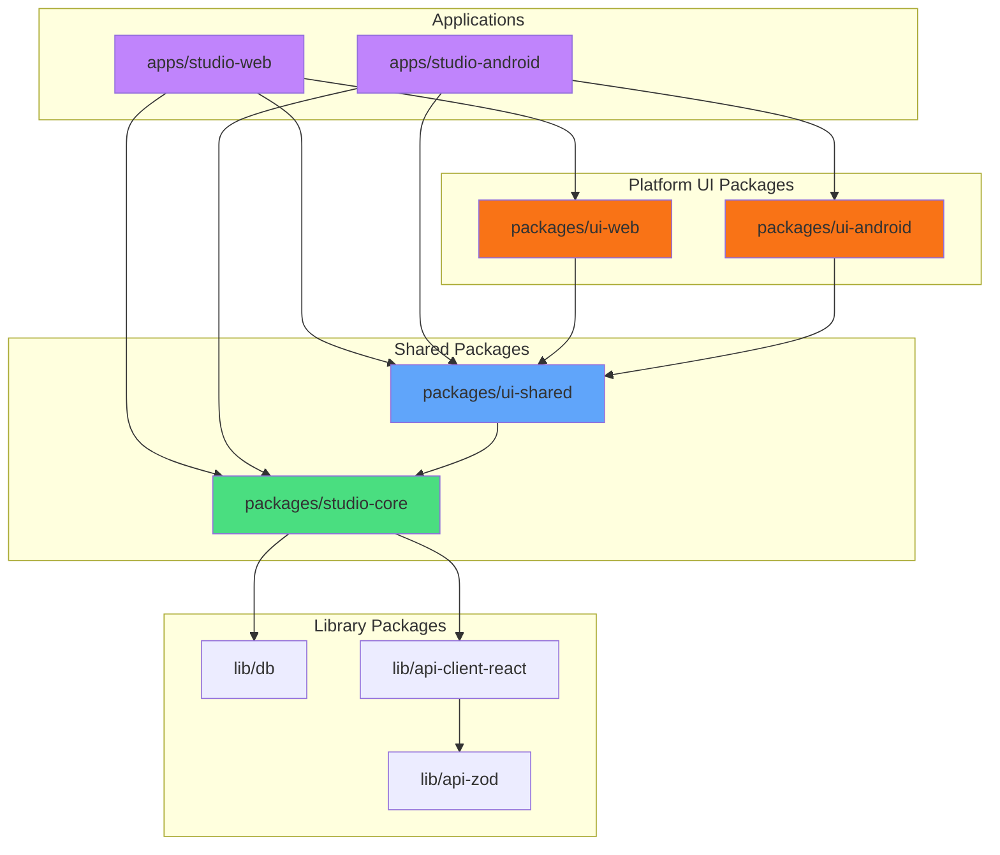
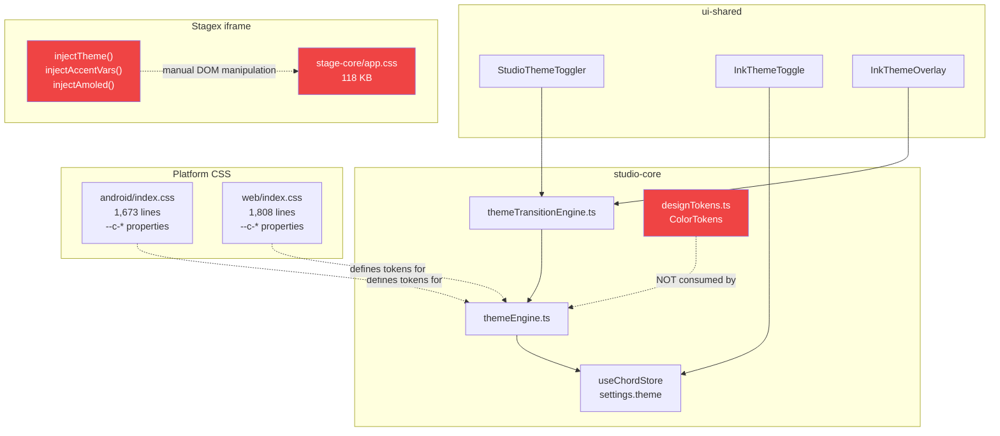
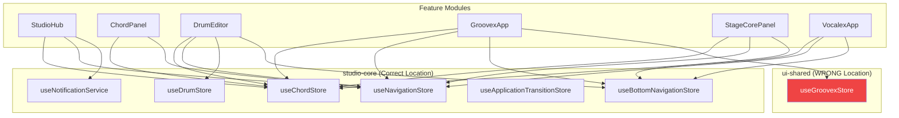
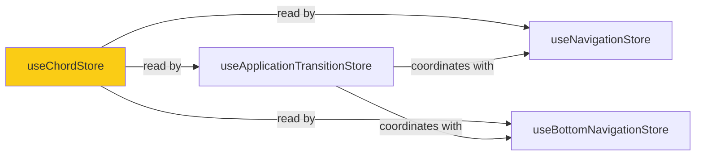
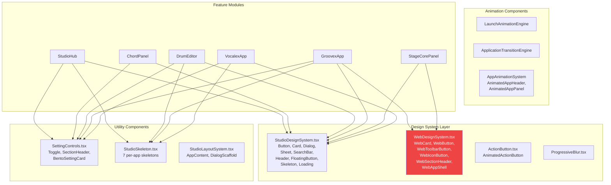
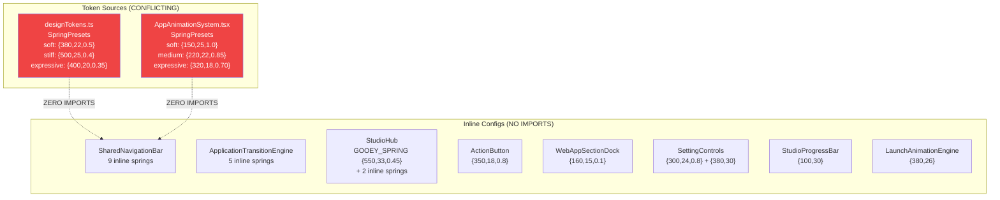
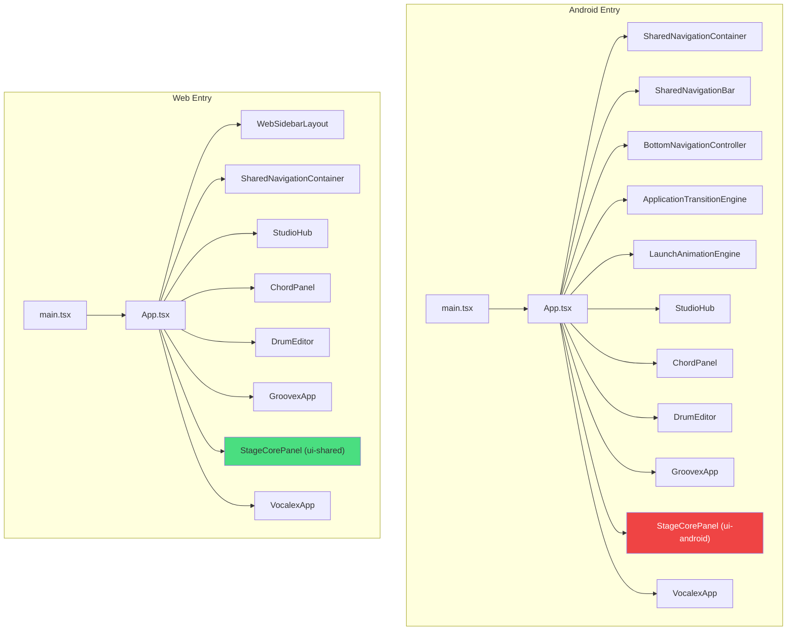

import { SpringPresets } from '@workspace/studio-core';
# Livex Dependency Graph

> **Principal Architect Document** · July 2026 · Version 4.2.4
> Classification: Permanent Architecture Document

---

## 1. Package Dependency Graph



### Package Boundary Rules (Enforced in CI)

| Package                | Can Import From                          | Cannot Import From        |
| ---------------------- | ---------------------------------------- | ------------------------- |
| `studio-core`          | `lib/db`, `lib/api-*`, external deps     | ❌ Any UI package         |
| `ui-shared`            | `studio-core`, external deps             | ❌ `ui-web`, `ui-android` |
| `ui-web`               | `ui-shared`, `studio-core`               | ❌ `ui-android`           |
| `ui-android`           | `ui-shared`, `studio-core`               | ❌ `ui-web`               |
| `studio-web` (app)     | `ui-web`, `ui-shared`, `studio-core`     | ❌ `ui-android`           |
| `studio-android` (app) | `ui-android`, `ui-shared`, `studio-core` | ❌ `ui-web`               |

---

## 2. Navigation System Dependency Graph

```mermaid
graph TD
    subgraph "studio-core/lib/navigation/"
        NS[useNavigationStore]
        ATS[useApplicationTransitionStore]
        BNS[useBottomNavigationStore]
        ND[NavigationDispatcher]
        NC[NavigationCoordinator]
        BD[BackDispatcher]
        GD[GestureDispatcher]
        TC[TransitionCoordinator]
        BH[useBackHandler]
        NT[navigationTypes]
        VAL[validation]
        SI[searchIndex]
    end

    subgraph "ui-shared/navigation/"
        SNC[SharedNavigationContainer]
        SNB[SharedNavigationBar]
        BNC[BottomNavigationController]
        AAS[AppAnimationSystem]
    end

    subgraph "ui-shared/components/launch/"
        ATE[ApplicationTransitionEngine]
        LAE[LaunchAnimationEngine]
    end

    subgraph "studio-core/store/"
        CS[useChordStore]
    end

    %% Core internal dependencies
    ND --> NS
    NC --> NS
    NC --> ATS
    BD --> NS
    BD --> BH
    GD --> NS
    TC --> ATS
    TC --> NS

    %% UI → Core
    SNC --> NS
    SNB --> BNS
    SNB --> ATS
    SNB --> CS
    BNC --> BNS
    AAS --> CS

    %% Launch → Core
    ATE --> ATS
    ATE --> BNS
    LAE --> CS

    style NS fill:#4ade80
    style ATS fill:#4ade80
    style BNS fill:#4ade80
    style CS fill:#facc15
```



### Navigation Initialization Order

```
1. App.tsx mounts
2. startupCoordinator.start()
3. useNavigationStore initialized (Zustand, lazy)
4. useApplicationTransitionStore initialized (Zustand, lazy)
5. useBottomNavigationStore initialized (Zustand, lazy)
6. SharedNavigationContainer renders
7. SharedNavigationBar renders
8. BottomNavigationController mounts (sync effects)
9. Current app mounts
10. App calls useBottomNavigationStore.setItems(...)
```

### Navigation Consumer Map

| System                              | Hub | Chordex | Drumex | Groovex | Stagex | Vocalex |
| ----------------------------------- | --- | ------- | ------ | ------- | ------ | ------- |
| `useNavigationStore`                | ✅  | ✅      | ✅     | ✅      | ✅     | ✅      |
| `NavigationDispatcher`              | —   | ✅      | ✅     | ✅      | ❌     | ✅      |
| `useBackHandler`                    | ✅  | ✅      | ✅     | ✅      | ✅     | ✅      |
| `useBottomNavigationStore.setItems` | ❌  | ❓      | ✅     | ✅      | ✅     | ✅      |
| `useScrollHide`                     | —   | ✅      | ❌     | ❌      | ✅     | ✅      |

---

## 3. Theme System Dependency Graph



> 🔴 **Red nodes** indicate fragmentation points: `designTokens.ts` is unused, Stagex iframe has its own CSS with manual injection.

---

## 4. State Management Dependency Graph



> 🔴 `useGroovexStore` lives in `ui-shared` instead of `studio-core`.

### Store Cross-Dependencies



> ⚠️ `useChordStore` is the hub of all cross-store reads because it contains global settings. Renaming to `useSettingsStore` would clarify this graph.

---

## 5. Shared Component Dependency Graph



> 🔴 `WebDesignSystem` is a parallel system that should be merged into `StudioDesignSystem`.

---

## 6. Motion / Animation Dependency Graph



> 🔴 **Every animation component defines its own spring values. Neither token source is consumed.**

---

## 7. Platform Entry Point Graph



> 🔴 Android uses `StageCorePanel` from `ui-android` (2,799 lines) while Web uses the version from `ui-shared` (2,358 lines). Two separate implementations.

---

## 8. Dead Dependencies

| Dependency                           | Defined In  | Imported By   | Status         |
| ------------------------------------ | ----------- | ------------- | -------------- |
| `designTokens.ts` `SpringPresets`    | studio-core | ❌ Nothing    | 🔴 Dead        |
| `designTokens.ts` `ColorTokens`      | studio-core | ❌ Nothing    | 🔴 Dead        |
| `designTokens.ts` `MotionTokens`     | studio-core | ❌ Nothing    | 🔴 Dead        |
| `designTokens.ts` `TypographyTokens` | studio-core | ❌ Nothing    | 🔴 Dead        |
| `designTokens.ts` `SpacingTokens`    | studio-core | ❌ Nothing    | 🔴 Dead        |
| `designTokens.ts` `HapticTokens`     | studio-core | ❌ Nothing    | 🔴 Dead        |
| `store/useNavigationStore.ts` (shim) | studio-core | Via re-export | ⚠️ Legacy shim |

> **Total dead token exports: 7 out of 9 token objects** — the design token system is 78% dead code at the export level.

---

## 9. Duplicate Dependency Paths

| Component            | Path 1                                                | Path 2                                           | Issue            |
| -------------------- | ----------------------------------------------------- | ------------------------------------------------ | ---------------- |
| `useNavigationStore` | `studio-core/lib/navigation/useNavigationStore.ts`    | `studio-core/store/useNavigationStore.ts` (shim) | Legacy re-export |
| `useGroovexStore`    | `ui-shared/features/groovex/state/useGroovexStore.ts` | `ui-shared/groovex/useGroovexStore.ts` (shim)    | Duplicate path   |
| `StageCorePanel`     | `ui-shared/features/stagex/pages/StageCorePanel.tsx`  | `ui-android/components/StageCorePanel.tsx`       | Platform fork    |
| `WebAppSectionDock`  | `ui-shared/components/feature/WebAppSectionDock.tsx`  | `ui-web/components/WebAppSectionDock.tsx`        | Two files        |

---

## 10. Circular Dependencies

No circular import dependencies detected at the package level. The dependency graph is strictly:

```
studio-core → (no UI deps)
ui-shared → studio-core
ui-android → ui-shared, studio-core
ui-web → ui-shared, studio-core
apps → platform UI + ui-shared + studio-core
```

However, a **logical circular dependency** exists:

```
useChordStore (settings) ←→ useNavigationStore (reads settings for theme)
useChordStore (settings) ←→ useBottomNavigationStore (reads settings for isLight)
```

These are Zustand cross-store reads, not import cycles. They work because Zustand stores are lazily initialized singletons.

---

## 11. Hidden Dependencies

| Hidden Dependency           | From                 | To                           | Nature                  |
| --------------------------- | -------------------- | ---------------------------- | ----------------------- |
| Stagex → iframe CSS         | `StageCorePanel.tsx` | `stage-core/app.css` (118KB) | Runtime `<iframe>` load |
| Stagex → iframe postMessage | `StageCorePanel.tsx` | Iframe `contentWindow`       | DOM manipulation        |
| CSS custom properties       | All components       | Platform `index.css`         | Runtime CSS cascade     |
| Lottie JSON files           | Lottie components    | `public/lottie/*.json`       | Runtime fetch           |
| Google Fonts                | `index.css`          | fonts.googleapis.com         | Network dependency      |

---

## 12. Index.ts Export Analysis

### `studio-core/src/index.ts` — 90 exports

**By category:**

| Category   | Count | Examples                                                                                                                         |
| ---------- | ----- | -------------------------------------------------------------------------------------------------------------------------------- |
| Stores     | 6     | useChordStore, useDrumStore, useNavigationStore, useBottomNavigationStore, useApplicationTransitionStore, useNotificationService |
| Navigation | 9     | NavigationDispatcher, BackDispatcher, GestureDispatcher, etc.                                                                    |
| Hooks      | 8     | useShallow, useIsWebDesktop, useBackHandler, useT, etc.                                                                          |
| Services   | 12    | auth, firebase, sync, security, etc.                                                                                             |
| Data       | 5     | chords, progressions, songs, etc.                                                                                                |
| Audio      | 4     | guitarAudio, drumAudio, drumPlugins, etc.                                                                                        |
| Updater    | 8     | stateMachine, pipeline, diagnostics, etc.                                                                                        |
| Tokens     | 1     | designTokens (unused)                                                                                                            |
| Utilities  | 10+   | utils, liquidGlass, transpose, etc.                                                                                              |

> ⚠️ **All 90 exports are in a flat namespace.** No sub-path exports exist. This makes it impossible to determine which subsystem a feature depends on from its import statement.

### `ui-shared/src/index.ts` — 75+ exports

Exports all feature modules (StudioHub, DrumEditor, etc.), all shared components, navigation system, design system, and re-exports from third parties.

> ⚠️ Re-exports `html2canvas` — an external library leaked into the package API.

---

## 13. Recommended Dependency Improvements

### 13.1 Sub-Path Exports

Replace flat `@workspace/studio-core` with sub-paths:

```
@workspace/studio-core/navigation  → useNavigationStore, NavigationDispatcher, etc.
@workspace/studio-core/theme       → themeEngine, themeTransitionEngine
@workspace/studio-core/settings    → useSettingsStore (renamed from useChordStore)
@workspace/studio-core/sync        → sync, syncEngine
@workspace/studio-core/auth        → auth, accountStatus
@workspace/studio-core/tokens      → designTokens (all token exports)
@workspace/studio-core/updater     → stateMachine, pipeline, etc.
@workspace/studio-core/audio       → guitarAudio, drumAudio, etc.
```

### 13.2 Eliminate Dead Paths

1. Delete `studio-core/src/store/useNavigationStore.ts` (shim)
2. Delete `ui-shared/src/groovex/useGroovexStore.ts` (shim after moving store)
3. Remove `html2canvas` re-export from `ui-shared/src/index.ts`

### 13.3 Consolidate Forks

1. Merge `ui-android/StageCorePanel.tsx` into `ui-shared/features/stagex/` with platform-conditional code
2. Merge `WebDesignSystem.tsx` into `StudioDesignSystem.tsx` as responsive variants
3. Consolidate `WebAppSectionDock` (2 files) into one

---

> _This document must be updated whenever package dependencies change._
> _Last updated: July 2026_
