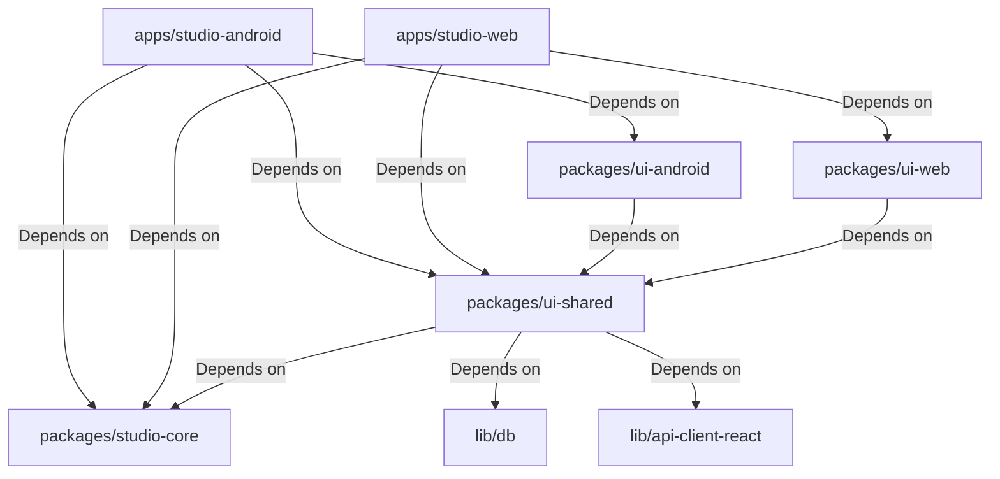

# Chordex Studio — Master Engineering Guide

This document serves as the master engineering guide and single source of truth for the Chordex Studio monorepo. Every developer, architect, and agent must read and reference this guide first.

---

## 1. Project Vision & Goals

Chordex Studio is a high-performance, cross-platform audio station, chords practice suite, interactive sequencer, and vocal tuning workshop. 

### Key Objectives
* **Unified Core Logic**: Leverage a shared core package (`@workspace/studio-core`) across both web and native Android builds to guarantee consistency in business rules, local storage caching, and state machine behaviors.
* **Low-Latency Audio Engine**: Deliver real-time audio playback, tuning, and sequencing capabilities natively on Android and in HTML5 browser environments.
* **Resilient Offline-First Sync**: Sync user configurations, practice sessions, and custom song databases seamlessly to Firestore or Supabase Realtime synchronization backends.
* **Robust OTA Updates**: Deploy bug fixes, performance upgrades, and assets dynamically via a secure native OTA (Over-the-Air) updater engine.

---

## 2. Monorepo Repository Structure

The monorepo uses `pnpm` workspaces for dependency orchestration.

```
studio/
├── apps/
│   ├── studio-android/       # Capacitor + React + Vite Android client
│   └── studio-web/           # React + Vite desktop web deployment
├── packages/
│   ├── studio-core/          # Core state stores, OTA engines, local storage interfaces, services
│   ├── ui-shared/            # Platform-neutral Material 3 UI component library
│   ├── ui-android/           # Touchsafe adapters, back gesture handlers, safe areas
│   └── ui-web/               # Desktop workspace docks and netlify views
├── lib/
│   ├── api-client-react/     # API Client hooks for frontend integration
│   ├── api-spec/             # JSON API Specifications and endpoints
│   ├── api-zod/              # Zod schemas for API request validation
│   └── db/                   # Database clients and schema definitions
├── docs/                     # Production engineering specifications & documentation
├── scripts/                  # Version manager, sync, and release automation scripts
├── supabase/                 # Supabase configuration, schema migrations, and edge functions
├── firebase-public/          # Web deployment assets targeted by Firebase Hosting
├── firebase-public-android/  # Android web asset bundles targeted by Firebase Hosting
├── package.json              # Workspace manifest
└── pnpm-workspace.yaml       # Workspace definition
```

Source:
* `pnpm-workspace.yaml`

---

## 3. Technology Stack & Applications

| Layer | Technology | Version / Notes |
|---|---|---|
| **PackageManager** | `pnpm` | Workspace mapping, lockfile enforcement |
| **Language** | `TypeScript` | Standard configuration, strict type checking |
| **Framework** | `React` | Hooks-first functional component architecture |
| **Build Engine** | `Vite` + `ESBuild` | Low-overhead bundler, fast dev reloading |
| **Native Bridge** | `Capacitor` | Core app plugins, native android views |
| **State Store** | `Zustand` | Lightweight decoupled hooks and actions (`useChordStore`, `useDrumStore`) |
| **Offline Sync** | `Firebase` / `Supabase` | Auth, sync engine (Supabase Realtime configured as default provider) |
| **Styling** | `CSS` / `Tailwind` | Inline utility styles, Material 3 layouts, safe-area adaptation |

Source:
* `package.json`
* `pnpm-workspace.yaml`
* `packages/studio-core/src/store/`

---

## 4. Platform Separation & Boundaries

To prevent compilation leaks, the monorepo strictly separates platform-specific dependencies:

* **Android changes stay in Android**: Native Gradle configurations, native Java plugins, and Android UI components (touch safety, back handlers, safe-area wrappers) belong under `apps/studio-android` and `packages/ui-android`.
* **Web changes stay in Web**: Netlify redirects, desktop-specific landing docks, and Vite web-only scripts belong under `apps/studio-web` and `packages/ui-web`.
* **Shared Logic stays in Core/Lib**: Core states, utilities, API callers, and OTA logic belong in `packages/studio-core` and the `lib/` workspace packages. They are not allowed to import native Capacitor plugins directly without environment checks (`isNative()`).
* **Shared UI stays in ui-shared**: Platform-neutral component templates belong in `packages/ui-shared`.

Source:
* `scripts/verify-bundle-separation.mjs`
* `scripts/enforce-platform-scope.mjs`

---

## 5. Dependency Graph



Source:
* `apps/studio-android/package.json`
* `apps/studio-web/package.json`
* `packages/ui-shared/package.json`
* `packages/ui-android/package.json`
* `packages/ui-web/package.json`

---

## 6. Mandatory Workflow Integration

This repository integrates documentation directly into the development cycle. Adhering to the following workflow components is mandatory:

* **Onboarding & Contribution**: Refer to [contributing.md](file:///c:/Users/ayuda/Documents/.gemini/antigravity/scratch/Studio/docs/contributing.md) for onboarding procedures.
* **AI Protocols**: Refer to [ai_workflow.md](file:///c:/Users/ayuda/Documents/.gemini/antigravity/scratch/Studio/docs/ai_workflow.md) for mandatory checklist prompts and validation steps.
* **Standard Checklists**: Refer to [engineering_checklists.md](file:///c:/Users/ayuda/Documents/.gemini/antigravity/scratch/Studio/docs/engineering_checklists.md) for reusable testing, release, and code review lists.
* **Doc Validation**: Refer to [documentation_validation.md](file:///c:/Users/ayuda/Documents/.gemini/antigravity/scratch/Studio/docs/documentation_validation.md) to verify that links, references, and configurations remain synced on changes.

Source:
* `docs/contributing.md`
* `docs/ai_workflow.md`
* `docs/engineering_checklists.md`
* `docs/documentation_validation.md`

---

## 7. Definition of Done (DoD)

An implementation is considered complete only when it meets the following criteria:

* [ ] **Compilation**: App builds successfully without warnings in all target packages (`pnpm build`).
* [ ] **Type Safety**: All TypeScript checks pass with zero compile issues (`pnpm run typecheck:libs`).
* [ ] **No regressions**: Previous client behaviors, logins, databases, and audio engines remain fully functional.
* [ ] **UI Adaptation**: Layouts are fully responsive on small screens (down to 360dp) and respect mobile safe area status bars and bottom navigation heights.
* [ ] **Touch Safety**: All interactive targets are easy to tap and do not suffer from scrolling touch-interception bugs.
* [ ] **Platform Isolation**: Web modifications are not loaded in the native WebView, and native interfaces handle fallback scenarios elegantly on web configurations.
* [ ] **Documentation**: Any system behavior changes are recorded in the engineering docs.
