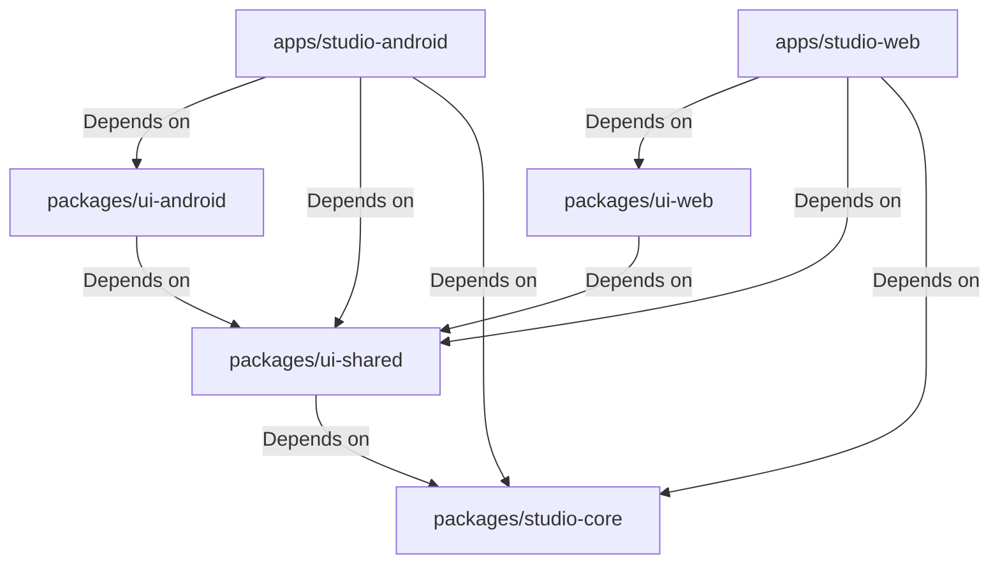

# Chordex Studio — Master Engineering Guide

This document serves as the master engineering guide and single source of truth for the Chordex Studio monorepo. Every developer, architect, and agent must read and verify their implementations against this guide first.

---

## 1. Project Vision & Goals

Chordex Studio is a high-performance, cross-platform audio station, chords practice suite, interactive sequencer, and vocal tuning workshop. 

### Key Objectives
* **Unified Core Logic**: Leverage a shared core package (`@workspace/studio-core`) across both web and native Android builds to guarantee consistency in business rules, offline database storage, and state machine behaviors.
* **Low-Latency Audio Engine**: Deliver real-time audio playback, tuning, and sequencing capabilities natively on Android and in HTML5 browser environments.
* **Resilient Offline-First Sync**: Sync user configurations, practice sessions, and custom song databases seamlessly to Firebase (with Supabase Realtime synchronization fallbacks).
* **Robust OTA Updates**: Deploy bug fixes, performance upgrades, and assets dynamically via a secure native OTA (Over-the-Air) updater engine.

---

## 2. Monorepo Repository Structure

The monorepo uses `pnpm` workspaces for dependency orchestration.

```
studio/
├── apps/
│   ├── studio-android/       # Capacitor + React + Vite Android client
│   └── studio-web/           # React + Vite desktop web deployment
├── packages/
│   ├── studio-core/          # Core state stores, OTA engines, offline db, services
│   ├── ui-shared/            # Platform-neutral Material 3 UI component library
│   ├── ui-android/           # Touchsafe adapters, back gesture handlers, safe areas
│   └── ui-web/               # Desktop workspace docks and netlify views
├── docs/                     # Production engineering specifications & documentation
├── scripts/                  # Version manager, sync, and release automation scripts
├── package.json              # Workspace manifest
└── pnpm-workspace.yaml       # Workspace definition
```

---

## 3. Technology Stack & Applications

| Layer | Technology | Version / Notes |
|---|---|---|
| **PackageManager** | `pnpm` | Workspace mapping, lockfile enforcement |
| **Language** | `TypeScript` | Standard configuration, strict type checking |
| **Framework** | `React` | Hooks-first functional component architecture |
| **Build Engine** | `Vite` + `ESBuild` | Low-overhead bundler, fast dev reloading |
| **Native Bridge** | `Capacitor` | Core app plugins, native android views |
| **State Store** | `Zustand` | Lightweight decoupled hooks and actions |
| **Offline Sync** | `Firebase` / `Supabase` | Firestore rules, authentication, realtime synchronization |
| **Styling** | `CSS` / `Tailwind` | Material 3 themes, safe-area adaptation |

---

## 4. Platform Separation & Boundaries

To prevent compilation leaks, the monorepo strictly separates platform-specific dependencies:

* **Android changes stay in Android**: Native Gradle configurations, native plugins, and Android UI components (touch safety, back handlers, safe-area wrappers) belong under `apps/studio-android` and `packages/ui-android`.
* **Web changes stay in Web**: Netlify redirects, desktop-specific landing docks, and Vite web-only scripts belong under `apps/studio-web` and `packages/ui-web`.
* **Shared Logic stays in Core**: Core states, utilities, API callers, and OTA logic belong in `packages/studio-core` and are not allowed to import native Cordova/Capacitor plugins directly without environment checks (`isNative()`).
* **Shared UI stays in ui-shared**: Platform-neutral component templates belong in `packages/ui-shared`.

---

## 5. Dependency Graph



---

## 6. Engineering Principles

### Root-Cause-First Debugging
* Never apply a band-aid fix or a temporary visual patch.
* Locate the root origin of a bug (e.g., race condition in storage, missing listener binding, incorrect type check).
* Refactor the system core rather than wrapping a buggy handler with conditional bypasses.

### Component Reuse
* Extend existing component templates and custom abstractions rather than writing duplicate UI elements or layout styles.
* Place shared components in `packages/ui-shared`.

### Performance Hygiene
* Prevent redundant rendering cycles by utilizing React `useMemo` and `useCallback` strategically.
* Always clean up event listeners, periodic interval timers, and database subscriptions in cleanup hooks.

---

## 7. Definition of Done (DoD)

An implementation is considered complete only when it meets the following criteria:

* [ ] **Compilation**: App builds successfully without warnings in all target packages (`pnpm build`).
* [ ] **Type Safety**: All TypeScript checks pass with zero compile issues (`pnpm run typecheck:libs`).
* [ ] **No regressions**: Previous client behaviors, logins, databases, and audio engines remain fully functional.
* [ ] **UI Adaptation**: Layouts are fully responsive on small screens (down to 360dp) and respect mobile safe area status bars and bottom navigation heights.
* [ ] **Touch Safety**: All interactive targets are easy to tap and do not suffer from scrolling touch-interception bugs.
* [ ] **Platform Isolation**: Web modifications are not loaded in the native WebView, and native interfaces handle fallback scenarios elegantly on web configurations.
* [ ] **Documentation**: Any system behavior changes are recorded in the engineering docs.
